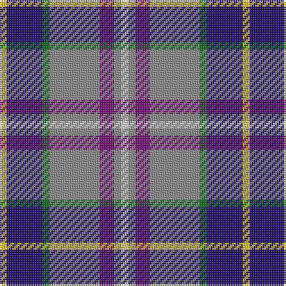

This page is one **sett** — a single exact thread-count. It belongs to the [tartan](/tartans/y1db5g1n7p2n1ln1/)
(the same proportion at any scale), whose colour order is pattern [WRBRGBY](/stripes/wrbrgby/).

Sourced from house-of-tartan.  It is a [7 stripe tartan](/stripes/stripes7/).

Original link http://www.house-of-tartan.scotland.net/house/TartanViewjs.asp?colr=Def&tnam=1833

## Thread count
Y/4 DB20 G4 N28 P8 N4 LN/4

## Palette
Each colour and the base-6 reference it is a variant of.

| Colour | Shade | Base |
|---|---|---|
| DB | <code style="background-color:#1C0070;">#1C0070</code> `oklch(26.3% 0.162 277.1)` <small>#1C0070</small> | B <code style="background-color:#2A418A;">#2A418A</code> |
| G | <code style="background-color:#006818;">#006818</code> `oklch(45.0% 0.142 145.0)` <small>#006818</small> | G <code style="background-color:#006100;">#006100</code> |
| LN | <code style="background-color:#E0E0E0;">#E0E0E0</code> `oklch(90.7% 0.000 89.9)` <small>#E0E0E0</small> | W <code style="background-color:#F7F7F7;">#F7F7F7</code> |
| N | <code style="background-color:#888888;">#888888</code> `oklch(62.7% 0.000 89.9)` <small>#888888</small> | R <code style="background-color:#CC0000;">#CC0000</code> |
| P | <code style="background-color:#780078;">#780078</code> `oklch(40.2% 0.185 328.4)` <small>#780078</small> | B <code style="background-color:#2A418A;">#2A418A</code> |
| Y | <code style="background-color:#E8C000;">#E8C000</code> `oklch(81.9% 0.168 93.7)` <small>#E8C000</small> | Y <code style="background-color:#F2BF00;">#F2BF00</code> |

# Sample pattern

## Nearest tartans

The nearest existing variants by ΔTartan distance, with this tartan at the top so the swatches line up against it.

ΔTartan

Tartan

Sett

—

<a href="/ttd/edit/#slug=w1o1dp2o7g1db5ly1~x4">Deeside District Tartan Tartan Number: 1833. Earliest known date: 1963 The name Deas is described as an 'alias' for Davidson in historic records, and is a recognised sept of Clan Dhai (Davidson). See products available Copyright © Blair Urquhart, Comrie, 2015</a> <a class="nn-out" href="/setts/s7/w1o1dp2o7g1db5ly1~x4/" title="open its dictionary page">↗</a>

0.66

<a href="/ttd/edit/#slug=db13ly2r4g2t8w2~x6">Meh Dundee</a> <a class="nn-out" href="/setts/s6/db13ly2r4g2t8w2~x6/" title="open its dictionary page">↗</a>

1.10

<a href="/ttd/edit/#slug=w8db5db30lr4db13lr13g5lo5~x2">Waterford County Crest (Fashion)</a> <a class="nn-out" href="/setts/s8/w8db5db30lr4db13lr13g5lo5~x2/" title="open its dictionary page">↗</a>

1.16

<a href="/ttd/edit/#slug=ly4b22g4o24dp6o4w3~x2">Deeside Plaid (Taobh Dhi) (District)</a> <a class="nn-out" href="/setts/s7/ly4b22g4o24dp6o4w3~x2/" title="open its dictionary page">↗</a>

1.17

<a href="/ttd/edit/#slug=r3lr25db6db3r2t5db18w3~x2">Fulbright Foundation</a> <a class="nn-out" href="/setts/s8/r3lr25db6db3r2t5db18w3~x2/" title="open its dictionary page">↗</a>

1.17

<a href="/ttd/edit/#slug=t5ly5db12g1db1r1db1w2~x4">Hodgkinson</a> <a class="nn-out" href="/setts/s8/t5ly5db12g1db1r1db1w2~x4/" title="open its dictionary page">↗</a>

1.20

<a href="/ttd/edit/#slug=dt36lo5r12r9dp5w12lo7~x2">Galvez-Brown (Personal)</a> <a class="nn-out" href="/setts/s7/dt36lo5r12r9dp5w12lo7~x2/" title="open its dictionary page">↗</a>

1.20

<a href="/ttd/edit/#slug=p2g6r1y1db3b10w1~x2">Manx National</a> <a class="nn-out" href="/setts/s7/p2g6r1y1db3b10w1~x2/" title="open its dictionary page">↗</a>

1.22

<a href="/ttd/edit/#slug=t5ly5db12g1db1r1db1w2~x2">Yorkshire, C.C.C.</a> <a class="nn-out" href="/setts/s8/t5ly5db12g1db1r1db1w2~x2/" title="open its dictionary page">↗</a>

1.23

<a href="/ttd/edit/#slug=db24r6w6r6w6r6db25k12b36ly6">Lopatinsky (Personal)</a> <a class="nn-out" href="/setts/s10/db24r6w6r6w6r6db25k12b36ly6/" title="open its dictionary page">↗</a>

1.24

<a href="/ttd/edit/#slug=dt48lo25dy15r7lb5dt7k10lb10~x2">State Seal of Utah (Fashion)</a> <a class="nn-out" href="/setts/s8/dt48lo25dy15r7lb5dt7k10lb10~x2/" title="open its dictionary page">↗</a>

## Neighbour map

Every grey dot is one of 14299 variants placed by the first two principal components of the ΔTartan feature space (44% of its variance). Red is this tartan; blue dots are its nearest — click one to open its page.

<svg viewBox="0 0 640 380" role="img" style="max-width:100%;height:auto;border:1px solid #e0e0e0;border-radius:4px;display:block" xmlns="http://www.w3.org/2000/svg"><image href="/nn/cloud.v1.png" width="640" height="380"/><a href="/setts/s6/db13ly2r4g2t8w2~x6/"><circle cx="136.9" cy="188.9" r="4" fill="#3465a4"><title>Meh Dundee</title></circle></a><a href="/setts/s8/w8db5db30lr4db13lr13g5lo5~x2/"><circle cx="99.5" cy="171.8" r="4" fill="#3465a4"><title>Waterford County Crest (Fashion)</title></circle></a><a href="/setts/s7/ly4b22g4o24dp6o4w3~x2/"><circle cx="179.4" cy="175.8" r="4" fill="#3465a4"><title>Deeside Plaid (Taobh Dhi) (District)</title></circle></a><a href="/setts/s8/r3lr25db6db3r2t5db18w3~x2/"><circle cx="153.2" cy="133.5" r="4" fill="#3465a4"><title>Fulbright Foundation</title></circle></a><a href="/setts/s8/t5ly5db12g1db1r1db1w2~x4/"><circle cx="203.2" cy="131.8" r="4" fill="#3465a4"><title>Hodgkinson</title></circle></a><a href="/setts/s7/dt36lo5r12r9dp5w12lo7~x2/"><circle cx="120.3" cy="163.5" r="4" fill="#3465a4"><title>Galvez-Brown (Personal)</title></circle></a><a href="/setts/s7/p2g6r1y1db3b10w1~x2/"><circle cx="138.3" cy="141.6" r="4" fill="#3465a4"><title>Manx National</title></circle></a><a href="/setts/s8/t5ly5db12g1db1r1db1w2~x2/"><circle cx="210.7" cy="135.4" r="4" fill="#3465a4"><title>Yorkshire, C.C.C.</title></circle></a><a href="/setts/s10/db24r6w6r6w6r6db25k12b36ly6/"><circle cx="91.4" cy="167.4" r="4" fill="#3465a4"><title>Lopatinsky (Personal)</title></circle></a><a href="/setts/s8/dt48lo25dy15r7lb5dt7k10lb10~x2/"><circle cx="157.9" cy="163.0" r="4" fill="#3465a4"><title>State Seal of Utah (Fashion)</title></circle></a><circle cx="158.4" cy="169.7" r="5" fill="#c00000"/></svg>

ID: /setts/s7/w1o1dp2o7g1db5ly1~x4/
