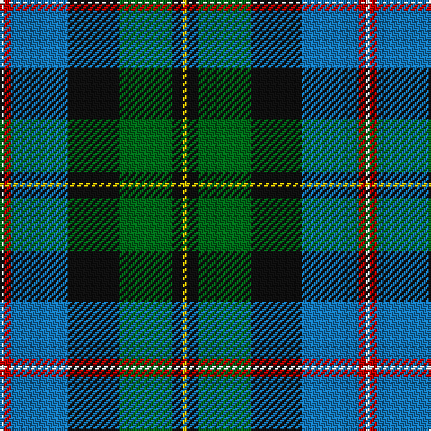

In pattern [WRBKGKY](/patterns/wrbkgky/).

This was sourced from register-of-tartans.  It is a [7 stripes tartan](/stripes/stripes7/).

Original link https://www.tartanregister.gov.uk/tartanDetails.aspx?ref=2679

## Register references

External register numbers recorded for this tartan.

- Scottish Register of Tartans: [2679](https://www.tartanregister.gov.uk/tartanDetails.aspx?ref=2679)
- Scottish Tartans Authority (ITI): 1839
- Scottish Tartans World Register: 1839

## Thread count
W/2 R4 B32 K28 G30 K6 Y/2

## Palette
Each colour and its ΔE from the base-6 reference it is a variant of.

| Colour | Shade | Base | ΔE (OKLab) |
|---|---|---|---|
| B | <code style="background-color:#1474B4;">#1474B4</code> `#1474B4` | B <code style="background-color:#2A418A;">#2A418A</code> | 0.15 |
| G | <code style="background-color:#006818;">#006818</code> `#006818` | G <code style="background-color:#006100;">#006100</code> | 0.02 |
| K | <code style="background-color:#101010;">#101010</code> `#101010` | K <code style="background-color:#000000;">#000000</code> | 0.17 |
| R | <code style="background-color:#C80000;">#C80000</code> `#C80000` | R <code style="background-color:#CC0000;">#CC0000</code> | 0.01 |
| W | <code style="background-color:#FCFCFC;">#FCFCFC</code> `#FCFCFC` | W <code style="background-color:#F7F7F7;">#F7F7F7</code> | 0.01 |
| Y | <code style="background-color:#E8C000;">#E8C000</code> `#E8C000` | Y <code style="background-color:#F2BF00;">#F2BF00</code> | 0.02 |

# Sample pattern

## Nearest tartans

The nearest existing variants by ΔTartan distance.

1. [MacNeil - 1840 (Chief's sett)](/setts/s7/w2r3b33k33g33k6y2~b2c2c80-g006818-k101010-rc80000-wfcfcfc-ye8c000~x2/) — ΔT 0.82
1. [Christian Hunting (Personal)](/setts/s7/r3g2b27k19g27ba2y3~b2c2c80-ba780078-g006818-k101010-rc80000-ye8c000~x2/) — ΔT 0.83
1. [Birch Family Tartan Tartan Number: 2157. Earliest known date: 1993 The Birch family tartan was designed and produced by Mr Robin Birch of Connell Reid kiltmaker, Blairgowrie. The new sett has been recorded by the Scottish Tartans Society. See products available Copyright © Blair Urquhart, Comrie, 2015](/setts/s9/g3b4g23k10r2k10ba18k1w3~b780078-ba5c8ca8-g006818-k101010-rc8002c-we0e0e0~x2/) — ΔT 0.90
1. [Whitson Family Tartan Tartan Number: 1422. Earliest known date: 1984 UK Design No 514358 See products available Copyright © Blair Urquhart, Comrie, 2015](/setts/s9/w4k1g19y1k19b13r2b4r2~b2c2c80-g006818-k101010-rc80000-we0e0e0-ye8c000~x2/) — ΔT 0.95
1. [Hogg Dress (Name)](/setts/s9/b34r3b8ba4b8k24g34k2w6~b4880a0-ba1c1c50-g006818-k101010-rc80000-we0e0e0/) — ΔT 0.96
1. [Bergen Scottish](/setts/s7/b5w3r12g37k12ba21w2~b2c2c80-ba202060-g006818-k101010-rc80000-wf8f8f8~x2/) — ΔT 0.97
1. [MacCormick](/setts/s7/w3k1g20k16b20k1y3~b2c2c80-g006818-k101010-we0e0e0-ye8c000~x2/) — ΔT 0.99
1. [Hughes](/setts/s7/g20ga14b9y2b9k1w2~b304080-g008000-ga003000-k000000-we0e0e0-yf0c000~x4/) — ΔT 1.00
1. [Turnbull of Thornton (Personal)](/setts/s6/k6r3g30y10b30w3~b2c2c80-g006818-k101010-rc80000-wfcfcfc-yd8b000~x2/) — ΔT 1.00
1. [Morris of Eddergoll (Personal)](/setts/s6/w2b20r3k10g20y2~b1c0070-g006818-k101010-rc80000-wf8f8f8-yd09800~x2/) — ΔT 1.03

## Neighbour map

Every grey dot is one of 15726 variants placed by the first two principal components of the ΔTartan feature space (44% of its variance). Red is this tartan; blue dots are its nearest — click one to open its page.

<svg viewBox="0 0 640 380" role="img" style="max-width:100%;height:auto;border:1px solid #e0e0e0;border-radius:4px;display:block" xmlns="http://www.w3.org/2000/svg"><image href="/nn/cloud.v1.png" width="640" height="380"/><a href="/setts/s7/w2r3b33k33g33k6y2~b2c2c80-g006818-k101010-rc80000-wfcfcfc-ye8c000~x2/"><circle cx="178.9" cy="155.8" r="4" fill="#3465a4"><title>MacNeil - 1840 (Chief's sett)</title></circle></a><a href="/setts/s7/r3g2b27k19g27ba2y3~b2c2c80-ba780078-g006818-k101010-rc80000-ye8c000~x2/"><circle cx="171.6" cy="161.6" r="4" fill="#3465a4"><title>Christian Hunting (Personal)</title></circle></a><a href="/setts/s9/g3b4g23k10r2k10ba18k1w3~b780078-ba5c8ca8-g006818-k101010-rc8002c-we0e0e0~x2/"><circle cx="157.5" cy="124.9" r="4" fill="#3465a4"><title>Birch Family Tartan Tartan Number: 2157. Earliest known date: 1993 The Birch family tartan was designed and produced by Mr Robin Birch of Connell Reid kiltmaker, Blairgowrie. The new sett has been recorded by the Scottish Tartans Society. See products available Copyright © Blair Urquhart, Comrie, 2015</title></circle></a><a href="/setts/s9/w4k1g19y1k19b13r2b4r2~b2c2c80-g006818-k101010-rc80000-we0e0e0-ye8c000~x2/"><circle cx="140.8" cy="124.0" r="4" fill="#3465a4"><title>Whitson Family Tartan Tartan Number: 1422. Earliest known date: 1984 UK Design No 514358 See products available Copyright © Blair Urquhart, Comrie, 2015</title></circle></a><a href="/setts/s9/b34r3b8ba4b8k24g34k2w6~b4880a0-ba1c1c50-g006818-k101010-rc80000-we0e0e0/"><circle cx="178.1" cy="137.7" r="4" fill="#3465a4"><title>Hogg Dress (Name)</title></circle></a><a href="/setts/s7/b5w3r12g37k12ba21w2~b2c2c80-ba202060-g006818-k101010-rc80000-wf8f8f8~x2/"><circle cx="167.0" cy="143.5" r="4" fill="#3465a4"><title>Bergen Scottish</title></circle></a><a href="/setts/s7/w3k1g20k16b20k1y3~b2c2c80-g006818-k101010-we0e0e0-ye8c000~x2/"><circle cx="168.5" cy="157.6" r="4" fill="#3465a4"><title>MacCormick</title></circle></a><a href="/setts/s7/g20ga14b9y2b9k1w2~b304080-g008000-ga003000-k000000-we0e0e0-yf0c000~x4/"><circle cx="163.5" cy="155.3" r="4" fill="#3465a4"><title>Hughes</title></circle></a><a href="/setts/s6/k6r3g30y10b30w3~b2c2c80-g006818-k101010-rc80000-wfcfcfc-yd8b000~x2/"><circle cx="140.5" cy="171.2" r="4" fill="#3465a4"><title>Turnbull of Thornton (Personal)</title></circle></a><a href="/setts/s6/w2b20r3k10g20y2~b1c0070-g006818-k101010-rc80000-wf8f8f8-yd09800~x2/"><circle cx="135.2" cy="178.7" r="4" fill="#3465a4"><title>Morris of Eddergoll (Personal)</title></circle></a><circle cx="148.5" cy="152.2" r="5" fill="#c00000"/></svg>

ID: /setts/s7/w1r2b16k14g15k3y1~b1474b4-g006818-k101010-rc80000-wfcfcfc-ye8c000~x2/
