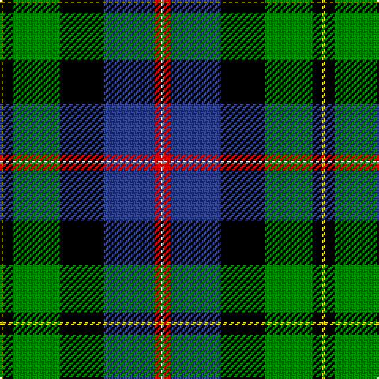

This page is one **sett** — a single exact thread-count. It belongs to the [tartan](/tartans/y1k3g15k14b16r2ln1/)
(the same proportion at any scale), whose colour order is pattern [WRBKGKY](/stripes/wrbkgky/).

Sourced from weddslist.  It is a [7 stripe tartan](/stripes/stripes7/).

Original link http://www.weddslist.com/cgi-bin/tartans/pg.pl?source=sts

## Thread count
Y/2 K6 G30 K28 B32 R4 LN/2

## Palette
Each colour and the base-6 reference it is a variant of.

| Colour | Shade | Base |
|---|---|---|
| B | <code style="background-color:#304080;">#304080</code> `oklch(39.4% 0.109 270.2)` <small>#304080</small> | B <code style="background-color:#2A418A;">#2A418A</code> |
| G | <code style="background-color:#008000;">#008000</code> `oklch(52.0% 0.177 142.5)` <small>#008000</small> | G <code style="background-color:#006100;">#006100</code> |
| K | <code style="background-color:#000000;">#000000</code> `oklch(0.0% 0.000 0.0)` <small>#000000</small> | K <code style="background-color:#000000;">#000000</code> |
| LN | <code style="background-color:#E0E0E0;">#E0E0E0</code> `oklch(90.7% 0.000 89.9)` <small>#E0E0E0</small> | W <code style="background-color:#F7F7F7;">#F7F7F7</code> |
| R | <code style="background-color:#C00000;">#C00000</code> `oklch(50.7% 0.208 29.2)` <small>#C00000</small> | R <code style="background-color:#CC0000;">#CC0000</code> |
| Y | <code style="background-color:#F0C000;">#F0C000</code> `oklch(82.7% 0.169 90.5)` <small>#F0C000</small> | Y <code style="background-color:#F2BF00;">#F2BF00</code> |

# Sample pattern

## Nearest tartans

The nearest existing variants by ΔTartan distance, with this tartan at the top so the swatches line up against it.

ΔTartan

Tartan

Sett

—

<a href="/ttd/edit/#slug=w1r2db16k14g15k3ly1~x2">MacNeil 7</a> <a class="nn-out" href="/setts/s7/w1r2db16k14g15k3ly1~x2/" title="open its dictionary page">↗</a>

0.81

<a href="/ttd/edit/#slug=w4k1g19ly1k19db13r2db4r2~x2">Whitson</a> <a class="nn-out" href="/setts/s9/w4k1g19ly1k19db13r2db4r2~x2/" title="open its dictionary page">↗</a>

0.94

<a href="/ttd/edit/#slug=db4k2db16k12w1g13r2g2lo4~x2">Cusack</a> <a class="nn-out" href="/setts/s9/db4k2db16k12w1g13r2g2lo4~x2/" title="open its dictionary page">↗</a>

0.98

<a href="/ttd/edit/#slug=r1g14k14r2db14t1~x2">Wilson's, No 221</a> <a class="nn-out" href="/setts/s6/r1g14k14r2db14t1~x2/" title="open its dictionary page">↗</a>

0.99

<a href="/ttd/edit/#slug=w4k1g18k17db13r1db3r1~x2">Whitson</a> <a class="nn-out" href="/setts/s8/w4k1g18k17db13r1db3r1~x2/" title="open its dictionary page">↗</a>

0.99

<a href="/ttd/edit/#slug=r5k12ly2dg25ly2db12t5~x2">James</a> <a class="nn-out" href="/setts/s7/r5k12ly2dg25ly2db12t5~x2/" title="open its dictionary page">↗</a>

0.99

<a href="/ttd/edit/#slug=k2r1g15k15db15ly1k2~x2">MacCaskill</a> <a class="nn-out" href="/setts/s7/k2r1g15k15db15ly1k2~x2/" title="open its dictionary page">↗</a>

0.99

<a href="/ttd/edit/#slug=w5k26ly2dg24db8k4r3~x2">Cornish Htg (District)</a> <a class="nn-out" href="/setts/s7/w5k26ly2dg24db8k4r3~x2/" title="open its dictionary page">↗</a>

1.03

<a href="/ttd/edit/#slug=ly1k3dg15k14db16r2lb1~x2">MacNeil</a> <a class="nn-out" href="/setts/s7/ly1k3dg15k14db16r2lb1~x2/" title="open its dictionary page">↗</a>

1.06

<a href="/ttd/edit/#slug=g3p4g23k10r2k10t18k1w3~x2">Birch</a> <a class="nn-out" href="/setts/s9/g3p4g23k10r2k10t18k1w3~x2/" title="open its dictionary page">↗</a>

1.07

<a href="/ttd/edit/#slug=w3dp22r3k22g22ly2~x2">Morris of Balgonie</a> <a class="nn-out" href="/setts/s6/w3dp22r3k22g22ly2~x2/" title="open its dictionary page">↗</a>

## Neighbour map

Every grey dot is one of 14299 variants placed by the first two principal components of the ΔTartan feature space (44% of its variance). Red is this tartan; blue dots are its nearest — click one to open its page.

<svg viewBox="0 0 640 380" role="img" style="max-width:100%;height:auto;border:1px solid #e0e0e0;border-radius:4px;display:block" xmlns="http://www.w3.org/2000/svg"><image href="/nn/cloud.v1.png" width="640" height="380"/><a href="/setts/s9/w4k1g19ly1k19db13r2db4r2~x2/"><circle cx="120.6" cy="117.7" r="4" fill="#3465a4"><title>Whitson</title></circle></a><a href="/setts/s9/db4k2db16k12w1g13r2g2lo4~x2/"><circle cx="129.8" cy="140.1" r="4" fill="#3465a4"><title>Cusack</title></circle></a><a href="/setts/s6/r1g14k14r2db14t1~x2/"><circle cx="141.9" cy="181.7" r="4" fill="#3465a4"><title>Wilson's, No 221</title></circle></a><a href="/setts/s8/w4k1g18k17db13r1db3r1~x2/"><circle cx="143.4" cy="144.3" r="4" fill="#3465a4"><title>Whitson</title></circle></a><a href="/setts/s7/r5k12ly2dg25ly2db12t5~x2/"><circle cx="143.4" cy="165.2" r="4" fill="#3465a4"><title>James</title></circle></a><a href="/setts/s7/k2r1g15k15db15ly1k2~x2/"><circle cx="178.3" cy="167.3" r="4" fill="#3465a4"><title>MacCaskill</title></circle></a><a href="/setts/s7/w5k26ly2dg24db8k4r3~x2/"><circle cx="165.9" cy="155.6" r="4" fill="#3465a4"><title>Cornish Htg (District)</title></circle></a><a href="/setts/s7/ly1k3dg15k14db16r2lb1~x2/"><circle cx="150.7" cy="160.3" r="4" fill="#3465a4"><title>MacNeil</title></circle></a><a href="/setts/s9/g3p4g23k10r2k10t18k1w3~x2/"><circle cx="135.6" cy="117.9" r="4" fill="#3465a4"><title>Birch</title></circle></a><a href="/setts/s6/w3dp22r3k22g22ly2~x2/"><circle cx="101.3" cy="172.1" r="4" fill="#3465a4"><title>Morris of Balgonie</title></circle></a><circle cx="135.0" cy="148.1" r="5" fill="#c00000"/></svg>

ID: /setts/s7/w1r2db16k14g15k3ly1~x2/
