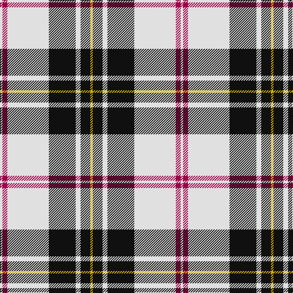

In pattern [WRWKWKY](/patterns/wrwkwky/).

This was sourced from tartans-authority.  It is a [7 stripes tartan](/stripes/stripes7/).

Original link http://www.tartansauthority.com/tartan-ferret/display/1872/

## Thread count
LN/4 R8 LN68 K44 LN8 K16 Y/4

## Palette
Each colour and its ΔE from the base-6 reference it is a variant of.

| Colour | Shade | Base | ΔE (OKLab) |
|---|---|---|---|
| K | <code style="background-color:#101010;">#101010</code> `#101010` | K <code style="background-color:#000000;">#000000</code> | 0.17 |
| LN | <code style="background-color:#E0E0E0;">#E0E0E0</code> `#E0E0E0` | W <code style="background-color:#F7F7F7;">#F7F7F7</code> | 0.07 |
| R | <code style="background-color:#A00048;">#A00048</code> `#A00048` | R <code style="background-color:#CC0000;">#CC0000</code> | 0.12 |
| Y | <code style="background-color:#D8B000;">#D8B000</code> `#D8B000` | Y <code style="background-color:#F2BF00;">#F2BF00</code> | 0.06 |

# Sample pattern

## Nearest tartans

The nearest existing variants by ΔTartan distance.

1. [MacPherson 8](/setts/s6/r1w14k6w1k3y1x4~k000000-rc00000-we0e0e0-yf0c000/) — ΔT 0.67
1. [MacPherson #10](/setts/s6/r1w14k6w1k3y1x4~k101010-rdc0000-we0e0e0-ye8c000/) — ΔT 0.74
1. [Rui (Personal)](/setts/s6/r1w12k1wa2k5r1x4~k000000-rc80000-wc8c8c8-wafcfcfc/) — ΔT 0.80
1. [St. Piran Dress](/setts/s8/r4w19g2w8g2w8k38w4x2~g003820-k101010-rc80000-we0e0e0/) — ΔT 0.82
1. [MacPherson Dress (1951)](/setts/s7/w3b3w30k20w3k9y3x2~b940094-k101010-we0e0e0-ye8c000/) — ΔT 0.84
1. [Brodie (WCWM)](/setts/s6/r2w30k15y2k15r2x2~k101010-rc80000-wf0ecd4-ybc8c00/) — ΔT 0.91
1. [MacPherson of Cluny Clan Tartan Tartan Number: 1830. Earliest known date: 1948 Also known as MacPherson Dress often woven with purple in place of red See products available Copyright © Blair Urquhart, Comrie, 2015](/setts/s7/w5r3w35k28w4k11w2x2~k101010-rc80000-we0e0e0/) — ΔT 0.94
1. [MacPherson of Cluny (Black and White)](/setts/s7/w5r3w35k28w4k11w2x2~k101010-rc80000-wfcfcfc/) — ΔT 0.95
1. [MacPherson Dress (1842)](/setts/s7/w3r1w30k20w3k9y1x2~k101010-rc80000-we0e0e0-yd8b000/) — ΔT 0.95
1. [Hannay (Clan)](/setts/s10/k9w4k2w4k2w30k9w4b14y2x2~b3850c8-k101010-we8ccb8-yd09800/) — ΔT 0.99

## Neighbour map

Every grey dot is one of 15726 variants placed by the first two principal components of the ΔTartan feature space (44% of its variance). Red is this tartan; blue dots are its nearest — click one to open its page.

<svg viewBox="0 0 640 380" role="img" style="max-width:100%;height:auto;border:1px solid #e0e0e0;border-radius:4px;display:block" xmlns="http://www.w3.org/2000/svg"><image href="/nn/cloud.v1.png" width="640" height="380"/><a href="/setts/s6/r1w14k6w1k3y1x4~k000000-rc00000-we0e0e0-yf0c000/"><circle cx="296.1" cy="158.7" r="4" fill="#3465a4"><title>MacPherson 8</title></circle></a><a href="/setts/s6/r1w14k6w1k3y1x4~k101010-rdc0000-we0e0e0-ye8c000/"><circle cx="299.5" cy="157.0" r="4" fill="#3465a4"><title>MacPherson #10</title></circle></a><a href="/setts/s6/r1w12k1wa2k5r1x4~k000000-rc80000-wc8c8c8-wafcfcfc/"><circle cx="258.7" cy="159.2" r="4" fill="#3465a4"><title>Rui (Personal)</title></circle></a><a href="/setts/s8/r4w19g2w8g2w8k38w4x2~g003820-k101010-rc80000-we0e0e0/"><circle cx="255.2" cy="137.1" r="4" fill="#3465a4"><title>St. Piran Dress</title></circle></a><a href="/setts/s7/w3b3w30k20w3k9y3x2~b940094-k101010-we0e0e0-ye8c000/"><circle cx="245.3" cy="170.0" r="4" fill="#3465a4"><title>MacPherson Dress (1951)</title></circle></a><a href="/setts/s6/r2w30k15y2k15r2x2~k101010-rc80000-wf0ecd4-ybc8c00/"><circle cx="240.7" cy="165.6" r="4" fill="#3465a4"><title>Brodie (WCWM)</title></circle></a><a href="/setts/s7/w5r3w35k28w4k11w2x2~k101010-rc80000-we0e0e0/"><circle cx="304.9" cy="169.1" r="4" fill="#3465a4"><title>MacPherson of Cluny Clan Tartan Tartan Number: 1830. Earliest known date: 1948 Also known as MacPherson Dress often woven with purple in place of red See products available Copyright © Blair Urquhart, Comrie, 2015</title></circle></a><a href="/setts/s7/w5r3w35k28w4k11w2x2~k101010-rc80000-wfcfcfc/"><circle cx="300.0" cy="165.4" r="4" fill="#3465a4"><title>MacPherson of Cluny (Black and White)</title></circle></a><a href="/setts/s7/w3r1w30k20w3k9y1x2~k101010-rc80000-we0e0e0-yd8b000/"><circle cx="320.4" cy="127.5" r="4" fill="#3465a4"><title>MacPherson Dress (1842)</title></circle></a><a href="/setts/s10/k9w4k2w4k2w30k9w4b14y2x2~b3850c8-k101010-we8ccb8-yd09800/"><circle cx="250.2" cy="136.2" r="4" fill="#3465a4"><title>Hannay (Clan)</title></circle></a><circle cx="279.8" cy="146.5" r="5" fill="#c00000"/></svg>

ID: /setts/s7/w1r2w17k11w2k4y1x4~k101010-ra00048-we0e0e0-yd8b000/
