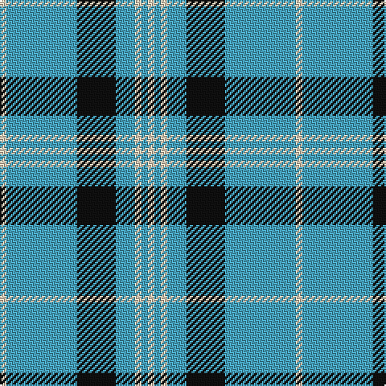

In pattern [WYKYWYW](/patterns/wykywyw/).

This was sourced from tartans-authority.  It is a [7 stripes tartan](/stripes/stripes7/).

Original link http://www.tartansauthority.com/tartan-ferret/display/3512/

## Attestations

This cloth appears in 2 source records; the oldest owns this page.

- 1986 — Angle, Blue (Fashion) (tartans-authority, [record](http://www.tartansauthority.com/tartan-ferret/display/3512/))
- undated — Angle Blue (register-of-tartans, [record](https://www.tartanregister.gov.uk/tartanDetails.aspx?ref=4882))

## Register references

External register numbers recorded for this tartan.

- Scottish Register of Tartans: [4882](https://www.tartanregister.gov.uk/tartanDetails.aspx?ref=4882)
- Scottish Tartans Authority (ITI): 3512

## Thread count
LR/4 B44 K24 B12 LR4 B4 LR/4

## Palette
Each colour and its ΔE from the base-6 reference it is a variant of.

| Colour | Shade | Base | ΔE (OKLab) |
|---|---|---|---|
| B | <code style="background-color:#48A4C0;">#48A4C0</code> `#48A4C0` | Y <code style="background-color:#F2BF00;">#F2BF00</code> | 0.29 |
| K | <code style="background-color:#101010;">#101010</code> `#101010` | K <code style="background-color:#000000;">#000000</code> | 0.17 |
| LR | <code style="background-color:#E8CCB8;">#E8CCB8</code> `#E8CCB8` | W <code style="background-color:#F7F7F7;">#F7F7F7</code> | 0.12 |

# Sample pattern

## Nearest tartans

The nearest existing variants by ΔTartan distance.

1. [Legary (Name)](/setts/s6/y5b15w5b5w40y3~b1c1c50-w98c8e8-ye8c000~x2/) — ΔT 1.01
1. [Legary](/setts/s6/y5b15w5b5w40y3~b00006b-wabcdd9-yeff265~x2/) — ΔT 1.12
1. [Rea](/setts/s6/b12y2b1k5b4k2~b2888c4-k101010-ye8c000~x4/) — ΔT 1.12
1. [Loch Lomond](/setts/s5/b37w9b3ba9w3~b5480b0-ba000050-we0e0e0~x2/) — ΔT 1.32
1. [MacLintock #2](/setts/s7/b3ba2w10ba2b6ba26k2~b5c5c5c-ba1474b4-k101010-wfcfcfc~x2/) — ΔT 1.42
1. [Alaska Highlanders Pipes & Drums Corporate Tartan Tartan Number: 8433. Earliest known date: pre 2001 Found on http://www.alaskahighlanders.com/alaska-flag-tartan: Captain Cook's own Alaska Highlanders was reformed in 1987 by the late great Pipe Major Iain MacPherson. We are a dedicated pipe band that is open to new discovery and experiences. We have played all over Alaska, Scotland twice and London in 2005. Our band has been represented at the Pipefest in 1995, 2000 and 2005. On August 23, 2005 (when his family and fellow Scots were finally allowed to hold a public funeral and memorial service 700 years to the day after his execution, we had the honor of escorting the spirit of the braveheart Sir William Wallace on his first mile home to Scotland. At the invitation of Clan Wallace Society convienor David Ross provided an Honour Guard with swords and led the funeral procession from the site of his execution thru the streets of London to the London Welsh Center where a Wake was held. The Highlanders wear the Alaska Flag Tartan and our uniforms reflect those worn by those pipers and drummers who sailed with Captain James Cook in 1778, when he discovered Alaska. (State of Alaska) See products available Copyright © Blair Urquhart, Comrie, 2015](/setts/s8/b9w27b2k4b2w10b2wa3~b2c2c80-k000000-w98c8e8-waf8f8f8~x2/) — ΔT 1.48
1. [Kinding (Personal)](/setts/s7/k10b30g3b3g3b3r6~b5c8ca8-g249018-k101010-rc80000~x2/) — ΔT 1.49
1. [Perkins 2015](/setts/s7/k3b10y5b29k10r6k2~b5c8ca8-k101010-rc80000-ye8c000~x2/) — ΔT 1.52
1. [Salem Scottish Dancers (Corporate)](/setts/s8/b5ba5b30w4b4ba18w3b3~b14283c-ba1474b4-wf8f8f8~x2/) — ΔT 1.52
1. [Sligo](/setts/s6/b50ba4b12ba23y4ba4~b5480b0-ba401000-yf0c000~x2/) — ΔT 1.53

## Neighbour map

Every grey dot is one of 15726 variants placed by the first two principal components of the ΔTartan feature space (44% of its variance). Red is this tartan; blue dots are its nearest — click one to open its page.

<svg viewBox="0 0 640 380" role="img" style="max-width:100%;height:auto;border:1px solid #e0e0e0;border-radius:4px;display:block" xmlns="http://www.w3.org/2000/svg"><image href="/nn/cloud.v1.png" width="640" height="380"/><a href="/setts/s6/y5b15w5b5w40y3~b1c1c50-w98c8e8-ye8c000~x2/"><circle cx="340.9" cy="184.6" r="4" fill="#3465a4"><title>Legary (Name)</title></circle></a><a href="/setts/s6/y5b15w5b5w40y3~b00006b-wabcdd9-yeff265~x2/"><circle cx="331.4" cy="181.9" r="4" fill="#3465a4"><title>Legary</title></circle></a><a href="/setts/s6/b12y2b1k5b4k2~b2888c4-k101010-ye8c000~x4/"><circle cx="361.1" cy="222.3" r="4" fill="#3465a4"><title>Rea</title></circle></a><a href="/setts/s5/b37w9b3ba9w3~b5480b0-ba000050-we0e0e0~x2/"><circle cx="380.0" cy="210.1" r="4" fill="#3465a4"><title>Loch Lomond</title></circle></a><a href="/setts/s7/b3ba2w10ba2b6ba26k2~b5c5c5c-ba1474b4-k101010-wfcfcfc~x2/"><circle cx="312.9" cy="170.7" r="4" fill="#3465a4"><title>MacLintock #2</title></circle></a><a href="/setts/s8/b9w27b2k4b2w10b2wa3~b2c2c80-k000000-w98c8e8-waf8f8f8~x2/"><circle cx="317.3" cy="154.9" r="4" fill="#3465a4"><title>Alaska Highlanders Pipes &amp; Drums Corporate Tartan Tartan Number: 8433. Earliest known date: pre 2001 Found on http://www.alaskahighlanders.com/alaska-flag-tartan: Captain Cook's own Alaska Highlanders was reformed in 1987 by the late great Pipe Major Iain MacPherson. We are a dedicated pipe band that is open to new discovery and experiences. We have played all over Alaska, Scotland twice and London in 2005. Our band has been represented at the Pipefest in 1995, 2000 and 2005. On August 23, 2005 (when his family and fellow Scots were finally allowed to hold a public funeral and memorial service 700 years to the day after his execution, we had the honor of escorting the spirit of the braveheart Sir William Wallace on his first mile home to Scotland. At the invitation of Clan Wallace Society convienor David Ross provided an Honour Guard with swords and led the funeral procession from the site of his execution thru the streets of London to the London Welsh Center where a Wake was held. The Highlanders wear the Alaska Flag Tartan and our uniforms reflect those worn by those pipers and drummers who sailed with Captain James Cook in 1778, when he discovered Alaska. (State of Alaska) See products available Copyright © Blair Urquhart, Comrie, 2015</title></circle></a><a href="/setts/s7/k10b30g3b3g3b3r6~b5c8ca8-g249018-k101010-rc80000~x2/"><circle cx="337.8" cy="186.7" r="4" fill="#3465a4"><title>Kinding (Personal)</title></circle></a><a href="/setts/s7/k3b10y5b29k10r6k2~b5c8ca8-k101010-rc80000-ye8c000~x2/"><circle cx="315.1" cy="179.1" r="4" fill="#3465a4"><title>Perkins 2015</title></circle></a><a href="/setts/s8/b5ba5b30w4b4ba18w3b3~b14283c-ba1474b4-wf8f8f8~x2/"><circle cx="325.8" cy="205.3" r="4" fill="#3465a4"><title>Salem Scottish Dancers (Corporate)</title></circle></a><a href="/setts/s6/b50ba4b12ba23y4ba4~b5480b0-ba401000-yf0c000~x2/"><circle cx="398.5" cy="210.2" r="4" fill="#3465a4"><title>Sligo</title></circle></a><circle cx="335.9" cy="196.3" r="5" fill="#c00000"/></svg>

ID: /setts/s7/w1y11k6y3w1y1w1~k101010-we8ccb8-y48a4c0~x4/
