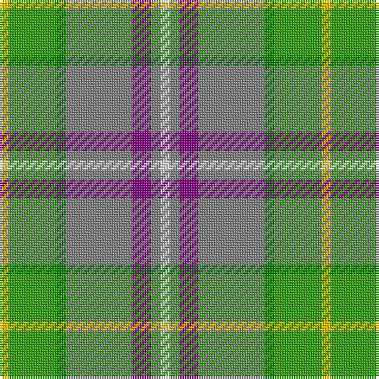

This page is one **sett** — a single exact thread-count. It belongs to the [tartan](/tartans/y1g5ga1n7p2n1ln1/)
(the same proportion at any scale), whose colour order is pattern [WGBGGGY](/stripes/wgbgggy/).

Sourced from weddslist.  It is a [7 stripe tartan](/stripes/stripes7/).

Original link http://www.weddslist.com/cgi-bin/tartans/pg.pl?source=sts

## Thread count
Y/4 G20 Ga4 N28 P8 N4 LN/4

## Palette
Each colour and the base-6 reference it is a variant of.

| Colour | Shade | Base |
|---|---|---|
| G | <code style="background-color:#30A010;">#30A010</code> `oklch(61.9% 0.195 140.5)` <small>#30A010</small> | G <code style="background-color:#006100;">#006100</code> |
| Ga | <code style="background-color:#008000;">#008000</code> `oklch(52.0% 0.177 142.5)` <small>#008000</small> | G <code style="background-color:#006100;">#006100</code> |
| LN | <code style="background-color:#E0E0E0;">#E0E0E0</code> `oklch(90.7% 0.000 89.9)` <small>#E0E0E0</small> | W <code style="background-color:#F7F7F7;">#F7F7F7</code> |
| N | <code style="background-color:#808080;">#808080</code> `oklch(60.0% 0.000 89.9)` <small>#808080</small> | G <code style="background-color:#006100;">#006100</code> |
| P | <code style="background-color:#800080;">#800080</code> `oklch(42.1% 0.193 328.4)` <small>#800080</small> | B <code style="background-color:#2A418A;">#2A418A</code> |
| Y | <code style="background-color:#F0C000;">#F0C000</code> `oklch(82.7% 0.169 90.5)` <small>#F0C000</small> | Y <code style="background-color:#F2BF00;">#F2BF00</code> |

# Sample pattern

## Nearest tartans

The nearest existing variants by ΔTartan distance, with this tartan at the top so the swatches line up against it.

ΔTartan

Tartan

Sett

—

<a href="/ttd/edit/#slug=w1y1p2y7g1g5ly1~x4">Deeside</a> <a class="nn-out" href="/setts/s7/w1y1p2y7g1g5ly1~x4/" title="open its dictionary page">↗</a>

0.76

<a href="/ttd/edit/#slug=g25r9t3ly7w3n11~x3">Montessori School of Denver (School)</a> <a class="nn-out" href="/setts/s6/g25r9t3ly7w3n11~x3/" title="open its dictionary page">↗</a>

1.07

<a href="/ttd/edit/#slug=o3lb2g19lb6g2lb6o14m4w2~x2">Royal Pharmaceutical, Society</a> <a class="nn-out" href="/setts/s9/o3lb2g19lb6g2lb6o14m4w2~x2/" title="open its dictionary page">↗</a>

1.09

<a href="/ttd/edit/#slug=lo5g23b21lo30k10lo4g4lo16lb3~x2">State Seal of Kansas (Fashion)</a> <a class="nn-out" href="/setts/s9/lo5g23b21lo30k10lo4g4lo16lb3~x2/" title="open its dictionary page">↗</a>

1.29

<a href="/ttd/edit/#slug=lo6t16lb3y3o3g3w2~x4">Atikokan (District)</a> <a class="nn-out" href="/setts/s7/lo6t16lb3y3o3g3w2~x4/" title="open its dictionary page">↗</a>

1.38

<a href="/ttd/edit/#slug=db4dg41lo4g4lo4g9o18lo4w4~x2">Gallagher Irish Fashion Tartan Tartan Number: 4053. Earliest known date: 2001 February See products available Copyright © Blair Urquhart, Comrie, 2015</a> <a class="nn-out" href="/setts/s9/db4dg41lo4g4lo4g9o18lo4w4~x2/" title="open its dictionary page">↗</a>

1.41

<a href="/ttd/edit/#slug=db4dg41lo4g4lo4g9r18lo4w4~x2">Gallagher Ancient</a> <a class="nn-out" href="/setts/s9/db4dg41lo4g4lo4g9r18lo4w4~x2/" title="open its dictionary page">↗</a>

1.42

<a href="/ttd/edit/#slug=lo29ly3b19lb3b3r3g17b3g4lb3~x2">State Seal of California (Fashion)</a> <a class="nn-out" href="/setts/s10/lo29ly3b19lb3b3r3g17b3g4lb3~x2/" title="open its dictionary page">↗</a>

1.45

<a href="/ttd/edit/#slug=lb2k2g8g8r1g1w1~x4">Lundy (Personal)</a> <a class="nn-out" href="/setts/s7/lb2k2g8g8r1g1w1~x4/" title="open its dictionary page">↗</a>

1.45

<a href="/ttd/edit/#slug=db2r1db10w1o4g8ly1g2~x4">Ayrshire</a> <a class="nn-out" href="/setts/s8/db2r1db10w1o4g8ly1g2~x4/" title="open its dictionary page">↗</a>

1.46

<a href="/ttd/edit/#slug=r4g3o8w3o4g18ly3~x2">Newfoundland</a> <a class="nn-out" href="/setts/s7/r4g3o8w3o4g18ly3~x2/" title="open its dictionary page">↗</a>

## Neighbour map

Every grey dot is one of 14299 variants placed by the first two principal components of the ΔTartan feature space (44% of its variance). Red is this tartan; blue dots are its nearest — click one to open its page.

<svg viewBox="0 0 640 380" role="img" style="max-width:100%;height:auto;border:1px solid #e0e0e0;border-radius:4px;display:block" xmlns="http://www.w3.org/2000/svg"><image href="/nn/cloud.v1.png" width="640" height="380"/><a href="/setts/s6/g25r9t3ly7w3n11~x3/"><circle cx="182.8" cy="200.3" r="4" fill="#3465a4"><title>Montessori School of Denver (School)</title></circle></a><a href="/setts/s9/o3lb2g19lb6g2lb6o14m4w2~x2/"><circle cx="155.0" cy="164.4" r="4" fill="#3465a4"><title>Royal Pharmaceutical, Society</title></circle></a><a href="/setts/s9/lo5g23b21lo30k10lo4g4lo16lb3~x2/"><circle cx="174.6" cy="180.0" r="4" fill="#3465a4"><title>State Seal of Kansas (Fashion)</title></circle></a><a href="/setts/s7/lo6t16lb3y3o3g3w2~x4/"><circle cx="168.0" cy="167.5" r="4" fill="#3465a4"><title>Atikokan (District)</title></circle></a><a href="/setts/s9/db4dg41lo4g4lo4g9o18lo4w4~x2/"><circle cx="209.7" cy="147.0" r="4" fill="#3465a4"><title>Gallagher Irish Fashion Tartan Tartan Number: 4053. Earliest known date: 2001 February See products available Copyright © Blair Urquhart, Comrie, 2015</title></circle></a><a href="/setts/s9/db4dg41lo4g4lo4g9r18lo4w4~x2/"><circle cx="203.4" cy="143.4" r="4" fill="#3465a4"><title>Gallagher Ancient</title></circle></a><a href="/setts/s10/lo29ly3b19lb3b3r3g17b3g4lb3~x2/"><circle cx="159.9" cy="153.6" r="4" fill="#3465a4"><title>State Seal of California (Fashion)</title></circle></a><a href="/setts/s7/lb2k2g8g8r1g1w1~x4/"><circle cx="157.9" cy="181.2" r="4" fill="#3465a4"><title>Lundy (Personal)</title></circle></a><a href="/setts/s8/db2r1db10w1o4g8ly1g2~x4/"><circle cx="192.0" cy="172.5" r="4" fill="#3465a4"><title>Ayrshire</title></circle></a><a href="/setts/s7/r4g3o8w3o4g18ly3~x2/"><circle cx="225.0" cy="214.5" r="4" fill="#3465a4"><title>Newfoundland</title></circle></a><circle cx="190.1" cy="188.0" r="5" fill="#c00000"/></svg>

ID: /setts/s7/w1y1p2y7g1g5ly1~x4/
