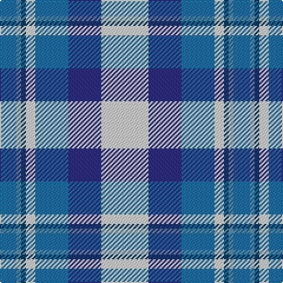

**Bands:** [BBBWBBW](/stripes/bbbwbbw/) · **Stripes:** [B T DT W B DB W](/stripes/stripes7/) B T DT W B DB W

This was sourced from tartans-authority.  It is a [7 band tartan](/bands/bands7/).

Original link http://www.tartansauthority.com/tartan-ferret/display/4778/

## Thread count
LN/40 DBa28 Ba28 LN8 DB4 B4 Ba/14

## Palette
Each colour and its ΔE from the base-6 reference it is a variant of.

| Colour | Shade | Base | ΔE (OKLab) |
|---|---|---|---|
| B | <code style="background-color:#5C8CA8;">#5C8CA8</code> `#5C8CA8` | B <code style="background-color:#2A418A;">#2A418A</code> | 0.23 |
| Ba | <code style="background-color:#1870A4;">#1870A4</code> `#1870A4` | B <code style="background-color:#2A418A;">#2A418A</code> | 0.13 |
| DB | <code style="background-color:#003C64;">#003C64</code> `#003C64` | B <code style="background-color:#2A418A;">#2A418A</code> | 0.08 |
| DBa | <code style="background-color:#2C2C80;">#2C2C80</code> `#2C2C80` | B <code style="background-color:#2A418A;">#2A418A</code> | 0.06 |
| LN | <code style="background-color:#E0E0E0;">#E0E0E0</code> `#E0E0E0` | W <code style="background-color:#F7F7F7;">#F7F7F7</code> | 0.07 |

# Sample pattern

## Nearest tartans

The nearest existing variants by ΔTartan distance.

1. [St Andrews, Earl of, dress](/setts/s7/w28t19db19w4db2lp2db7~x2/) — ΔT 0.72
1. [St. Andrews Dress, Earl of (Danc](/setts/s7/w28t19db19w4db2p2db7~x2/) — ΔT 0.76
1. [Earl of St. Andrews Dress](/setts/s7/w20db14dt14w4db2b2dt7~x2/) — ΔT 0.78
1. [Ferguson, dress](/setts/s7/t34db24w18r3w18g2w3~x2/) — ΔT 1.03
1. [Arran - 1989 (Fashion)](/setts/s8/t12k1t1k1t1db8w9o2~x4/) — ΔT 1.11
1. [Allanton Dress (Fashion)](/setts/s6/g4w28db14ly2t17g4~x2/) — ΔT 1.16
1. [Arran (Pendleton)](/setts/s8/t12k1t1k1t1db8w9y2~x4/) — ΔT 1.18
1. [Afternoon Tea / Mint Tea](/setts/s6/w15lg98dt72b25dt8ly15/) — ΔT 1.20
1. [Strathclyde District Tartan Tartan Number: 1072. Earliest known date: 1975 The navy blue and white are said to represent the 'Scottish Sporting Colours'. This sett is also produced with light blue in place of white. See products available Copyright © Blair Urquhart, Comrie, 2015](/setts/s7/k2lb16w2dt16w15k2w2~x2/) — ΔT 1.23
1. [Conquergood (Name)](/setts/s8/k4t2w11t5o5w2k1t2~x2/) — ΔT 1.25

## Neighbour map

Every grey dot is one of 14299 variants placed by the first two principal components of the ΔTartan feature space (44% of its variance). Red is this tartan; blue dots are its nearest — click one to open its page.

<svg viewBox="0 0 640 380" role="img" style="max-width:100%;height:auto;border:1px solid #e0e0e0;border-radius:4px;display:block" xmlns="http://www.w3.org/2000/svg"><image href="/nn/cloud.v1.png" width="640" height="380"/><a href="/setts/s7/w28t19db19w4db2lp2db7~x2/"><circle cx="174.1" cy="158.0" r="4" fill="#3465a4"><title>St Andrews, Earl of, dress</title></circle></a><a href="/setts/s7/w28t19db19w4db2p2db7~x2/"><circle cx="169.8" cy="155.5" r="4" fill="#3465a4"><title>St. Andrews Dress, Earl of (Danc</title></circle></a><a href="/setts/s7/w20db14dt14w4db2b2dt7~x2/"><circle cx="129.1" cy="171.7" r="4" fill="#3465a4"><title>Earl of St. Andrews Dress</title></circle></a><a href="/setts/s7/t34db24w18r3w18g2w3~x2/"><circle cx="159.1" cy="149.7" r="4" fill="#3465a4"><title>Ferguson, dress</title></circle></a><a href="/setts/s8/t12k1t1k1t1db8w9o2~x4/"><circle cx="156.1" cy="142.4" r="4" fill="#3465a4"><title>Arran - 1989 (Fashion)</title></circle></a><a href="/setts/s6/g4w28db14ly2t17g4~x2/"><circle cx="162.5" cy="163.9" r="4" fill="#3465a4"><title>Allanton Dress (Fashion)</title></circle></a><a href="/setts/s8/t12k1t1k1t1db8w9y2~x4/"><circle cx="158.3" cy="148.0" r="4" fill="#3465a4"><title>Arran (Pendleton)</title></circle></a><a href="/setts/s6/w15lg98dt72b25dt8ly15/"><circle cx="193.2" cy="181.5" r="4" fill="#3465a4"><title>Afternoon Tea / Mint Tea</title></circle></a><a href="/setts/s7/k2lb16w2dt16w15k2w2~x2/"><circle cx="139.4" cy="183.5" r="4" fill="#3465a4"><title>Strathclyde District Tartan Tartan Number: 1072. Earliest known date: 1975 The navy blue and white are said to represent the 'Scottish Sporting Colours'. This sett is also produced with light blue in place of white. See products available Copyright © Blair Urquhart, Comrie, 2015</title></circle></a><a href="/setts/s8/k4t2w11t5o5w2k1t2~x2/"><circle cx="159.7" cy="178.1" r="4" fill="#3465a4"><title>Conquergood (Name)</title></circle></a><circle cx="144.0" cy="181.4" r="5" fill="#c00000"/></svg>

ID: /setts/s7/w20db14b14w4dt2t2b7~x2/
