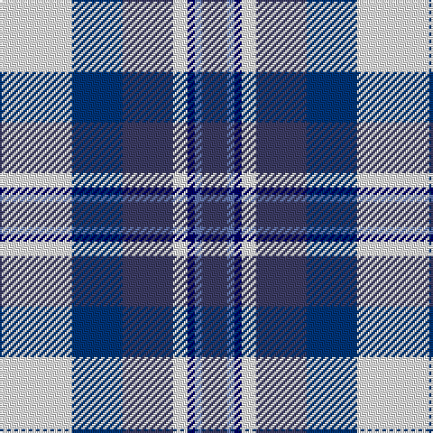

This page is one **sett** — a single exact thread-count. It belongs to the [tartan](/tartans/w20db14n14w4dba2b2n7/)
(the same proportion at any scale), whose colour order is pattern [BBBWBBW](/stripes/bbbwbbw/).

Sourced from register-of-tartans.  It is a [7 stripe tartan](/stripes/stripes7/).

Original link https://www.tartanregister.gov.uk/tartanDetails.aspx?ref=1064

## Register references

External register numbers recorded for this tartan.

- Scottish Register of Tartans: [1064](https://www.tartanregister.gov.uk/tartanDetails.aspx?ref=1064)
- Scottish Tartans Authority (ITI): 4778

## Thread count
W/40 DB28 N28 W8 DBa4 B4 N/14

## Palette
Each colour and the base-6 reference it is a variant of.

| Colour | Shade | Base |
|---|---|---|
| B | <code style="background-color:#6478B0;">#6478B0</code> `oklch(58.0% 0.090 268.5)` <small>#6478B0</small> | B <code style="background-color:#2A418A;">#2A418A</code> |
| DB | <code style="background-color:#003478;">#003478</code> `oklch(34.1% 0.127 258.1)` <small>#003478</small> | B <code style="background-color:#2A418A;">#2A418A</code> |
| DBa | <code style="background-color:#000064;">#000064</code> `oklch(22.7% 0.158 264.1)` <small>#000064</small> | B <code style="background-color:#2A418A;">#2A418A</code> |
| N | <code style="background-color:#3C3C64;">#3C3C64</code> `oklch(37.5% 0.068 282.6)` <small>#3C3C64</small> | B <code style="background-color:#2A418A;">#2A418A</code> |
| W | <code style="background-color:#F8F8F8;">#F8F8F8</code> `oklch(97.9% 0.000 89.9)` <small>#F8F8F8</small> | W <code style="background-color:#F7F7F7;">#F7F7F7</code> |

# Sample pattern

## Nearest tartans

The nearest existing variants by ΔTartan distance, with this tartan at the top so the swatches line up against it.

ΔTartan

Tartan

Sett

—

<a href="/ttd/edit/#slug=w20db14dt14w4db2b2dt7~x2">Earl of St. Andrews Dress</a> <a class="nn-out" href="/setts/s7/w20db14dt14w4db2b2dt7~x2/" title="open its dictionary page">↗</a>

0.78

<a href="/ttd/edit/#slug=w20db14b14w4dt2t2b7~x2">Earl of St. Andrews Dress (Dance)</a> <a class="nn-out" href="/setts/s7/w20db14b14w4dt2t2b7~x2/" title="open its dictionary page">↗</a>

0.86

<a href="/ttd/edit/#slug=w28t19db19w4db2p2db7~x2">St. Andrews Dress, Earl of (Danc</a> <a class="nn-out" href="/setts/s7/w28t19db19w4db2p2db7~x2/" title="open its dictionary page">↗</a>

0.87

<a href="/ttd/edit/#slug=t34db24w18r3w18g2w3~x2">Ferguson, dress</a> <a class="nn-out" href="/setts/s7/t34db24w18r3w18g2w3~x2/" title="open its dictionary page">↗</a>

1.00

<a href="/ttd/edit/#slug=w28t19db19w4db2lp2db7~x2">St Andrews, Earl of, dress</a> <a class="nn-out" href="/setts/s7/w28t19db19w4db2lp2db7~x2/" title="open its dictionary page">↗</a>

1.03

<a href="/ttd/edit/#slug=r2db14k6g1w12g1w2~x4">Davidson (Wedding) (Personal)</a> <a class="nn-out" href="/setts/s7/r2db14k6g1w12g1w2~x4/" title="open its dictionary page">↗</a>

1.04

<a href="/ttd/edit/#slug=t12k1t1k1t1db8w9o2~x4">Arran - 1989 (Fashion)</a> <a class="nn-out" href="/setts/s8/t12k1t1k1t1db8w9o2~x4/" title="open its dictionary page">↗</a>

1.08

<a href="/ttd/edit/#slug=dg4db22db6w10db3w6dp4db3w4~x2">Sibbald Blue (2014)</a> <a class="nn-out" href="/setts/s9/dg4db22db6w10db3w6dp4db3w4~x2/" title="open its dictionary page">↗</a>

1.11

<a href="/ttd/edit/#slug=dg4db22dt6w10db3w6dp4dt3w4~x2">Sibbald Blue (2014)</a> <a class="nn-out" href="/setts/s9/dg4db22dt6w10db3w6dp4dt3w4~x2/" title="open its dictionary page">↗</a>

1.11

<a href="/ttd/edit/#slug=db68k42w32r5w32dg4w6">Ferguson Dress #2</a> <a class="nn-out" href="/setts/s7/db68k42w32r5w32dg4w6/" title="open its dictionary page">↗</a>

1.11

<a href="/ttd/edit/#slug=m1k1w13b13db7k7w13k1m1~x4">Bradey Blue Dress</a> <a class="nn-out" href="/setts/s9/m1k1w13b13db7k7w13k1m1~x4/" title="open its dictionary page">↗</a>

## Neighbour map

Every grey dot is one of 14299 variants placed by the first two principal components of the ΔTartan feature space (44% of its variance). Red is this tartan; blue dots are its nearest — click one to open its page.

<svg viewBox="0 0 640 380" role="img" style="max-width:100%;height:auto;border:1px solid #e0e0e0;border-radius:4px;display:block" xmlns="http://www.w3.org/2000/svg"><image href="/nn/cloud.v1.png" width="640" height="380"/><a href="/setts/s7/w20db14b14w4dt2t2b7~x2/"><circle cx="144.0" cy="181.4" r="4" fill="#3465a4"><title>Earl of St. Andrews Dress (Dance)</title></circle></a><a href="/setts/s7/w28t19db19w4db2p2db7~x2/"><circle cx="169.8" cy="155.5" r="4" fill="#3465a4"><title>St. Andrews Dress, Earl of (Danc</title></circle></a><a href="/setts/s7/t34db24w18r3w18g2w3~x2/"><circle cx="159.1" cy="149.7" r="4" fill="#3465a4"><title>Ferguson, dress</title></circle></a><a href="/setts/s7/w28t19db19w4db2lp2db7~x2/"><circle cx="174.1" cy="158.0" r="4" fill="#3465a4"><title>St Andrews, Earl of, dress</title></circle></a><a href="/setts/s7/r2db14k6g1w12g1w2~x4/"><circle cx="149.4" cy="138.7" r="4" fill="#3465a4"><title>Davidson (Wedding) (Personal)</title></circle></a><a href="/setts/s8/t12k1t1k1t1db8w9o2~x4/"><circle cx="156.1" cy="142.4" r="4" fill="#3465a4"><title>Arran - 1989 (Fashion)</title></circle></a><a href="/setts/s9/dg4db22db6w10db3w6dp4db3w4~x2/"><circle cx="125.9" cy="163.5" r="4" fill="#3465a4"><title>Sibbald Blue (2014)</title></circle></a><a href="/setts/s9/dg4db22dt6w10db3w6dp4dt3w4~x2/"><circle cx="123.4" cy="164.9" r="4" fill="#3465a4"><title>Sibbald Blue (2014)</title></circle></a><a href="/setts/s7/db68k42w32r5w32dg4w6/"><circle cx="160.2" cy="148.1" r="4" fill="#3465a4"><title>Ferguson Dress #2</title></circle></a><a href="/setts/s9/m1k1w13b13db7k7w13k1m1~x4/"><circle cx="154.9" cy="135.2" r="4" fill="#3465a4"><title>Bradey Blue Dress</title></circle></a><circle cx="129.1" cy="171.7" r="5" fill="#c00000"/></svg>

ID: /setts/s7/w20db14dt14w4db2b2dt7~x2/
