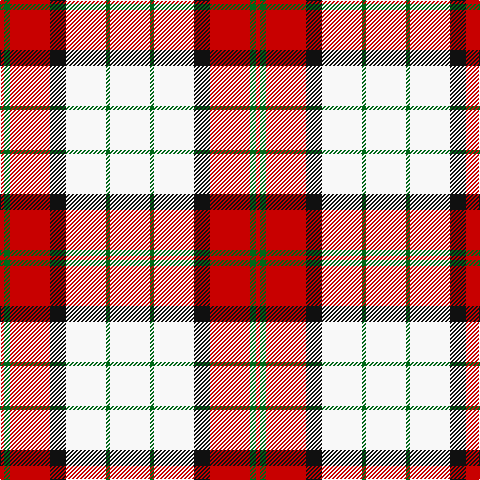

This page is one **sett** — a single exact thread-count. It belongs to the [tartan](/tartans/w20g2w20k8r20g3r2/)
(the same proportion at any scale), whose colour order is pattern [RGRKWGW](/stripes/rgrkwgw/).

Sourced from register-of-tartans.  It is a [7 stripe tartan](/stripes/stripes7/).

Original link https://www.tartanregister.gov.uk/tartanDetails.aspx?ref=437

2 attestations — the source records this cloth was collapsed from (oldest owns this page)

<ul>
<li>01/01/2006 — Bull-Dog Sauce (register-of-tartans, <a href="https://www.tartanregister.gov.uk/tartanDetails.aspx?ref=437">record</a>)</li>
<li>pre 2006 — Bull-Dog Sauce (Corporate) (tartans-authority, <a href="http://www.tartansauthority.com/tartan-ferret/display/7070/">record</a>)</li>
</ul>

## Register references

External register numbers recorded for this tartan.

- Scottish Register of Tartans: [437](https://www.tartanregister.gov.uk/tartanDetails.aspx?ref=437)
- Scottish Tartans Authority (ITI): 7070

## Thread count
W/40 G4 W40 K16 R40 G6 R/4

## Palette

Palette: <strong>Tartan Register</strong>
<table><thead><tr><th>Colour</th><th>Threads</th><th>Shade</th><th>Base</th><th>OKLCh</th></tr></thead><tbody><tr><td>W/</td><td style="text-align:right;font-variant-numeric:tabular-nums">40</td><td><code style="background-color:#F8F8F8;">#F8F8F8</code> <small style="color:#888">#F8F8F8</small></td><td>W <code style="background-color:#F7F7F7;">#F7F7F7</code></td><td><small style="color:#888">oklch(97.9% 0.000 89.9)</small></td></tr><tr><td>G</td><td style="text-align:right;font-variant-numeric:tabular-nums">4</td><td><code style="background-color:#006818;">#006818</code> <small style="color:#888">#006818</small></td><td>G <code style="background-color:#006100;">#006100</code></td><td><small style="color:#888">oklch(45.0% 0.142 145.0)</small></td></tr><tr><td>W</td><td style="text-align:right;font-variant-numeric:tabular-nums">40</td><td><code style="background-color:#F8F8F8;">#F8F8F8</code> <small style="color:#888">#F8F8F8</small></td><td>W <code style="background-color:#F7F7F7;">#F7F7F7</code></td><td><small style="color:#888">oklch(97.9% 0.000 89.9)</small></td></tr><tr><td>K</td><td style="text-align:right;font-variant-numeric:tabular-nums">16</td><td><code style="background-color:#101010;">#101010</code> <small style="color:#888">#101010</small></td><td>K <code style="background-color:#000000;">#000000</code></td><td><small style="color:#888">oklch(17.3% 0.000 89.9)</small></td></tr><tr><td>R</td><td style="text-align:right;font-variant-numeric:tabular-nums">40</td><td><code style="background-color:#C80000;">#C80000</code> <small style="color:#888">#C80000</small></td><td>R <code style="background-color:#CC0000;">#CC0000</code></td><td><small style="color:#888">oklch(52.3% 0.215 29.2)</small></td></tr><tr><td>G</td><td style="text-align:right;font-variant-numeric:tabular-nums">6</td><td><code style="background-color:#006818;">#006818</code> <small style="color:#888">#006818</small></td><td>G <code style="background-color:#006100;">#006100</code></td><td><small style="color:#888">oklch(45.0% 0.142 145.0)</small></td></tr><tr><td>R/</td><td style="text-align:right;font-variant-numeric:tabular-nums">4</td><td><code style="background-color:#C80000;">#C80000</code> <small style="color:#888">#C80000</small></td><td>R <code style="background-color:#CC0000;">#CC0000</code></td><td><small style="color:#888">oklch(52.3% 0.215 29.2)</small></td></tr></tbody></table>

# Sample pattern

## Nearest tartans

The nearest existing variants by ΔTartan distance, with this tartan at the top so the swatches line up against it.

ΔTartan

Tartan

Sett

—

<a href="/ttd/edit/#slug=w20g2w20k8r20g3r2~x2">Bull-Dog Sauce</a> <a class="nn-out" href="/setts/s7/w20g2w20k8r20g3r2~x2/" title="open its dictionary page">↗</a>

1.11

<a href="/ttd/edit/#slug=w4k2w25r21w3r8ly3~x2">MacPherson Dress Burgundy (Dance)</a> <a class="nn-out" href="/setts/s7/w4k2w25r21w3r8ly3~x2/" title="open its dictionary page">↗</a>

1.24

<a href="/ttd/edit/#slug=w5p3w26r20w3r8ly3~x2">MacPherson, Red</a> <a class="nn-out" href="/setts/s7/w5p3w26r20w3r8ly3~x2/" title="open its dictionary page">↗</a>

1.27

<a href="/ttd/edit/#slug=w18db4w18r30w18db4w9dp4">Milne Dress Family Tartan Tartan Number: 634. Earliest known date: pre 2003 Milnes are usually regarded as being a Sept of the Gordons or of the Ogilvys. See products available Copyright © Blair Urquhart, Comrie, 2015</a> <a class="nn-out" href="/setts/s8/w18db4w18r30w18db4w9dp4/" title="open its dictionary page">↗</a>

1.27

<a href="/ttd/edit/#slug=w18db4w18r30w18db4w9p4">Milne, dress</a> <a class="nn-out" href="/setts/s8/w18db4w18r30w18db4w9p4/" title="open its dictionary page">↗</a>

1.30

<a href="/ttd/edit/#slug=w5dp3w26r20w3r8ly3~x2">MacPherson Dress Red (Dance)</a> <a class="nn-out" href="/setts/s7/w5dp3w26r20w3r8ly3~x2/" title="open its dictionary page">↗</a>

1.36

<a href="/ttd/edit/#slug=lb12lo75k22w12k22w16lb8">Orange Fanaticos</a> <a class="nn-out" href="/setts/s7/lb12lo75k22w12k22w16lb8/" title="open its dictionary page">↗</a>

1.50

<a href="/ttd/edit/#slug=w13r3w2k5w2r3w13db8~x2">Boswell Dress Personal Tartan Tartan Number: 6359. Earliest known date: 2004 A tartan for William Boswell of Balmuto in Fife. See products available Copyright © Blair Urquhart, Comrie, 2015</a> <a class="nn-out" href="/setts/s8/w13r3w2k5w2r3w13db8~x2/" title="open its dictionary page">↗</a>

1.50

<a href="/ttd/edit/#slug=t1r3k2w1r8w1k2w9k1w3t1~x6">MacRae, Dress Red (Dance)</a> <a class="nn-out" href="/setts/s11/t1r3k2w1r8w1k2w9k1w3t1~x6/" title="open its dictionary page">↗</a>

1.51

<a href="/ttd/edit/#slug=w5k2w30r24w3r8dt3~x2">Arduaine, Red (Dance)</a> <a class="nn-out" href="/setts/s7/w5k2w30r24w3r8dt3~x2/" title="open its dictionary page">↗</a>

1.53

<a href="/ttd/edit/#slug=w5k20w2r5w20r2~x2">Gangs of New York Fashion Check Tartan Tartan Number: 8248. Earliest known date: 8th July 2010 The period was the 1860s, a rather attractive time for men, all frock coats and top hats. Narrow-leg trousers and checks were fashionable. I accentuated Daniel's height and slenderness by extending his top hat, making his trousers thinner and his shoes longer. The other members of his gang were dressed along the same lines but not so finely: no one had the same presence as Bill the Butcher. See products available Copyright © Blair Urquhart, Comrie, 2015</a> <a class="nn-out" href="/setts/s6/w5k20w2r5w20r2~x2/" title="open its dictionary page">↗</a>

## Neighbour map

Every grey dot is one of 14359 variants placed by the first two principal components of the ΔTartan feature space (44% of its variance). Red is this tartan; blue dots are its nearest — click one to open its page.

<svg viewBox="0 0 640 380" role="img" style="max-width:100%;height:auto;border:1px solid #e0e0e0;border-radius:4px;display:block" xmlns="http://www.w3.org/2000/svg"><image href="/nn/cloud.v1.png" width="640" height="380"/><a href="/setts/s7/w4k2w25r21w3r8ly3~x2/"><circle cx="263.6" cy="153.5" r="4" fill="#3465a4"><title>MacPherson Dress Burgundy (Dance)</title></circle></a><a href="/setts/s7/w5p3w26r20w3r8ly3~x2/"><circle cx="263.8" cy="169.4" r="4" fill="#3465a4"><title>MacPherson, Red</title></circle></a><a href="/setts/s8/w18db4w18r30w18db4w9dp4/"><circle cx="268.3" cy="189.9" r="4" fill="#3465a4"><title>Milne Dress Family Tartan Tartan Number: 634. Earliest known date: pre 2003 Milnes are usually regarded as being a Sept of the Gordons or of the Ogilvys. See products available Copyright © Blair Urquhart, Comrie, 2015</title></circle></a><a href="/setts/s8/w18db4w18r30w18db4w9p4/"><circle cx="269.3" cy="190.8" r="4" fill="#3465a4"><title>Milne, dress</title></circle></a><a href="/setts/s7/w5dp3w26r20w3r8ly3~x2/"><circle cx="265.3" cy="169.6" r="4" fill="#3465a4"><title>MacPherson Dress Red (Dance)</title></circle></a><a href="/setts/s7/lb12lo75k22w12k22w16lb8/"><circle cx="187.8" cy="161.7" r="4" fill="#3465a4"><title>Orange Fanaticos</title></circle></a><a href="/setts/s8/w13r3w2k5w2r3w13db8~x2/"><circle cx="245.4" cy="191.5" r="4" fill="#3465a4"><title>Boswell Dress Personal Tartan Tartan Number: 6359. Earliest known date: 2004 A tartan for William Boswell of Balmuto in Fife. See products available Copyright © Blair Urquhart, Comrie, 2015</title></circle></a><a href="/setts/s11/t1r3k2w1r8w1k2w9k1w3t1~x6/"><circle cx="183.8" cy="138.1" r="4" fill="#3465a4"><title>MacRae, Dress Red (Dance)</title></circle></a><a href="/setts/s7/w5k2w30r24w3r8dt3~x2/"><circle cx="295.3" cy="141.5" r="4" fill="#3465a4"><title>Arduaine, Red (Dance)</title></circle></a><a href="/setts/s6/w5k20w2r5w20r2~x2/"><circle cx="249.8" cy="188.6" r="4" fill="#3465a4"><title>Gangs of New York Fashion Check Tartan Tartan Number: 8248. Earliest known date: 8th July 2010 The period was the 1860s, a rather attractive time for men, all frock coats and top hats. Narrow-leg trousers and checks were fashionable. I accentuated Daniel's height and slenderness by extending his top hat, making his trousers thinner and his shoes longer. The other members of his gang were dressed along the same lines but not so finely: no one had the same presence as Bill the Butcher. See products available Copyright © Blair Urquhart, Comrie, 2015</title></circle></a><circle cx="228.8" cy="167.7" r="5" fill="#c00000"/></svg>

ID: /setts/s7/w20g2w20k8r20g3r2~x2/
