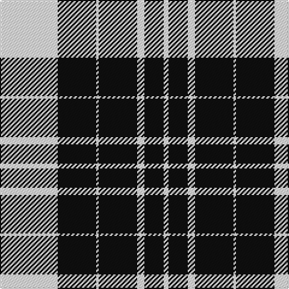

**Bands:** [WKWKWKW](/stripes/wkwkwkw/) · **Stripes:** [W K W K W K W](/stripes/stripes7/) W K W K W K W

This was sourced from tartans-authority.  It is a [7 band tartan](/bands/bands7/).

Original link http://www.tartansauthority.com/tartan-ferret/display/8525/

## Variants

Other setts woven to the same stripe pattern.

- [Scott (Abbreviated)](/setts/s7/w2k1w6k6w2k1w1~x2/)

## Thread count
W/48 K32 W2 K32 W6 K16 W/4

## Palette
Each colour and its ΔE from the base-6 reference it is a variant of.

| Colour | Shade | Base | ΔE (OKLab) |
|---|---|---|---|
| K | <code style="background-color:#101010;">#101010</code> `#101010` | K <code style="background-color:#000000;">#000000</code> | 0.17 |
| W | <code style="background-color:#FCFCFC;">#FCFCFC</code> `#FCFCFC` | W <code style="background-color:#F7F7F7;">#F7F7F7</code> | 0.01 |

# Sample pattern

## Nearest tartans

The nearest existing variants by ΔTartan distance.

1. [St. Piran Cornish Flag](/setts/s8/w5k20w10k1r2~x2/) — ΔT 1.19
1. [MacLeod, Black & White](/setts/s5/w8k1w8k12w1~x2/) — ΔT 1.30
1. [Cornish Flag (District)](/setts/s5/w5k20w10k1r2~x2/) — ΔT 1.33
1. [Menzies Dress Tartan Tartan Number: 12444. Earliest known date: See products available Copyright © Blair Urquhart, Comrie, 2015](/setts/s9/w6k1w2k4w4k2w4k15r1~x2/) — ΔT 1.35
1. [Gretna Football Club (Corporate)](/setts/s7/w36k8w36k95w4k4r6/) — ΔT 1.37
1. [MacPhee MacFee or MacIver](/setts/s5/k22w3k3w11k1~x2/) — ΔT 1.37
1. [MacPherson of Cluny (Black and White)](/setts/s7/w5r3w35k28w4k11w2~x2/) — ΔT 1.45
1. [MacKnight (Name)](/setts/s9/k12lr1k2lr6k4lr3k4lr21r4~x2/) — ΔT 1.51
1. [Nowell/Noel 1951 (Name)](/setts/s8/lr3k24lr6k8w4k8lr35k2~x2/) — ΔT 1.58
1. [McPartlin (Personal)](/setts/s5/k27w29k5w14r2~x2/) — ΔT 1.63

## Neighbour map

Every grey dot is one of 14299 variants placed by the first two principal components of the ΔTartan feature space (44% of its variance). Red is this tartan; blue dots are its nearest — click one to open its page.

<svg viewBox="0 0 640 380" role="img" style="max-width:100%;height:auto;border:1px solid #e0e0e0;border-radius:4px;display:block" xmlns="http://www.w3.org/2000/svg"><image href="/nn/cloud.v1.png" width="640" height="380"/><a href="/setts/s8/w5k20w10k1r2~x2/"><circle cx="344.7" cy="170.9" r="4" fill="#3465a4"><title>St. Piran Cornish Flag</title></circle></a><a href="/setts/s5/w8k1w8k12w1~x2/"><circle cx="320.2" cy="229.4" r="4" fill="#3465a4"><title>MacLeod, Black &amp; White</title></circle></a><a href="/setts/s5/w5k20w10k1r2~x2/"><circle cx="325.2" cy="181.5" r="4" fill="#3465a4"><title>Cornish Flag (District)</title></circle></a><a href="/setts/s9/w6k1w2k4w4k2w4k15r1~x2/"><circle cx="316.1" cy="166.3" r="4" fill="#3465a4"><title>Menzies Dress Tartan Tartan Number: 12444. Earliest known date: See products available Copyright © Blair Urquhart, Comrie, 2015</title></circle></a><a href="/setts/s7/w36k8w36k95w4k4r6/"><circle cx="346.4" cy="144.0" r="4" fill="#3465a4"><title>Gretna Football Club (Corporate)</title></circle></a><a href="/setts/s5/k22w3k3w11k1~x2/"><circle cx="413.0" cy="196.9" r="4" fill="#3465a4"><title>MacPhee MacFee or MacIver</title></circle></a><a href="/setts/s7/w5r3w35k28w4k11w2~x2/"><circle cx="302.1" cy="157.5" r="4" fill="#3465a4"><title>MacPherson of Cluny (Black and White)</title></circle></a><a href="/setts/s9/k12lr1k2lr6k4lr3k4lr21r4~x2/"><circle cx="326.0" cy="159.4" r="4" fill="#3465a4"><title>MacKnight (Name)</title></circle></a><a href="/setts/s8/lr3k24lr6k8w4k8lr35k2~x2/"><circle cx="305.1" cy="169.2" r="4" fill="#3465a4"><title>Nowell/Noel 1951 (Name)</title></circle></a><a href="/setts/s5/k27w29k5w14r2~x2/"><circle cx="299.8" cy="200.8" r="4" fill="#3465a4"><title>McPartlin (Personal)</title></circle></a><circle cx="350.8" cy="183.1" r="5" fill="#c00000"/></svg>

ID: /setts/s7/w24k16w1k16w3k8w2~x2/
