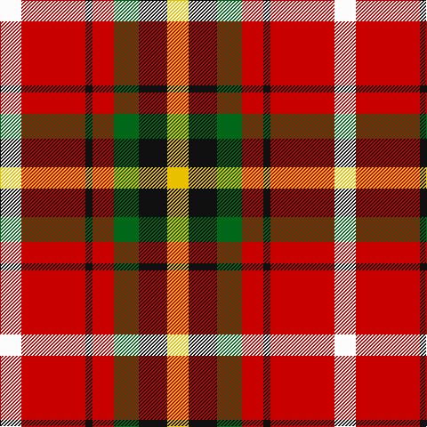

In pattern [WRKRGKY](/patterns/wrkrgky/).

This was sourced from register-of-tartans.  It is a [7 stripes tartan](/stripes/stripes7/).

Original link https://www.tartanregister.gov.uk/tartanDetails.aspx?ref=4102

## Thread count
W/24 R72 K8 R24 G28 K32 Y/24

## Palette
Each colour and its ΔE from the base-6 reference it is a variant of.

| Colour | Shade | Base | ΔE (OKLab) |
|---|---|---|---|
| G | <code style="background-color:#006818;">#006818</code> `#006818` | G <code style="background-color:#006400;">#006400</code> | 0.02 |
| K | <code style="background-color:#101010;">#101010</code> `#101010` | K <code style="background-color:#000000;">#000000</code> | 0.17 |
| R | <code style="background-color:#C80000;">#C80000</code> `#C80000` | R <code style="background-color:#C80000;">#C80000</code> | 0.00 |
| W | <code style="background-color:#FCFCFC;">#FCFCFC</code> `#FCFCFC` | W <code style="background-color:#F4F4F0;">#F4F4F0</code> | 0.03 |
| Y | <code style="background-color:#E8C000;">#E8C000</code> `#E8C000` | Y <code style="background-color:#E8C000;">#E8C000</code> | 0.00 |

# Sample pattern

## Nearest tartans

The nearest existing variants by ΔTartan distance.

1. [Abbink, Ingmar (Personal)](/setts/s5/r78b44k22y44g10-b5c8ca8-g288028-k101010-ra00000-yfccc00/) — ΔT 1.07
1. [Abbink, Ingmar (Personal)](/setts/s5/r78b44k22y44g10-b5f749c-g649848-k101010-rc8002c-yf8e38c/) — ΔT 1.22
1. [Keeling (Corporate)](/setts/s7/y34g14y12r86k10ra12k26-g289c18-k101010-rc80000-ra888888-ye8c000/) — ΔT 1.22
1. [Carolyn, Melieres](/setts/s10/y8w4y4w16r32g6r6g16r12k4-g008000-k000000-rc00000-we0e0e0-yf0c000/) — ΔT 1.25
1. [Melieres, Carolyn (Personal)](/setts/s10/y8w4y4w16r32g6r6g16r12k4-g006818-k101010-rc80000-we0e0e0-ye8c000/) — ΔT 1.25
1. [Rose, White dress](/setts/s6/r32b6k6g6w18k3-b304080-g008000-k000000-rc00000-we0e0e0/) — ΔT 1.26
1. [Scottish American Athletic Assoc](/setts/s5/y64k42r32ya12b8-b344054-k101010-r901c1c-ye8c000-yab8b8b8/) — ΔT 1.29
1. [Rose Dress White Dress Clan Tartan Tartan Number: 1227. Earliest known date: 1930-50 This sample comes from the MacGregor-Hastie collection which forms the basis of the cloth archive of the Scottish Tartans Society. Stocked by Dalgliesh See products available Copyright © Blair Urquhart, Comrie, 2015](/setts/s6/r32b6k6g6w18k3-b2c2c80-g006818-k101010-rc80000-we0e0e0/) — ΔT 1.30
1. [Keeling](/setts/s7/y34g14y12r86k10ga12k26-g008000-ga848484-k000000-rcd0000-yffff00/) — ΔT 1.34
1. [Thirkill](/setts/s9/w8k4r30k4r10g14ga14k4y8-g5c6428-ga003820-k101010-rc80000-we0e0e0-ye8c000/) — ΔT 1.36

## Neighbour map

Every grey dot is one of 15726 variants placed by the first two principal components of the ΔTartan feature space (44% of its variance). Red is this tartan; blue dots are its nearest — click one to open its page.

<svg viewBox="0 0 640 380" role="img" style="max-width:100%;height:auto;border:1px solid #e0e0e0;border-radius:4px;display:block" xmlns="http://www.w3.org/2000/svg"><image href="/nn/cloud.v1.png" width="640" height="380"/><a href="/setts/s5/r78b44k22y44g10-b5c8ca8-g288028-k101010-ra00000-yfccc00/"><circle cx="130.7" cy="210.3" r="4" fill="#3465a4"><title>Abbink, Ingmar (Personal)</title></circle></a><a href="/setts/s5/r78b44k22y44g10-b5f749c-g649848-k101010-rc8002c-yf8e38c/"><circle cx="130.7" cy="206.1" r="4" fill="#3465a4"><title>Abbink, Ingmar (Personal)</title></circle></a><a href="/setts/s7/y34g14y12r86k10ra12k26-g289c18-k101010-rc80000-ra888888-ye8c000/"><circle cx="185.0" cy="160.2" r="4" fill="#3465a4"><title>Keeling (Corporate)</title></circle></a><a href="/setts/s10/y8w4y4w16r32g6r6g16r12k4-g008000-k000000-rc00000-we0e0e0-yf0c000/"><circle cx="168.1" cy="157.3" r="4" fill="#3465a4"><title>Carolyn, Melieres</title></circle></a><a href="/setts/s10/y8w4y4w16r32g6r6g16r12k4-g006818-k101010-rc80000-we0e0e0-ye8c000/"><circle cx="173.6" cy="158.8" r="4" fill="#3465a4"><title>Melieres, Carolyn (Personal)</title></circle></a><a href="/setts/s6/r32b6k6g6w18k3-b304080-g008000-k000000-rc00000-we0e0e0/"><circle cx="179.3" cy="158.1" r="4" fill="#3465a4"><title>Rose, White dress</title></circle></a><a href="/setts/s5/y64k42r32ya12b8-b344054-k101010-r901c1c-ye8c000-yab8b8b8/"><circle cx="130.1" cy="199.8" r="4" fill="#3465a4"><title>Scottish American Athletic Assoc</title></circle></a><a href="/setts/s6/r32b6k6g6w18k3-b2c2c80-g006818-k101010-rc80000-we0e0e0/"><circle cx="186.8" cy="159.6" r="4" fill="#3465a4"><title>Rose Dress White Dress Clan Tartan Tartan Number: 1227. Earliest known date: 1930-50 This sample comes from the MacGregor-Hastie collection which forms the basis of the cloth archive of the Scottish Tartans Society. Stocked by Dalgliesh See products available Copyright © Blair Urquhart, Comrie, 2015</title></circle></a><a href="/setts/s7/y34g14y12r86k10ga12k26-g008000-ga848484-k000000-rcd0000-yffff00/"><circle cx="161.9" cy="152.2" r="4" fill="#3465a4"><title>Keeling</title></circle></a><a href="/setts/s9/w8k4r30k4r10g14ga14k4y8-g5c6428-ga003820-k101010-rc80000-we0e0e0-ye8c000/"><circle cx="119.3" cy="158.7" r="4" fill="#3465a4"><title>Thirkill</title></circle></a><circle cx="149.5" cy="183.4" r="5" fill="#c00000"/></svg>

ID: /setts/s7/w24r72k8r24g28k32y24-g006818-k101010-rc80000-wfcfcfc-ye8c000/
