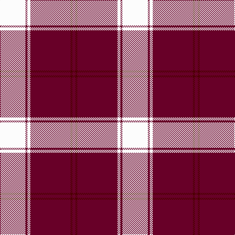

This page is one **sett** — a single exact thread-count. It belongs to the [tartan](/tartans/w26dr2w3dr15dr26dr2dr3/)
(the same proportion at any scale), whose colour order is pattern [BBBBWBW](/stripes/bbbbwbw/).

Sourced from tartans-authority.  It is a [7 stripe tartan](/stripes/stripes7/).

Original link http://www.tartansauthority.com/tartan-ferret/display/4960/

## Thread count
W/52 DRb4 W6 DRa30 DRa52 DR4 DRa/6

## Palette

Palette: <strong>Tartan Register</strong>
<table><thead><tr><th>Colour</th><th>Threads</th><th>Shade</th><th>Base</th><th>OKLCh</th></tr></thead><tbody><tr><td>W/</td><td style="text-align:right;font-variant-numeric:tabular-nums">52</td><td><code style="background-color:#FCFCFC;">#FCFCFC</code> <small style="color:#888">#FCFCFC</small></td><td>W <code style="background-color:#F7F7F7;">#F7F7F7</code></td><td><small style="color:#888">oklch(99.1% 0.000 89.9)</small></td></tr><tr><td>DRb</td><td style="text-align:right;font-variant-numeric:tabular-nums">4</td><td><code style="background-color:#680028;">#680028</code> <small style="color:#888">#680028</small></td><td>B <code style="background-color:#2A418A;">#2A418A</code></td><td><small style="color:#888">oklch(33.1% 0.133 8.3)</small></td></tr><tr><td>W</td><td style="text-align:right;font-variant-numeric:tabular-nums">6</td><td><code style="background-color:#FCFCFC;">#FCFCFC</code> <small style="color:#888">#FCFCFC</small></td><td>W <code style="background-color:#F7F7F7;">#F7F7F7</code></td><td><small style="color:#888">oklch(99.1% 0.000 89.9)</small></td></tr><tr><td>DRa</td><td style="text-align:right;font-variant-numeric:tabular-nums">30</td><td><code style="background-color:#680028;">#680028</code> <small style="color:#888">#680028</small></td><td>B <code style="background-color:#2A418A;">#2A418A</code></td><td><small style="color:#888">oklch(33.1% 0.133 8.3)</small></td></tr><tr><td>DRa</td><td style="text-align:right;font-variant-numeric:tabular-nums">52</td><td><code style="background-color:#680028;">#680028</code> <small style="color:#888">#680028</small></td><td>B <code style="background-color:#2A418A;">#2A418A</code></td><td><small style="color:#888">oklch(33.1% 0.133 8.3)</small></td></tr><tr><td>DR</td><td style="text-align:right;font-variant-numeric:tabular-nums">4</td><td><code style="background-color:#4C0000;">#4C0000</code> <small style="color:#888">#4C0000</small></td><td>B <code style="background-color:#2A418A;">#2A418A</code></td><td><small style="color:#888">oklch(26.2% 0.107 29.2)</small></td></tr><tr><td>DRa/</td><td style="text-align:right;font-variant-numeric:tabular-nums">6</td><td><code style="background-color:#680028;">#680028</code> <small style="color:#888">#680028</small></td><td>B <code style="background-color:#2A418A;">#2A418A</code></td><td><small style="color:#888">oklch(33.1% 0.133 8.3)</small></td></tr></tbody></table>

# Sample pattern

## Nearest tartans

The nearest existing variants by ΔTartan distance, with this tartan at the top so the swatches line up against it.

ΔTartan

Tartan

Sett

—

<a href="/ttd/edit/#slug=w26dr2w3dr15dr26dr2dr3~x2">Gavin (Personal)</a> <a class="nn-out" href="/setts/s7/w26dr2w3dr15dr26dr2dr3~x2/" title="open its dictionary page">↗</a>

1.23

<a href="/ttd/edit/#slug=w1r12g2r2w16r2g2r12lo1~x4">MacFie Dress</a> <a class="nn-out" href="/setts/s9/w1r12g2r2w16r2g2r12lo1~x4/" title="open its dictionary page">↗</a>

1.29

<a href="/ttd/edit/#slug=w4k2w25r21w3r8ly3~x2">MacPherson Dress Burgundy (Dance)</a> <a class="nn-out" href="/setts/s7/w4k2w25r21w3r8ly3~x2/" title="open its dictionary page">↗</a>

1.35

<a href="/ttd/edit/#slug=k2w28r13w2r13w2~x2">Buchanan #5</a> <a class="nn-out" href="/setts/s6/k2w28r13w2r13w2~x2/" title="open its dictionary page">↗</a>

1.37

<a href="/ttd/edit/#slug=m8w4m50k12m4k15m5~x2">Instakilt, Pink (Fashion)</a> <a class="nn-out" href="/setts/s7/m8w4m50k12m4k15m5~x2/" title="open its dictionary page">↗</a>

1.39

<a href="/ttd/edit/#slug=r50db14w6db9ly3db4r4~x2">Texas Lone Star</a> <a class="nn-out" href="/setts/s7/r50db14w6db9ly3db4r4~x2/" title="open its dictionary page">↗</a>

1.41

<a href="/ttd/edit/#slug=m3w1m20k8w8g2~x4">Nisbet Dress Rose (Dance)</a> <a class="nn-out" href="/setts/s6/m3w1m20k8w8g2~x4/" title="open its dictionary page">↗</a>

1.44

<a href="/ttd/edit/#slug=r6lb3r37k16lb16g4~x2">Nesbit, Rose</a> <a class="nn-out" href="/setts/s6/r6lb3r37k16lb16g4~x2/" title="open its dictionary page">↗</a>

1.48

<a href="/ttd/edit/#slug=w5r2w34r34k2r2ly4~x2">Cunningham Dress Burgundy (Dance)</a> <a class="nn-out" href="/setts/s7/w5r2w34r34k2r2ly4~x2/" title="open its dictionary page">↗</a>

1.55

<a href="/ttd/edit/#slug=r80lb40k5lo6">Broberg (Scania) (Personal)</a> <a class="nn-out" href="/setts/s4/r80lb40k5lo6/" title="open its dictionary page">↗</a>

1.59

<a href="/ttd/edit/#slug=w5k2w30r24w3r8dt3~x2">Arduaine, Red (Dance)</a> <a class="nn-out" href="/setts/s7/w5k2w30r24w3r8dt3~x2/" title="open its dictionary page">↗</a>

## Neighbour map

Every grey dot is one of 14299 variants placed by the first two principal components of the ΔTartan feature space (44% of its variance). Red is this tartan; blue dots are its nearest — click one to open its page.

<svg viewBox="0 0 640 380" role="img" style="max-width:100%;height:auto;border:1px solid #e0e0e0;border-radius:4px;display:block" xmlns="http://www.w3.org/2000/svg"><image href="/nn/cloud.v1.png" width="640" height="380"/><a href="/setts/s9/w1r12g2r2w16r2g2r12lo1~x4/"><circle cx="309.4" cy="134.0" r="4" fill="#3465a4"><title>MacFie Dress</title></circle></a><a href="/setts/s7/w4k2w25r21w3r8ly3~x2/"><circle cx="264.9" cy="152.7" r="4" fill="#3465a4"><title>MacPherson Dress Burgundy (Dance)</title></circle></a><a href="/setts/s6/k2w28r13w2r13w2~x2/"><circle cx="322.9" cy="170.6" r="4" fill="#3465a4"><title>Buchanan #5</title></circle></a><a href="/setts/s7/m8w4m50k12m4k15m5~x2/"><circle cx="365.9" cy="153.6" r="4" fill="#3465a4"><title>Instakilt, Pink (Fashion)</title></circle></a><a href="/setts/s7/r50db14w6db9ly3db4r4~x2/"><circle cx="350.1" cy="123.4" r="4" fill="#3465a4"><title>Texas Lone Star</title></circle></a><a href="/setts/s6/m3w1m20k8w8g2~x4/"><circle cx="301.4" cy="152.0" r="4" fill="#3465a4"><title>Nisbet Dress Rose (Dance)</title></circle></a><a href="/setts/s6/r6lb3r37k16lb16g4~x2/"><circle cx="266.8" cy="172.0" r="4" fill="#3465a4"><title>Nesbit, Rose</title></circle></a><a href="/setts/s7/w5r2w34r34k2r2ly4~x2/"><circle cx="280.9" cy="120.7" r="4" fill="#3465a4"><title>Cunningham Dress Burgundy (Dance)</title></circle></a><a href="/setts/s4/r80lb40k5lo6/"><circle cx="361.7" cy="182.5" r="4" fill="#3465a4"><title>Broberg (Scania) (Personal)</title></circle></a><a href="/setts/s7/w5k2w30r24w3r8dt3~x2/"><circle cx="296.8" cy="140.9" r="4" fill="#3465a4"><title>Arduaine, Red (Dance)</title></circle></a><circle cx="305.0" cy="151.5" r="5" fill="#c00000"/></svg>

ID: /setts/s7/w26dr2w3dr15dr26dr2dr3~x2/
