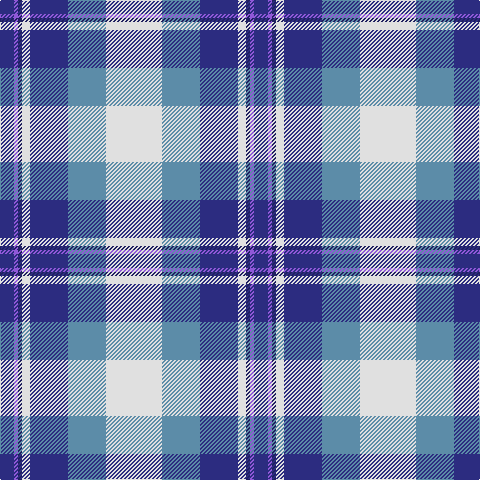

In pattern [BBBWBBW](/patterns/bbbwbbw/).

This was sourced from tartans-authority.  It is a [7 stripes tartan](/stripes/stripes7/).

Original link http://www.tartansauthority.com/tartan-ferret/display/45/

## Thread count
DB/14 P4 DBa4 LN8 DB38 B38 LN/56

## Palette
Each colour and its ΔE from the base-6 reference it is a variant of.

| Colour | Shade | Base | ΔE (OKLab) |
|---|---|---|---|
| B | <code style="background-color:#5C8CA8;">#5C8CA8</code> `#5C8CA8` | B <code style="background-color:#2A418A;">#2A418A</code> | 0.23 |
| DB | <code style="background-color:#2C2C80;">#2C2C80</code> `#2C2C80` | B <code style="background-color:#2A418A;">#2A418A</code> | 0.06 |
| DBa | <code style="background-color:#202060;">#202060</code> `#202060` | B <code style="background-color:#2A418A;">#2A418A</code> | 0.11 |
| LN | <code style="background-color:#E0E0E0;">#E0E0E0</code> `#E0E0E0` | W <code style="background-color:#F7F7F7;">#F7F7F7</code> | 0.07 |
| P | <code style="background-color:#9058D8;">#9058D8</code> `#9058D8` | B <code style="background-color:#2A418A;">#2A418A</code> | 0.21 |

# Sample pattern

## Nearest tartans

The nearest existing variants by ΔTartan distance.

1. [St Andrews Dress, Earl of.. District Tartan Tartan Number: 45. Earliest known date: pre 2003 See products available Copyright © Blair Urquhart, Comrie, 2015](/setts/s7/w28b19ba19w4bb2wa2ba7~b5c8ca8-ba2c2c80-bb202060-we0e0e0-wac49cd8~x2/) — ΔT 0.06
1. [St Andrews, Earl of, dress](/setts/s7/w28b19ba19w4bb2wa2ba7~b5480b0-ba304080-bb000050-we0e0e0-wac0a0e0~x2/) — ΔT 0.23
1. [Ferguson, dress](/setts/s7/b34ba24w18r3w18g2w3~b5480b0-ba000050-g008000-rc00000-we0e0e0~x2/) — ΔT 0.58
1. [Ferguson Dress Clan Tartan Tartan Number: 92. Earliest known date: 1980 See also 371 where the dark blue is changed to black. These are problably one and the same tartan. Dark blue being the correct colour. See products available Copyright © Blair Urquhart, Comrie, 2015](/setts/s7/b34ba24w18r3w18g2w3~b588ca8-ba202060-g006818-r880000-we0e0e0~x2/) — ΔT 0.61
1. [Earl of St. Andrews Dress (Dance)](/setts/s7/w20b14ba14w4bb2bc2ba7~b2c2c80-ba1870a4-bb003c64-bc5c8ca8-we0e0e0~x2/) — ΔT 0.75
1. [Arran - 1989 (Fashion)](/setts/s8/b12k1b1k1b1ba8w9r2~b5c8ca8-ba202060-k101010-r888888-wfcfcfc~x4/) — ΔT 0.82
1. [Earl of St. Andrews Dress](/setts/s7/w20b14ba14w4bb2bc2ba7~b003478-ba3c3c64-bb000064-bc6478b0-wf8f8f8~x2/) — ΔT 0.86
1. [Manx Dress](/setts/s6/g4w28b8y2ba17g4~b780078-ba2c2c80-g006818-we0e0e0-ye8c000~x2/) — ΔT 0.91
1. [Manx, dress](/setts/s6/g4w28b8y2ba17g4~b800080-ba304080-g008000-we0e0e0-yf0c000~x2/) — ΔT 1.02
1. [Allanton Dress (Fashion)](/setts/s6/g4w28b14y2ba17g4~b2c2c80-ba5c8ca8-g006818-we0e0e0-ye8c000~x2/) — ΔT 1.02

## Neighbour map

Every grey dot is one of 15726 variants placed by the first two principal components of the ΔTartan feature space (44% of its variance). Red is this tartan; blue dots are its nearest — click one to open its page.

<svg viewBox="0 0 640 380" role="img" style="max-width:100%;height:auto;border:1px solid #e0e0e0;border-radius:4px;display:block" xmlns="http://www.w3.org/2000/svg"><image href="/nn/cloud.v1.png" width="640" height="380"/><a href="/setts/s7/w28b19ba19w4bb2wa2ba7~b5c8ca8-ba2c2c80-bb202060-we0e0e0-wac49cd8~x2/"><circle cx="166.8" cy="156.4" r="4" fill="#3465a4"><title>St Andrews Dress, Earl of.. District Tartan Tartan Number: 45. Earliest known date: pre 2003 See products available Copyright © Blair Urquhart, Comrie, 2015</title></circle></a><a href="/setts/s7/w28b19ba19w4bb2wa2ba7~b5480b0-ba304080-bb000050-we0e0e0-wac0a0e0~x2/"><circle cx="171.1" cy="158.4" r="4" fill="#3465a4"><title>St Andrews, Earl of, dress</title></circle></a><a href="/setts/s7/b34ba24w18r3w18g2w3~b5480b0-ba000050-g008000-rc00000-we0e0e0~x2/"><circle cx="155.8" cy="151.5" r="4" fill="#3465a4"><title>Ferguson, dress</title></circle></a><a href="/setts/s7/b34ba24w18r3w18g2w3~b588ca8-ba202060-g006818-r880000-we0e0e0~x2/"><circle cx="165.0" cy="153.2" r="4" fill="#3465a4"><title>Ferguson Dress Clan Tartan Tartan Number: 92. Earliest known date: 1980 See also 371 where the dark blue is changed to black. These are problably one and the same tartan. Dark blue being the correct colour. See products available Copyright © Blair Urquhart, Comrie, 2015</title></circle></a><a href="/setts/s7/w20b14ba14w4bb2bc2ba7~b2c2c80-ba1870a4-bb003c64-bc5c8ca8-we0e0e0~x2/"><circle cx="140.6" cy="181.3" r="4" fill="#3465a4"><title>Earl of St. Andrews Dress (Dance)</title></circle></a><a href="/setts/s8/b12k1b1k1b1ba8w9r2~b5c8ca8-ba202060-k101010-r888888-wfcfcfc~x4/"><circle cx="152.8" cy="143.4" r="4" fill="#3465a4"><title>Arran - 1989 (Fashion)</title></circle></a><a href="/setts/s7/w20b14ba14w4bb2bc2ba7~b003478-ba3c3c64-bb000064-bc6478b0-wf8f8f8~x2/"><circle cx="125.8" cy="173.9" r="4" fill="#3465a4"><title>Earl of St. Andrews Dress</title></circle></a><a href="/setts/s6/g4w28b8y2ba17g4~b780078-ba2c2c80-g006818-we0e0e0-ye8c000~x2/"><circle cx="178.9" cy="153.5" r="4" fill="#3465a4"><title>Manx Dress</title></circle></a><a href="/setts/s6/g4w28b8y2ba17g4~b800080-ba304080-g008000-we0e0e0-yf0c000~x2/"><circle cx="182.2" cy="154.2" r="4" fill="#3465a4"><title>Manx, dress</title></circle></a><a href="/setts/s6/g4w28b14y2ba17g4~b2c2c80-ba5c8ca8-g006818-we0e0e0-ye8c000~x2/"><circle cx="159.6" cy="164.6" r="4" fill="#3465a4"><title>Allanton Dress (Fashion)</title></circle></a><circle cx="166.8" cy="156.6" r="5" fill="#c00000"/></svg>

ID: /setts/s7/w28b19ba19w4bb2bc2ba7~b5c8ca8-ba2c2c80-bb202060-bc9058d8-we0e0e0~x2/
