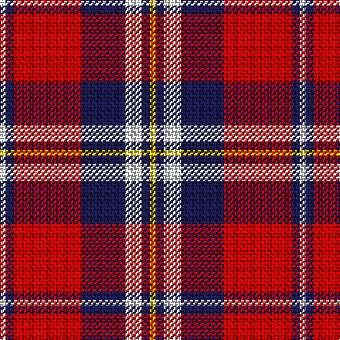

In pattern [WBRBWBY](/patterns/wbrbwby/).

This was sourced from tartans-authority.  It is a [7 stripes tartan](/stripes/stripes7/).

Original link http://www.tartansauthority.com/tartan-ferret/display/7689/

## Attestations

This cloth appears in 2 source records; the oldest owns this page.

- pre 2008 — Fazzolettone (Fashion?) (tartans-authority, [record](http://www.tartansauthority.com/tartan-ferret/display/7689/))
- undated — Fazzolettone (register-of-tartans, [record](https://www.tartanregister.gov.uk/tartanDetails.aspx?ref=5688))

## Thread count
LN/4 DB6 R48 DB30 LN12 DB6 Y/4

## Palette
Each colour and its ΔE from the base-6 reference it is a variant of.

| Colour | Shade | Base | ΔE (OKLab) |
|---|---|---|---|
| DB | <code style="background-color:#1C1C50;">#1C1C50</code> `#1C1C50` | B <code style="background-color:#2A418A;">#2A418A</code> | 0.14 |
| LN | <code style="background-color:#E0E0E0;">#E0E0E0</code> `#E0E0E0` | W <code style="background-color:#F7F7F7;">#F7F7F7</code> | 0.07 |
| R | <code style="background-color:#C80000;">#C80000</code> `#C80000` | R <code style="background-color:#CC0000;">#CC0000</code> | 0.01 |
| Y | <code style="background-color:#E8C000;">#E8C000</code> `#E8C000` | Y <code style="background-color:#F2BF00;">#F2BF00</code> | 0.02 |

# Sample pattern

## Nearest tartans

The nearest existing variants by ΔTartan distance.

1. [Suntan (Masai Shuka) (District?)](/setts/s6/k3r11b3w1b3w1~b38409c-k101010-rc80000-we0e0e0~x4/) — ΔT 0.80
1. [Superfast Ferries (Corporate)](/setts/s6/b1r16b6y4b6w1~b2c2c80-rc80000-we0e0e0-ye8c000~x4/) — ΔT 0.86
1. [Memery (Reston, USA)](/setts/s9/w4k6r3k15r3k6r27b9w2~b271b86-k120a01-rda412d-wf7f1e8~x2/) — ΔT 0.90
1. [Galloway Red](/setts/s6/g3r2b22r22b2w3~b2c2c80-g006818-rc80000-wfcfcfc~x2/) — ΔT 0.97
1. [Memery (Name)](/setts/s9/w4k6r3k15r3k6r27b9w2~b2c2c80-k101010-rc80000-we0e0e0~x2/) — ΔT 0.98
1. [Ainslie](/setts/s9/b12k3b2r2b2r12w2k1w2~b2c2c80-k101010-rc80000-wfcfcfc~x4/) — ΔT 0.99
1. [Henkel (Corporate)](/setts/s6/k3g28k3r22k8w3~g808080-k101010-rc80000-wfcfcfc~x2/) — ΔT 1.09
1. [MacTavish](/setts/s6/w2r12b2w6k6w1~b00004c-k000000-rc80000-wd0d0d0~x2/) — ΔT 1.12
1. [Fraser Gathering, Red](/setts/s9/r2b12r2g11r4b5g2r24w2~b000050-g008000-rc00000-we0e0e0~x2/) — ΔT 1.14
1. [Thompson/Thomson/MacTavish](/setts/s6/b2r12ba2b6k6b1~b3c82af-ba2c4084-k101010-rdc0000~x4/) — ΔT 1.14

## Neighbour map

Every grey dot is one of 15726 variants placed by the first two principal components of the ΔTartan feature space (44% of its variance). Red is this tartan; blue dots are its nearest — click one to open its page.

<svg viewBox="0 0 640 380" role="img" style="max-width:100%;height:auto;border:1px solid #e0e0e0;border-radius:4px;display:block" xmlns="http://www.w3.org/2000/svg"><image href="/nn/cloud.v1.png" width="640" height="380"/><a href="/setts/s6/k3r11b3w1b3w1~b38409c-k101010-rc80000-we0e0e0~x4/"><circle cx="265.1" cy="182.2" r="4" fill="#3465a4"><title>Suntan (Masai Shuka) (District?)</title></circle></a><a href="/setts/s6/b1r16b6y4b6w1~b2c2c80-rc80000-we0e0e0-ye8c000~x4/"><circle cx="278.9" cy="172.6" r="4" fill="#3465a4"><title>Superfast Ferries (Corporate)</title></circle></a><a href="/setts/s9/w4k6r3k15r3k6r27b9w2~b271b86-k120a01-rda412d-wf7f1e8~x2/"><circle cx="224.2" cy="155.8" r="4" fill="#3465a4"><title>Memery (Reston, USA)</title></circle></a><a href="/setts/s6/g3r2b22r22b2w3~b2c2c80-g006818-rc80000-wfcfcfc~x2/"><circle cx="276.1" cy="182.0" r="4" fill="#3465a4"><title>Galloway Red</title></circle></a><a href="/setts/s9/w4k6r3k15r3k6r27b9w2~b2c2c80-k101010-rc80000-we0e0e0~x2/"><circle cx="235.3" cy="160.4" r="4" fill="#3465a4"><title>Memery (Name)</title></circle></a><a href="/setts/s9/b12k3b2r2b2r12w2k1w2~b2c2c80-k101010-rc80000-wfcfcfc~x4/"><circle cx="220.2" cy="156.3" r="4" fill="#3465a4"><title>Ainslie</title></circle></a><a href="/setts/s6/k3g28k3r22k8w3~g808080-k101010-rc80000-wfcfcfc~x2/"><circle cx="221.6" cy="192.0" r="4" fill="#3465a4"><title>Henkel (Corporate)</title></circle></a><a href="/setts/s6/w2r12b2w6k6w1~b00004c-k000000-rc80000-wd0d0d0~x2/"><circle cx="184.6" cy="179.4" r="4" fill="#3465a4"><title>MacTavish</title></circle></a><a href="/setts/s9/r2b12r2g11r4b5g2r24w2~b000050-g008000-rc00000-we0e0e0~x2/"><circle cx="261.8" cy="162.0" r="4" fill="#3465a4"><title>Fraser Gathering, Red</title></circle></a><a href="/setts/s6/b2r12ba2b6k6b1~b3c82af-ba2c4084-k101010-rdc0000~x4/"><circle cx="215.3" cy="194.3" r="4" fill="#3465a4"><title>Thompson/Thomson/MacTavish</title></circle></a><circle cx="239.1" cy="163.2" r="5" fill="#c00000"/></svg>

ID: /setts/s7/w2b3r24b15w6b3y2~b1c1c50-rc80000-we0e0e0-ye8c000~x2/
