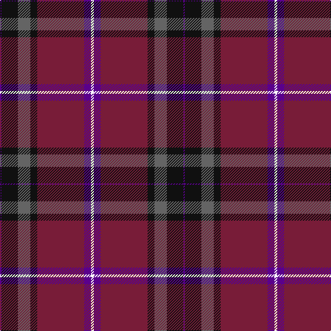

In pattern [BKBKRBW](/patterns/bkbkrbw/).

This was sourced from register-of-tartans.  It is a [7 stripes tartan](/stripes/stripes7/).

Original link https://www.tartanregister.gov.uk/tartanDetails.aspx?ref=11249

## Thread count
P/2 K24 N18 K10 DR68 P10 W/4

## Palette
Each colour and its ΔE from the base-6 reference it is a variant of.

| Colour | Shade | Base | ΔE (OKLab) |
|---|---|---|---|
| DR | <code style="background-color:#781C38;">#781C38</code> `#781C38` | R <code style="background-color:#CC0000;">#CC0000</code> | 0.18 |
| K | <code style="background-color:#101010;">#101010</code> `#101010` | K <code style="background-color:#000000;">#000000</code> | 0.17 |
| N | <code style="background-color:#646464;">#646464</code> `#646464` | B <code style="background-color:#2A418A;">#2A418A</code> | 0.16 |
| P | <code style="background-color:#5A008C;">#5A008C</code> `#5A008C` | B <code style="background-color:#2A418A;">#2A418A</code> | 0.13 |
| W | <code style="background-color:#FFFFFF;">#FFFFFF</code> `#FFFFFF` | W <code style="background-color:#F7F7F7;">#F7F7F7</code> | 0.02 |

# Sample pattern

## Nearest tartans

The nearest existing variants by ΔTartan distance.

1. [Heather Mead (Personal)](/setts/s8/r13g16ga4b4ga4b34y1b1x2~b440044-g003820-ga005020-r9c68a4-ya08858/) — ΔT 1.00
1. [Thomson, Reona Ellen (Personal)](/setts/s7/w2b5r34k5ra9k12b1x2~b780078-k101010-ra00048-ra888888-wfcfcfc/) — ΔT 1.16
1. [Highland Prince (Fashion)](/setts/s7/r32ra2g2b30r1b2y1x2~b202060-g006818-r880000-rac80000-yfccc00/) — ΔT 1.24
1. [Java Saint Andrew Society Dress](/setts/s7/b50r26k9r4w2y2r10x2~b003c64-k101010-rc80000-we0e0e0-yd09800/) — ΔT 1.31
1. [Heather Mead (Personal)](/setts/s8/b13g16ga4ba1ga4ba34y1ba1x2~b780078-ba440044-g003820-ga006818-ye8c000/) — ΔT 1.33
1. [Robb Dress (Personal)](/setts/s8/b2r1g26r18b26ga1r1b2x2~b440044-g003820-ga789484-rc80000/) — ΔT 1.37
1. [Murdoch](/setts/s6/k2r1b17r17ba1y2x4~b304080-ba102040-k000000-r802040-yf0c000/) — ΔT 1.45
1. [European Judo Union](/setts/s6/r28ra1b18y2g1b18x2~b2c2c80-g006818-ra00000-rac80000-yfccc00/) — ΔT 1.46
1. [McKnight #2 (Personal)](/setts/s7/b4y1r28ba24k5b5k3x4~b2888c4-ba2c2c80-k101010-rc80000-ye8c000/) — ΔT 1.47
1. [Royal Scottish Assurance](/setts/s9/b26g11r8k2r2w2r4w1r15x2~b304080-g004010-k000000-rc00000-we0e0e0/) — ΔT 1.50

## Neighbour map

Every grey dot is one of 15726 variants placed by the first two principal components of the ΔTartan feature space (44% of its variance). Red is this tartan; blue dots are its nearest — click one to open its page.

<svg viewBox="0 0 640 380" role="img" style="max-width:100%;height:auto;border:1px solid #e0e0e0;border-radius:4px;display:block" xmlns="http://www.w3.org/2000/svg"><image href="/nn/cloud.v1.png" width="640" height="380"/><a href="/setts/s8/r13g16ga4b4ga4b34y1b1x2~b440044-g003820-ga005020-r9c68a4-ya08858/"><circle cx="340.9" cy="137.9" r="4" fill="#3465a4"><title>Heather Mead (Personal)</title></circle></a><a href="/setts/s7/w2b5r34k5ra9k12b1x2~b780078-k101010-ra00048-ra888888-wfcfcfc/"><circle cx="311.7" cy="118.7" r="4" fill="#3465a4"><title>Thomson, Reona Ellen (Personal)</title></circle></a><a href="/setts/s7/r32ra2g2b30r1b2y1x2~b202060-g006818-r880000-rac80000-yfccc00/"><circle cx="386.2" cy="132.5" r="4" fill="#3465a4"><title>Highland Prince (Fashion)</title></circle></a><a href="/setts/s7/b50r26k9r4w2y2r10x2~b003c64-k101010-rc80000-we0e0e0-yd09800/"><circle cx="312.3" cy="135.0" r="4" fill="#3465a4"><title>Java Saint Andrew Society Dress</title></circle></a><a href="/setts/s8/b13g16ga4ba1ga4ba34y1ba1x2~b780078-ba440044-g003820-ga006818-ye8c000/"><circle cx="349.9" cy="139.6" r="4" fill="#3465a4"><title>Heather Mead (Personal)</title></circle></a><a href="/setts/s8/b2r1g26r18b26ga1r1b2x2~b440044-g003820-ga789484-rc80000/"><circle cx="304.3" cy="151.8" r="4" fill="#3465a4"><title>Robb Dress (Personal)</title></circle></a><a href="/setts/s6/k2r1b17r17ba1y2x4~b304080-ba102040-k000000-r802040-yf0c000/"><circle cx="312.8" cy="168.5" r="4" fill="#3465a4"><title>Murdoch</title></circle></a><a href="/setts/s6/r28ra1b18y2g1b18x2~b2c2c80-g006818-ra00000-rac80000-yfccc00/"><circle cx="364.1" cy="159.9" r="4" fill="#3465a4"><title>European Judo Union</title></circle></a><a href="/setts/s7/b4y1r28ba24k5b5k3x4~b2888c4-ba2c2c80-k101010-rc80000-ye8c000/"><circle cx="247.7" cy="128.4" r="4" fill="#3465a4"><title>McKnight #2 (Personal)</title></circle></a><a href="/setts/s9/b26g11r8k2r2w2r4w1r15x2~b304080-g004010-k000000-rc00000-we0e0e0/"><circle cx="250.8" cy="125.0" r="4" fill="#3465a4"><title>Royal Scottish Assurance</title></circle></a><circle cx="331.0" cy="134.5" r="5" fill="#c00000"/></svg>

ID: /setts/s7/w2b5r34k5ba9k12b1x2~b5a008c-ba646464-k101010-r781c38-wffffff/
