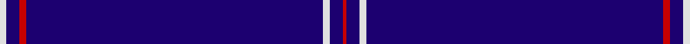

In pattern [RBWBRBW](/stripes/rbwbrbw/).

This was sourced from register-of-tartans.  It is a [7 stripe tartan](/stripes/stripes7/).

Original link https://www.tartanregister.gov.uk/tartanDetails.aspx?ref=3866

## Attestations

This cloth appears in 2 source records; the oldest owns this page.

- 01/03/2007 — Spirit of Ulster (register-of-tartans, [record](https://www.tartanregister.gov.uk/tartanDetails.aspx?ref=3866))
- March 2007 — Spirit of Ulster (Fashion) (tartans-authority, [record](http://www.tartansauthority.com/tartan-ferret/display/7194/))

## Register references

External register numbers recorded for this tartan.

- Scottish Register of Tartans: [3866](https://www.tartanregister.gov.uk/tartanDetails.aspx?ref=3866)
- Scottish Tartans Authority (ITI): 7194

## Thread count
LN/4 DB8 R4 DB180 LN4 DB8 R/2

## Palette
Each colour and the base-6 reference it is a variant of.

| Colour | Shade | Base |
|---|---|---|
| DB | <code style="background-color:#1C0070;">#1C0070</code> `oklch(26.3% 0.162 277.1)` <small>#1C0070</small> | B <code style="background-color:#2A418A;">#2A418A</code> |
| LN | <code style="background-color:#E0E0E0;">#E0E0E0</code> `oklch(90.7% 0.000 89.9)` <small>#E0E0E0</small> | W <code style="background-color:#F7F7F7;">#F7F7F7</code> |
| O | <code style="background-color:#E86000;">#E86000</code> `oklch(65.3% 0.187 44.9)` <small>#E86000</small> | R <code style="background-color:#CC0000;">#CC0000</code> |
| Oa | <code style="background-color:#DC943C;">#DC943C</code> `oklch(72.3% 0.133 67.9)` <small>#DC943C</small> | Y <code style="background-color:#F2BF00;">#F2BF00</code> |
| R | <code style="background-color:#C80000;">#C80000</code> `oklch(52.3% 0.215 29.2)` <small>#C80000</small> | R <code style="background-color:#CC0000;">#CC0000</code> |

# Sample pattern

## Nearest tartans

The nearest existing variants by ΔTartan distance.

1. [Greenock Morton F. C. (Corporate)](/setts/s5/db19w6db105ly4db5/) — ΔT 1.72
1. [Weir Minerals (Corporate)](/setts/s4/db80w1lo8w3~x2/) — ΔT 2.23
1. [Mack of Stoneywood Dress (Personal)](/setts/s8/db80r1db2r1db6r10db1r7~x2/) — ΔT 2.25
1. [Easton (2014)](/setts/s7/r3db2ly1db50w1db2lb3~x2/) — ΔT 2.54
1. [Easton (2014)](/setts/s7/r3db2ly1db50w1db2t3~x2/) — ΔT 2.76
1. [Auchairne (Corporate)](/setts/s6/b11db7b3db70lb4db6~x2/) — ΔT 2.79
1. [MacLaine of Lochbuie Hunting](/setts/s5/db32r3db4k1ly3/) — ΔT 2.85
1. [Duke of York (Royal)](/setts/s8/db61r6w2r8lo2db3lo2db15~x2/) — ΔT 2.88
1. [Norwich No.030](/setts/s6/db33g3r1~x2/) — ΔT 3.04
1. [Auchairne](/setts/s6/b10db6b3db62w4db5~x2/) — ΔT 3.09

## Neighbour map

Every grey dot is one of 14299 variants placed by the first two principal components of the ΔTartan feature space (44% of its variance). Red is this tartan; blue dots are its nearest — click one to open its page.

<svg viewBox="0 0 640 380" role="img" style="max-width:100%;height:auto;border:1px solid #e0e0e0;border-radius:4px;display:block" xmlns="http://www.w3.org/2000/svg"><image href="/nn/cloud.v1.png" width="640" height="380"/><a href="/setts/s5/db19w6db105ly4db5/"><circle cx="626.0" cy="194.9" r="4" fill="#3465a4"><title>Greenock Morton F. C. (Corporate)</title></circle></a><a href="/setts/s4/db80w1lo8w3~x2/"><circle cx="626.0" cy="169.4" r="4" fill="#3465a4"><title>Weir Minerals (Corporate)</title></circle></a><a href="/setts/s8/db80r1db2r1db6r10db1r7~x2/"><circle cx="626.0" cy="138.9" r="4" fill="#3465a4"><title>Mack of Stoneywood Dress (Personal)</title></circle></a><a href="/setts/s7/r3db2ly1db50w1db2lb3~x2/"><circle cx="626.0" cy="99.3" r="4" fill="#3465a4"><title>Easton (2014)</title></circle></a><a href="/setts/s7/r3db2ly1db50w1db2t3~x2/"><circle cx="626.0" cy="108.7" r="4" fill="#3465a4"><title>Easton (2014)</title></circle></a><a href="/setts/s6/b11db7b3db70lb4db6~x2/"><circle cx="613.4" cy="198.4" r="4" fill="#3465a4"><title>Auchairne (Corporate)</title></circle></a><a href="/setts/s5/db32r3db4k1ly3/"><circle cx="575.7" cy="165.6" r="4" fill="#3465a4"><title>MacLaine of Lochbuie Hunting</title></circle></a><a href="/setts/s8/db61r6w2r8lo2db3lo2db15~x2/"><circle cx="551.2" cy="141.5" r="4" fill="#3465a4"><title>Duke of York (Royal)</title></circle></a><a href="/setts/s6/db33g3r1~x2/"><circle cx="626.0" cy="225.9" r="4" fill="#3465a4"><title>Norwich No.030</title></circle></a><a href="/setts/s6/b10db6b3db62w4db5~x2/"><circle cx="553.1" cy="185.2" r="4" fill="#3465a4"><title>Auchairne</title></circle></a><circle cx="626.0" cy="142.6" r="5" fill="#c00000"/></svg>

ID: /setts/s7/w2db4r2db90w2db4r1~x2/
