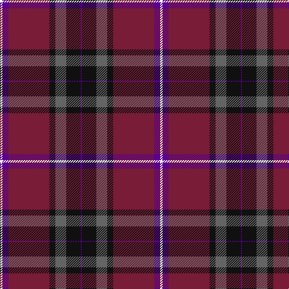

This page is one **sett** — a single exact thread-count. It belongs to the [tartan](/tartans/w2p5dr34k5n9k12p1/)
(the same proportion at any scale), whose colour order is pattern [BKBKRBW](/stripes/bkbkrbw/).

Sourced from register-of-tartans.  It is a [7 stripe tartan](/stripes/stripes7/).

Original link https://www.tartanregister.gov.uk/tartanDetails.aspx?ref=11249

## Register references

External register numbers recorded for this tartan.

- Scottish Register of Tartans: [11249](https://www.tartanregister.gov.uk/tartanDetails.aspx?ref=11249)

## Thread count
W/4 P10 DR68 K10 N18 K24 P/2

## Palette
Each colour and the base-6 reference it is a variant of.

| Colour | Shade | Base |
|---|---|---|
| DR | <code style="background-color:#781C38;">#781C38</code> `oklch(38.7% 0.127 7.4)` <small>#781C38</small> | R <code style="background-color:#CC0000;">#CC0000</code> |
| K | <code style="background-color:#101010;">#101010</code> `oklch(17.3% 0.000 89.9)` <small>#101010</small> | K <code style="background-color:#000000;">#000000</code> |
| N | <code style="background-color:#646464;">#646464</code> `oklch(50.3% 0.000 89.9)` <small>#646464</small> | B <code style="background-color:#2A418A;">#2A418A</code> |
| P | <code style="background-color:#5A008C;">#5A008C</code> `oklch(37.0% 0.191 306.3)` <small>#5A008C</small> | B <code style="background-color:#2A418A;">#2A418A</code> |
| W | <code style="background-color:#FFFFFF;">#FFFFFF</code> `oklch(100.0% 0.000 89.9)` <small>#FFFFFF</small> | W <code style="background-color:#F7F7F7;">#F7F7F7</code> |

# Sample pattern

## Nearest tartans

The nearest existing variants by ΔTartan distance, with this tartan at the top so the swatches line up against it.

ΔTartan

Tartan

Sett

—

<a href="/ttd/edit/#slug=w2dp5m34k5n9k12dp1~x2">Thomson, Reona Ellen (Personal)</a> <a class="nn-out" href="/setts/s7/w2dp5m34k5n9k12dp1~x2/" title="open its dictionary page">↗</a>

1.00

<a href="/ttd/edit/#slug=m13dg16dg4dp4dg4dp34lo1dp1~x2">Heather Mead (Personal)</a> <a class="nn-out" href="/setts/s8/m13dg16dg4dp4dg4dp34lo1dp1~x2/" title="open its dictionary page">↗</a>

1.17

<a href="/ttd/edit/#slug=w2dp5m34k5o9k12dp1~x2">Thomson, Reona Ellen (Personal)</a> <a class="nn-out" href="/setts/s7/w2dp5m34k5o9k12dp1~x2/" title="open its dictionary page">↗</a>

1.24

<a href="/ttd/edit/#slug=r32r2g2db30r1db2ly1~x2">Highland Prince (Fashion)</a> <a class="nn-out" href="/setts/s7/r32r2g2db30r1db2ly1~x2/" title="open its dictionary page">↗</a>

1.31

<a href="/ttd/edit/#slug=dt50r26k9r4w2lo2r10~x2">Java Saint Andrew Society Dress</a> <a class="nn-out" href="/setts/s7/dt50r26k9r4w2lo2r10~x2/" title="open its dictionary page">↗</a>

1.33

<a href="/ttd/edit/#slug=dp13dg16g4dp1g4dp34ly1dp1~x2">Heather Mead (Personal)</a> <a class="nn-out" href="/setts/s8/dp13dg16g4dp1g4dp34ly1dp1~x2/" title="open its dictionary page">↗</a>

1.37

<a href="/ttd/edit/#slug=dp2r1dg26r18dp26y1r1dp2~x2">Robb Dress (Personal)</a> <a class="nn-out" href="/setts/s8/dp2r1dg26r18dp26y1r1dp2~x2/" title="open its dictionary page">↗</a>

1.45

<a href="/ttd/edit/#slug=k2m1db17m17dt1ly2~x4">Murdoch</a> <a class="nn-out" href="/setts/s6/k2m1db17m17dt1ly2~x4/" title="open its dictionary page">↗</a>

1.46

<a href="/ttd/edit/#slug=r28r1db18ly2g1db18~x2">European Judo Union</a> <a class="nn-out" href="/setts/s6/r28r1db18ly2g1db18~x2/" title="open its dictionary page">↗</a>

1.46

<a href="/ttd/edit/#slug=t4ly1r28db24k5t5k3~x4">McKnight #2 (Personal)</a> <a class="nn-out" href="/setts/s7/t4ly1r28db24k5t5k3~x4/" title="open its dictionary page">↗</a>

1.50

<a href="/ttd/edit/#slug=db26dg11r8k2r2w2r4w1r15~x2">Royal Scottish Assurance</a> <a class="nn-out" href="/setts/s9/db26dg11r8k2r2w2r4w1r15~x2/" title="open its dictionary page">↗</a>

## Neighbour map

Every grey dot is one of 14299 variants placed by the first two principal components of the ΔTartan feature space (44% of its variance). Red is this tartan; blue dots are its nearest — click one to open its page.

<svg viewBox="0 0 640 380" role="img" style="max-width:100%;height:auto;border:1px solid #e0e0e0;border-radius:4px;display:block" xmlns="http://www.w3.org/2000/svg"><image href="/nn/cloud.v1.png" width="640" height="380"/><a href="/setts/s8/m13dg16dg4dp4dg4dp34lo1dp1~x2/"><circle cx="342.6" cy="143.2" r="4" fill="#3465a4"><title>Heather Mead (Personal)</title></circle></a><a href="/setts/s7/w2dp5m34k5o9k12dp1~x2/"><circle cx="312.4" cy="117.7" r="4" fill="#3465a4"><title>Thomson, Reona Ellen (Personal)</title></circle></a><a href="/setts/s7/r32r2g2db30r1db2ly1~x2/"><circle cx="387.2" cy="136.0" r="4" fill="#3465a4"><title>Highland Prince (Fashion)</title></circle></a><a href="/setts/s7/dt50r26k9r4w2lo2r10~x2/"><circle cx="313.7" cy="134.4" r="4" fill="#3465a4"><title>Java Saint Andrew Society Dress</title></circle></a><a href="/setts/s8/dp13dg16g4dp1g4dp34ly1dp1~x2/"><circle cx="351.4" cy="147.1" r="4" fill="#3465a4"><title>Heather Mead (Personal)</title></circle></a><a href="/setts/s8/dp2r1dg26r18dp26y1r1dp2~x2/"><circle cx="305.7" cy="155.0" r="4" fill="#3465a4"><title>Robb Dress (Personal)</title></circle></a><a href="/setts/s6/k2m1db17m17dt1ly2~x4/"><circle cx="314.4" cy="171.7" r="4" fill="#3465a4"><title>Murdoch</title></circle></a><a href="/setts/s6/r28r1db18ly2g1db18~x2/"><circle cx="365.1" cy="160.3" r="4" fill="#3465a4"><title>European Judo Union</title></circle></a><a href="/setts/s7/t4ly1r28db24k5t5k3~x4/"><circle cx="249.4" cy="128.7" r="4" fill="#3465a4"><title>McKnight #2 (Personal)</title></circle></a><a href="/setts/s9/db26dg11r8k2r2w2r4w1r15~x2/"><circle cx="252.3" cy="125.7" r="4" fill="#3465a4"><title>Royal Scottish Assurance</title></circle></a><circle cx="332.1" cy="137.3" r="5" fill="#c00000"/></svg>

ID: /setts/s7/w2dp5m34k5n9k12dp1~x2/
