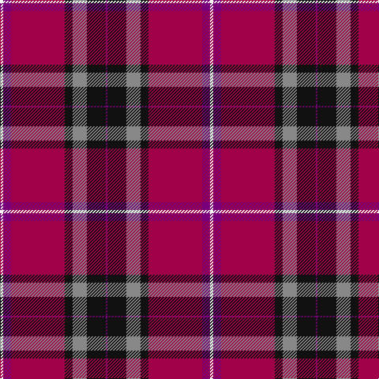

This page is one **sett** — a single exact thread-count. It belongs to the [tartan](/tartans/w2dp5m34k5o9k12dp1/)
(the same proportion at any scale), whose colour order is pattern [BKRKRBW](/stripes/bkrkrbw/).

Sourced from tartans-authority.  It is a [7 stripe tartan](/stripes/stripes7/).

Original link http://www.tartansauthority.com/tartan-ferret/display/11249/

## Register references

External register numbers recorded for this tartan.

- Scottish Register of Tartans: [11249](https://www.tartanregister.gov.uk/tartanDetails?ref=11249)
- Scottish Tartans Authority (ITI): 11249

## Thread count
W/4 P10 R68 K10 N18 K24 P/2

## Palette

Palette: <strong>Tartan Register</strong>
<table><thead><tr><th>Colour</th><th>Threads</th><th>Shade</th><th>Base</th><th>OKLCh</th></tr></thead><tbody><tr><td>W/</td><td style="text-align:right;font-variant-numeric:tabular-nums">4</td><td><code style="background-color:#FCFCFC;">#FCFCFC</code> <small style="color:#888">#FCFCFC</small></td><td>W <code style="background-color:#F7F7F7;">#F7F7F7</code></td><td><small style="color:#888">oklch(99.1% 0.000 89.9)</small></td></tr><tr><td>P</td><td style="text-align:right;font-variant-numeric:tabular-nums">10</td><td><code style="background-color:#780078;">#780078</code> <small style="color:#888">#780078</small></td><td>B <code style="background-color:#2A418A;">#2A418A</code></td><td><small style="color:#888">oklch(40.2% 0.185 328.4)</small></td></tr><tr><td>R</td><td style="text-align:right;font-variant-numeric:tabular-nums">68</td><td><code style="background-color:#A00048;">#A00048</code> <small style="color:#888">#A00048</small></td><td>R <code style="background-color:#CC0000;">#CC0000</code></td><td><small style="color:#888">oklch(45.4% 0.182 5.3)</small></td></tr><tr><td>K</td><td style="text-align:right;font-variant-numeric:tabular-nums">10</td><td><code style="background-color:#101010;">#101010</code> <small style="color:#888">#101010</small></td><td>K <code style="background-color:#000000;">#000000</code></td><td><small style="color:#888">oklch(17.3% 0.000 89.9)</small></td></tr><tr><td>N</td><td style="text-align:right;font-variant-numeric:tabular-nums">18</td><td><code style="background-color:#888888;">#888888</code> <small style="color:#888">#888888</small></td><td>R <code style="background-color:#CC0000;">#CC0000</code></td><td><small style="color:#888">oklch(62.7% 0.000 89.9)</small></td></tr><tr><td>K</td><td style="text-align:right;font-variant-numeric:tabular-nums">24</td><td><code style="background-color:#101010;">#101010</code> <small style="color:#888">#101010</small></td><td>K <code style="background-color:#000000;">#000000</code></td><td><small style="color:#888">oklch(17.3% 0.000 89.9)</small></td></tr><tr><td>P/</td><td style="text-align:right;font-variant-numeric:tabular-nums">2</td><td><code style="background-color:#780078;">#780078</code> <small style="color:#888">#780078</small></td><td>B <code style="background-color:#2A418A;">#2A418A</code></td><td><small style="color:#888">oklch(40.2% 0.185 328.4)</small></td></tr></tbody></table>

# Sample pattern

## Nearest tartans

The nearest existing variants by ΔTartan distance, with this tartan at the top so the swatches line up against it.

ΔTartan

Tartan

Sett

—

<a href="/ttd/edit/#slug=w2dp5m34k5o9k12dp1~x2">Thomson, Reona Ellen (Personal)</a> <a class="nn-out" href="/setts/s7/w2dp5m34k5o9k12dp1~x2/" title="open its dictionary page">↗</a>

1.16

<a href="/ttd/edit/#slug=w2dp5m34k5n9k12dp1~x2">Thomson, Reona Ellen (Personal)</a> <a class="nn-out" href="/setts/s7/w2dp5m34k5n9k12dp1~x2/" title="open its dictionary page">↗</a>

1.20

<a href="/ttd/edit/#slug=t4ly1r28db24k5t5k3~x4">McKnight #2 (Personal)</a> <a class="nn-out" href="/setts/s7/t4ly1r28db24k5t5k3~x4/" title="open its dictionary page">↗</a>

1.21

<a href="/ttd/edit/#slug=r40db15k2dp1db15k6~x2">Double Elvis Gallery (Corporate)</a> <a class="nn-out" href="/setts/s6/r40db15k2dp1db15k6~x2/" title="open its dictionary page">↗</a>

1.30

<a href="/ttd/edit/#slug=dt50r26k9r4w2lo2r10~x2">Java Saint Andrew Society Dress</a> <a class="nn-out" href="/setts/s7/dt50r26k9r4w2lo2r10~x2/" title="open its dictionary page">↗</a>

1.31

<a href="/ttd/edit/#slug=lo5dt1r2dt4r36dt22w4ly2~x2">Aberdeen F.C. Corporate Tartan Tartan Number: 2694. Earliest known date: 1997 The Aberdeen Football Club commissioned this design to include the colours of the teams away strip - navy and gold. See products available Copyright © Blair Urquhart, Comrie, 2015</a> <a class="nn-out" href="/setts/s8/lo5dt1r2dt4r36dt22w4ly2~x2/" title="open its dictionary page">↗</a>

1.36

<a href="/ttd/edit/#slug=r27g4k4g4k4db6lo1~x4">MacLeay (Clan)</a> <a class="nn-out" href="/setts/s7/r27g4k4g4k4db6lo1~x4/" title="open its dictionary page">↗</a>

1.39

<a href="/ttd/edit/#slug=db26dg11r8k2r2w2r4w1r15~x2">Royal Scottish Assurance</a> <a class="nn-out" href="/setts/s9/db26dg11r8k2r2w2r4w1r15~x2/" title="open its dictionary page">↗</a>

1.41

<a href="/ttd/edit/#slug=db26g11r8k2r2w2r4w1r15~x2">Royal Scottish Assurance (Corporate)</a> <a class="nn-out" href="/setts/s9/db26g11r8k2r2w2r4w1r15~x2/" title="open its dictionary page">↗</a>

1.41

<a href="/ttd/edit/#slug=db3t1r30db32r3w1r3dg23r31db3w1">MacDonald of Glenaladale</a> <a class="nn-out" href="/setts/s11/db3t1r30db32r3w1r3dg23r31db3w1/" title="open its dictionary page">↗</a>

1.47

<a href="/ttd/edit/#slug=dbi4ly1r28db25k10dbi5k3~x2">McKnight (Personal)</a> <a class="nn-out" href="/setts/s7/dbi4ly1r28db25k10dbi5k3~x2/" title="open its dictionary page">↗</a>

## Neighbour map

Every grey dot is one of 14359 variants placed by the first two principal components of the ΔTartan feature space (44% of its variance). Red is this tartan; blue dots are its nearest — click one to open its page.

<svg viewBox="0 0 640 380" role="img" style="max-width:100%;height:auto;border:1px solid #e0e0e0;border-radius:4px;display:block" xmlns="http://www.w3.org/2000/svg"><image href="/nn/cloud.v1.png" width="640" height="380"/><a href="/setts/s7/w2dp5m34k5n9k12dp1~x2/"><circle cx="331.5" cy="137.8" r="4" fill="#3465a4"><title>Thomson, Reona Ellen (Personal)</title></circle></a><a href="/setts/s7/t4ly1r28db24k5t5k3~x4/"><circle cx="248.7" cy="129.3" r="4" fill="#3465a4"><title>McKnight #2 (Personal)</title></circle></a><a href="/setts/s6/r40db15k2dp1db15k6~x2/"><circle cx="367.4" cy="144.6" r="4" fill="#3465a4"><title>Double Elvis Gallery (Corporate)</title></circle></a><a href="/setts/s7/dt50r26k9r4w2lo2r10~x2/"><circle cx="312.9" cy="135.0" r="4" fill="#3465a4"><title>Java Saint Andrew Society Dress</title></circle></a><a href="/setts/s8/lo5dt1r2dt4r36dt22w4ly2~x2/"><circle cx="327.2" cy="94.8" r="4" fill="#3465a4"><title>Aberdeen F.C. Corporate Tartan Tartan Number: 2694. Earliest known date: 1997 The Aberdeen Football Club commissioned this design to include the colours of the teams away strip - navy and gold. See products available Copyright © Blair Urquhart, Comrie, 2015</title></circle></a><a href="/setts/s7/r27g4k4g4k4db6lo1~x4/"><circle cx="324.9" cy="121.0" r="4" fill="#3465a4"><title>MacLeay (Clan)</title></circle></a><a href="/setts/s9/db26dg11r8k2r2w2r4w1r15~x2/"><circle cx="251.6" cy="126.3" r="4" fill="#3465a4"><title>Royal Scottish Assurance</title></circle></a><a href="/setts/s9/db26g11r8k2r2w2r4w1r15~x2/"><circle cx="242.2" cy="120.3" r="4" fill="#3465a4"><title>Royal Scottish Assurance (Corporate)</title></circle></a><a href="/setts/s11/db3t1r30db32r3w1r3dg23r31db3w1/"><circle cx="319.8" cy="100.3" r="4" fill="#3465a4"><title>MacDonald of Glenaladale</title></circle></a><a href="/setts/s7/dbi4ly1r28db25k10dbi5k3~x2/"><circle cx="225.0" cy="136.2" r="4" fill="#3465a4"><title>McKnight (Personal)</title></circle></a><circle cx="311.5" cy="118.2" r="5" fill="#c00000"/></svg>

ID: /setts/s7/w2dp5m34k5o9k12dp1~x2/
