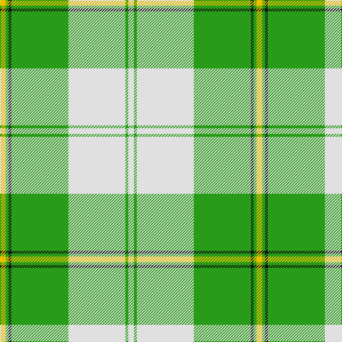

This page is one **sett** — a single exact thread-count. It belongs to the [tartan](/tartans/w2g1w20g20k1g1ly2/)
(the same proportion at any scale), whose colour order is pattern [WGWGKGY](/stripes/wgwgkgy/).

Sourced from house-of-tartan.  It is a [7 stripe tartan](/stripes/stripes7/).

Original link http://www.house-of-tartan.scotland.net/house/TartanViewjs.asp?colr=Def&tnam=6532

## Thread count
Y/8 G4 K4 G80 LN80 G4 LN/8

## Palette

Palette: <strong>Tartan Register</strong>
<table><thead><tr><th>Colour</th><th>Threads</th><th>Shade</th><th>Base</th><th>OKLCh</th></tr></thead><tbody><tr><td>Y/</td><td style="text-align:right;font-variant-numeric:tabular-nums">8</td><td><code style="background-color:#E8C000;">#E8C000</code> <small style="color:#888">#E8C000</small></td><td>Y <code style="background-color:#F2BF00;">#F2BF00</code></td><td><small style="color:#888">oklch(81.9% 0.168 93.7)</small></td></tr><tr><td>G</td><td style="text-align:right;font-variant-numeric:tabular-nums">4</td><td><code style="background-color:#289C18;">#289C18</code> <small style="color:#888">#289C18</small></td><td>G <code style="background-color:#006100;">#006100</code></td><td><small style="color:#888">oklch(60.6% 0.191 141.6)</small></td></tr><tr><td>K</td><td style="text-align:right;font-variant-numeric:tabular-nums">4</td><td><code style="background-color:#101010;">#101010</code> <small style="color:#888">#101010</small></td><td>K <code style="background-color:#000000;">#000000</code></td><td><small style="color:#888">oklch(17.3% 0.000 89.9)</small></td></tr><tr><td>G</td><td style="text-align:right;font-variant-numeric:tabular-nums">80</td><td><code style="background-color:#289C18;">#289C18</code> <small style="color:#888">#289C18</small></td><td>G <code style="background-color:#006100;">#006100</code></td><td><small style="color:#888">oklch(60.6% 0.191 141.6)</small></td></tr><tr><td>LN</td><td style="text-align:right;font-variant-numeric:tabular-nums">80</td><td><code style="background-color:#E0E0E0;">#E0E0E0</code> <small style="color:#888">#E0E0E0</small></td><td>W <code style="background-color:#F7F7F7;">#F7F7F7</code></td><td><small style="color:#888">oklch(90.7% 0.000 89.9)</small></td></tr><tr><td>G</td><td style="text-align:right;font-variant-numeric:tabular-nums">4</td><td><code style="background-color:#289C18;">#289C18</code> <small style="color:#888">#289C18</small></td><td>G <code style="background-color:#006100;">#006100</code></td><td><small style="color:#888">oklch(60.6% 0.191 141.6)</small></td></tr><tr><td>LN/</td><td style="text-align:right;font-variant-numeric:tabular-nums">8</td><td><code style="background-color:#E0E0E0;">#E0E0E0</code> <small style="color:#888">#E0E0E0</small></td><td>W <code style="background-color:#F7F7F7;">#F7F7F7</code></td><td><small style="color:#888">oklch(90.7% 0.000 89.9)</small></td></tr></tbody></table>

# Sample pattern

## Nearest tartans

The nearest existing variants by ΔTartan distance, with this tartan at the top so the swatches line up against it.

ΔTartan

Tartan

Sett

—

<a href="/ttd/edit/#slug=w2g1w20g20k1g1ly2~x4">Cunningham Dress Green (Dance) Fashion Tartan Tartan Number: 6532. Earliest known date: 01/01/1988 A dancers' tartan now woven by D C Dalgliesh of Selkirk /Threadcount and colours aren't 100% original. Generated manually./ See products available Copyright © Blair Urquhart, Comrie, 2015</a> <a class="nn-out" href="/setts/s7/w2g1w20g20k1g1ly2~x4/" title="open its dictionary page">↗</a>

0.68

<a href="/ttd/edit/#slug=w5g2w34g34k2g2ly4~x2">Cunningham Dress Green (Dance)</a> <a class="nn-out" href="/setts/s7/w5g2w34g34k2g2ly4~x2/" title="open its dictionary page">↗</a>

1.39

<a href="/ttd/edit/#slug=g3r2g27dg3w30dg2w3~x2">Uist, Green (Dance)</a> <a class="nn-out" href="/setts/s7/g3r2g27dg3w30dg2w3~x2/" title="open its dictionary page">↗</a>

1.42

<a href="/ttd/edit/#slug=g42gi2w2gi2g5dg12w32g4~x2">Longniddry, Green</a> <a class="nn-out" href="/setts/s8/g42gi2w2gi2g5dg12w32g4~x2/" title="open its dictionary page">↗</a>

1.59

<a href="/ttd/edit/#slug=n4w2n1w36g21ly4~x2">Skye, Green (Dance)</a> <a class="nn-out" href="/setts/s6/n4w2n1w36g21ly4~x2/" title="open its dictionary page">↗</a>

1.59

<a href="/ttd/edit/#slug=g1g1w1g15w15g1w1g1~x4">Bundy, Dress Black Personal)</a> <a class="nn-out" href="/setts/s8/g1g1w1g15w15g1w1g1~x4/" title="open its dictionary page">↗</a>

1.67

<a href="/ttd/edit/#slug=gi42g2w2g2gi5dg12w32gi4~x2">Longniddry Green District Tartan Tartan Number: 764. Earliest known date: pre 1992 A dancers tartan from D.C. Dalgleish weavers of Selkirk See products available Copyright © Blair Urquhart, Comrie, 2015</a> <a class="nn-out" href="/setts/s8/gi42g2w2g2gi5dg12w32gi4~x2/" title="open its dictionary page">↗</a>

1.69

<a href="/ttd/edit/#slug=m3lb35db4g47w3~x2">Exabyte</a> <a class="nn-out" href="/setts/s5/m3lb35db4g47w3~x2/" title="open its dictionary page">↗</a>

1.82

<a href="/ttd/edit/#slug=b6k3b37ly41w3ly6w3~x2">Tilburg Hunting (District)</a> <a class="nn-out" href="/setts/s7/b6k3b37ly41w3ly6w3~x2/" title="open its dictionary page">↗</a>

1.83

<a href="/ttd/edit/#slug=gi42g2w2g2gi5dt12w32gi4~x2">Longniddry Green (Dance)</a> <a class="nn-out" href="/setts/s8/gi42g2w2g2gi5dt12w32gi4~x2/" title="open its dictionary page">↗</a>

1.85

<a href="/ttd/edit/#slug=g3r1g12w4lb15ly1lb3~x4">Postcode Lottery</a> <a class="nn-out" href="/setts/s7/g3r1g12w4lb15ly1lb3~x4/" title="open its dictionary page">↗</a>

## Neighbour map

Every grey dot is one of 14359 variants placed by the first two principal components of the ΔTartan feature space (44% of its variance). Red is this tartan; blue dots are its nearest — click one to open its page.

<svg viewBox="0 0 640 380" role="img" style="max-width:100%;height:auto;border:1px solid #e0e0e0;border-radius:4px;display:block" xmlns="http://www.w3.org/2000/svg"><image href="/nn/cloud.v1.png" width="640" height="380"/><a href="/setts/s7/w5g2w34g34k2g2ly4~x2/"><circle cx="281.2" cy="141.0" r="4" fill="#3465a4"><title>Cunningham Dress Green (Dance)</title></circle></a><a href="/setts/s7/g3r2g27dg3w30dg2w3~x2/"><circle cx="266.4" cy="145.6" r="4" fill="#3465a4"><title>Uist, Green (Dance)</title></circle></a><a href="/setts/s8/g42gi2w2gi2g5dg12w32g4~x2/"><circle cx="280.1" cy="139.1" r="4" fill="#3465a4"><title>Longniddry, Green</title></circle></a><a href="/setts/s6/n4w2n1w36g21ly4~x2/"><circle cx="335.6" cy="121.2" r="4" fill="#3465a4"><title>Skye, Green (Dance)</title></circle></a><a href="/setts/s8/g1g1w1g15w15g1w1g1~x4/"><circle cx="294.8" cy="144.3" r="4" fill="#3465a4"><title>Bundy, Dress Black Personal)</title></circle></a><a href="/setts/s8/gi42g2w2g2gi5dg12w32gi4~x2/"><circle cx="279.7" cy="138.8" r="4" fill="#3465a4"><title>Longniddry Green District Tartan Tartan Number: 764. Earliest known date: pre 1992 A dancers tartan from D.C. Dalgleish weavers of Selkirk See products available Copyright © Blair Urquhart, Comrie, 2015</title></circle></a><a href="/setts/s5/m3lb35db4g47w3~x2/"><circle cx="290.0" cy="172.7" r="4" fill="#3465a4"><title>Exabyte</title></circle></a><a href="/setts/s7/b6k3b37ly41w3ly6w3~x2/"><circle cx="287.2" cy="161.9" r="4" fill="#3465a4"><title>Tilburg Hunting (District)</title></circle></a><a href="/setts/s8/gi42g2w2g2gi5dt12w32gi4~x2/"><circle cx="265.5" cy="129.7" r="4" fill="#3465a4"><title>Longniddry Green (Dance)</title></circle></a><a href="/setts/s7/g3r1g12w4lb15ly1lb3~x4/"><circle cx="258.2" cy="170.1" r="4" fill="#3465a4"><title>Postcode Lottery</title></circle></a><circle cx="310.3" cy="141.9" r="5" fill="#c00000"/></svg>

ID: /setts/s7/w2g1w20g20k1g1ly2~x4/
