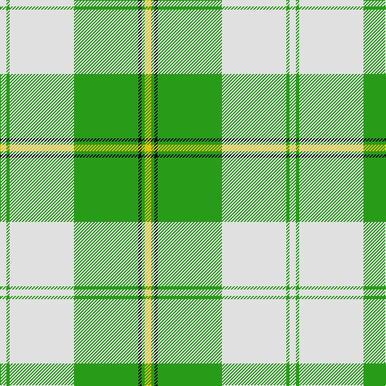

In pattern [WGWGKGY](/patterns/wgwgkgy/).

This was sourced from house-of-tartan.  It is a [7 stripes tartan](/stripes/stripes7/).

Original link http://www.house-of-tartan.scotland.net/house/TartanViewjs.asp?colr=Def&tnam=6532

## Thread count
LN/8 G4 LN80 G80 K4 G4 Y/8

## Palette
Each colour and its ΔE from the base-6 reference it is a variant of.

| Colour | Shade | Base | ΔE (OKLab) |
|---|---|---|---|
| G | <code style="background-color:#289C18;">#289C18</code> `#289C18` | G <code style="background-color:#006100;">#006100</code> | 0.19 |
| K | <code style="background-color:#101010;">#101010</code> `#101010` | K <code style="background-color:#000000;">#000000</code> | 0.17 |
| LN | <code style="background-color:#E0E0E0;">#E0E0E0</code> `#E0E0E0` | W <code style="background-color:#F7F7F7;">#F7F7F7</code> | 0.07 |
| Y | <code style="background-color:#E8C000;">#E8C000</code> `#E8C000` | Y <code style="background-color:#F2BF00;">#F2BF00</code> | 0.02 |

# Sample pattern

## Nearest tartans

The nearest existing variants by ΔTartan distance.

1. [Cunningham Dress Green (Dance)](/setts/s7/w5g2w34g34k2g2y4~g289c18-k101010-wf8f8f8-ye8c000~x2/) — ΔT 0.69
1. [Uist, Green (Dance)](/setts/s7/g3r2g27ga3w30ga2w3~g006818-ga003820-rc80000-wf0e0c8~x2/) — ΔT 1.39
1. [Longniddry, Green](/setts/s8/g42ga2w2ga2g5gb12w32g4~g008000-ga30a010-gb003000-we0e0e0~x2/) — ΔT 1.42
1. [Skye, Green (Dance)](/setts/s6/b4w2b1w36g21y4~b506878-g006818-wf0e0c8-yfce888~x2/) — ΔT 1.59
1. [Bundy, Dress Black Personal)](/setts/s8/g1g1w1g15w15g1w1g1~g006818-wf8f8f8~x4/) — ΔT 1.60
1. [Longniddry Green District Tartan Tartan Number: 764. Earliest known date: pre 1992 A dancers tartan from D.C. Dalgleish weavers of Selkirk See products available Copyright © Blair Urquhart, Comrie, 2015](/setts/s8/g42ga2w2ga2g5gb12w32g4~g006818-ga289c18-gb003820-we0e0e0~x2/) — ΔT 1.67
1. [Exabyte](/setts/s5/r3w35b4g47wa3~b304080-g008000-r802040-wc0c0c0-wae0e0e0~x2/) — ΔT 1.69
1. [MacPherson, dress green](/setts/s7/w5r3w26g20w3g8y3~g008000-rc00000-we0e0e0-yf0c000~x2/) — ΔT 1.73
1. [Tilburg Hunting (District)](/setts/s7/b6k3b37y41w3y6w3~b1068a4-k101010-we0e0e0-yd8a810~x2/) — ΔT 1.81
1. [Longniddry Green (Dance)](/setts/s8/g42ga2w2ga2g5b12w32g4~b1c1c1c-g006818-ga289c18-wfcfcfc~x2/) — ΔT 1.83

## Neighbour map

Every grey dot is one of 15726 variants placed by the first two principal components of the ΔTartan feature space (44% of its variance). Red is this tartan; blue dots are its nearest — click one to open its page.

<svg viewBox="0 0 640 380" role="img" style="max-width:100%;height:auto;border:1px solid #e0e0e0;border-radius:4px;display:block" xmlns="http://www.w3.org/2000/svg"><image href="/nn/cloud.v1.png" width="640" height="380"/><a href="/setts/s7/w5g2w34g34k2g2y4~g289c18-k101010-wf8f8f8-ye8c000~x2/"><circle cx="280.2" cy="143.8" r="4" fill="#3465a4"><title>Cunningham Dress Green (Dance)</title></circle></a><a href="/setts/s7/g3r2g27ga3w30ga2w3~g006818-ga003820-rc80000-wf0e0c8~x2/"><circle cx="265.1" cy="148.9" r="4" fill="#3465a4"><title>Uist, Green (Dance)</title></circle></a><a href="/setts/s8/g42ga2w2ga2g5gb12w32g4~g008000-ga30a010-gb003000-we0e0e0~x2/"><circle cx="278.1" cy="140.4" r="4" fill="#3465a4"><title>Longniddry, Green</title></circle></a><a href="/setts/s6/b4w2b1w36g21y4~b506878-g006818-wf0e0c8-yfce888~x2/"><circle cx="335.3" cy="125.2" r="4" fill="#3465a4"><title>Skye, Green (Dance)</title></circle></a><a href="/setts/s8/g1g1w1g15w15g1w1g1~g006818-wf8f8f8~x4/"><circle cx="293.2" cy="148.7" r="4" fill="#3465a4"><title>Bundy, Dress Black Personal)</title></circle></a><a href="/setts/s8/g42ga2w2ga2g5gb12w32g4~g006818-ga289c18-gb003820-we0e0e0~x2/"><circle cx="277.6" cy="140.3" r="4" fill="#3465a4"><title>Longniddry Green District Tartan Tartan Number: 764. Earliest known date: pre 1992 A dancers tartan from D.C. Dalgleish weavers of Selkirk See products available Copyright © Blair Urquhart, Comrie, 2015</title></circle></a><a href="/setts/s5/r3w35b4g47wa3~b304080-g008000-r802040-wc0c0c0-wae0e0e0~x2/"><circle cx="288.6" cy="172.0" r="4" fill="#3465a4"><title>Exabyte</title></circle></a><a href="/setts/s7/w5r3w26g20w3g8y3~g008000-rc00000-we0e0e0-yf0c000~x2/"><circle cx="250.8" cy="189.5" r="4" fill="#3465a4"><title>MacPherson, dress green</title></circle></a><a href="/setts/s7/b6k3b37y41w3y6w3~b1068a4-k101010-we0e0e0-yd8a810~x2/"><circle cx="286.1" cy="163.3" r="4" fill="#3465a4"><title>Tilburg Hunting (District)</title></circle></a><a href="/setts/s8/g42ga2w2ga2g5b12w32g4~b1c1c1c-g006818-ga289c18-wfcfcfc~x2/"><circle cx="263.6" cy="132.9" r="4" fill="#3465a4"><title>Longniddry Green (Dance)</title></circle></a><circle cx="309.3" cy="142.9" r="5" fill="#c00000"/></svg>

ID: /setts/s7/w2g1w20g20k1g1y2~g289c18-k101010-we0e0e0-ye8c000~x4/
