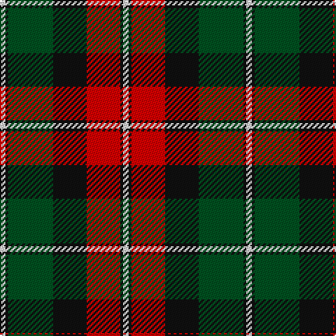

In pattern [WKGKRKW](/patterns/wkgkrkw/).

This was sourced from register-of-tartans.  It is a [7 stripes tartan](/stripes/stripes7/).

Original link https://www.tartanregister.gov.uk/tartanDetails.aspx?ref=3389

## Thread count
LN/4 K2 G32 K24 R24 K2 LN/4

## Palette
Each colour and its ΔE from the base-6 reference it is a variant of.

| Colour | Shade | Base | ΔE (OKLab) |
|---|---|---|---|
| G | <code style="background-color:#005020;">#005020</code> `#005020` | G <code style="background-color:#006100;">#006100</code> | 0.07 |
| K | <code style="background-color:#101010;">#101010</code> `#101010` | K <code style="background-color:#000000;">#000000</code> | 0.17 |
| LN | <code style="background-color:#E0E0E0;">#E0E0E0</code> `#E0E0E0` | W <code style="background-color:#F7F7F7;">#F7F7F7</code> | 0.07 |
| R | <code style="background-color:#DC0000;">#DC0000</code> `#DC0000` | R <code style="background-color:#CC0000;">#CC0000</code> | 0.03 |

# Sample pattern

## Nearest tartans

The nearest existing variants by ΔTartan distance.

1. [Prince Edward Island District Tartan Tartan Number: 1815. Earliest known date: 1960-70 The warmth and glow of the fertile soil, The green field and tree, The yellow and the brown of Autumn, The white of surf or a summer snow, Rust, green, yellow and white, Yes! That's our Island Tartan. See products available Copyright © Blair Urquhart, Comrie, 2015](/setts/s7/w2k1g16k12r12k1w2x2~g006818-k101010-rc80000-we0e0e0/) — ΔT 0.34
1. [Logan - 1797 (Dark)](/setts/s7/k9y4k1y4g15r4k1x4~g003820-k101010-rc80000-ye08070/) — ΔT 0.78
1. [Dickie](/setts/s8/g8r2g12k6g3b6r24k4x2~b00008c-g146400-k000000-rc82800/) — ΔT 0.80
1. [Bannockbane Brown #1](/setts/s8/b2r2b15r1w10g15r2g2x2~b441800-g604000-rc80000-we0e0e0/) — ΔT 0.83
1. [United Distillers](/setts/s6/r2b14r1k14r14y2x2~b680028-k101010-r948860-ye8c000/) — ΔT 0.84
1. [Longford County Crest (Fashion)](/setts/s8/k44y9k3y8y16y15y6k7x2~k101010-ybc8c00/) — ΔT 0.84
1. [Prince Edward Island](/setts/s7/w2k1g16k12r12k1w2x2~g008000-k000000-rc00000-we0e0e0/) — ΔT 0.86
1. [Wcwm 1062](/setts/s7/g3r20g16k22y6k3g2x2~g006818-k101010-rc80000-yd09800/) — ΔT 0.89
1. [Logan, Dark](/setts/s7/k9r4k1r4g15ra4k1x2~g008000-k000000-rd03030-rac00000/) — ΔT 0.91
1. [Logan #3](/setts/s7/b9y4b1y4g15r4b1x4~b440044-g00801c-rc8002c-ye08070/) — ΔT 0.92

## Neighbour map

Every grey dot is one of 15726 variants placed by the first two principal components of the ΔTartan feature space (44% of its variance). Red is this tartan; blue dots are its nearest — click one to open its page.

<svg viewBox="0 0 640 380" role="img" style="max-width:100%;height:auto;border:1px solid #e0e0e0;border-radius:4px;display:block" xmlns="http://www.w3.org/2000/svg"><image href="/nn/cloud.v1.png" width="640" height="380"/><a href="/setts/s7/w2k1g16k12r12k1w2x2~g006818-k101010-rc80000-we0e0e0/"><circle cx="187.9" cy="169.2" r="4" fill="#3465a4"><title>Prince Edward Island District Tartan Tartan Number: 1815. Earliest known date: 1960-70 The warmth and glow of the fertile soil, The green field and tree, The yellow and the brown of Autumn, The white of surf or a summer snow, Rust, green, yellow and white, Yes! That's our Island Tartan. See products available Copyright © Blair Urquhart, Comrie, 2015</title></circle></a><a href="/setts/s7/k9y4k1y4g15r4k1x4~g003820-k101010-rc80000-ye08070/"><circle cx="213.0" cy="185.0" r="4" fill="#3465a4"><title>Logan - 1797 (Dark)</title></circle></a><a href="/setts/s8/g8r2g12k6g3b6r24k4x2~b00008c-g146400-k000000-rc82800/"><circle cx="198.6" cy="182.2" r="4" fill="#3465a4"><title>Dickie</title></circle></a><a href="/setts/s8/b2r2b15r1w10g15r2g2x2~b441800-g604000-rc80000-we0e0e0/"><circle cx="192.3" cy="158.7" r="4" fill="#3465a4"><title>Bannockbane Brown #1</title></circle></a><a href="/setts/s6/r2b14r1k14r14y2x2~b680028-k101010-r948860-ye8c000/"><circle cx="202.6" cy="194.2" r="4" fill="#3465a4"><title>United Distillers</title></circle></a><a href="/setts/s8/k44y9k3y8y16y15y6k7x2~k101010-ybc8c00/"><circle cx="210.5" cy="167.9" r="4" fill="#3465a4"><title>Longford County Crest (Fashion)</title></circle></a><a href="/setts/s7/w2k1g16k12r12k1w2x2~g008000-k000000-rc00000-we0e0e0/"><circle cx="169.0" cy="164.5" r="4" fill="#3465a4"><title>Prince Edward Island</title></circle></a><a href="/setts/s7/g3r20g16k22y6k3g2x2~g006818-k101010-rc80000-yd09800/"><circle cx="177.6" cy="197.1" r="4" fill="#3465a4"><title>Wcwm 1062</title></circle></a><a href="/setts/s7/k9r4k1r4g15ra4k1x2~g008000-k000000-rd03030-rac00000/"><circle cx="187.2" cy="175.2" r="4" fill="#3465a4"><title>Logan, Dark</title></circle></a><a href="/setts/s7/b9y4b1y4g15r4b1x4~b440044-g00801c-rc8002c-ye08070/"><circle cx="209.1" cy="177.1" r="4" fill="#3465a4"><title>Logan #3</title></circle></a><circle cx="189.1" cy="168.7" r="5" fill="#c00000"/></svg>

ID: /setts/s7/w2k1g16k12r12k1w2x2~g005020-k101010-rdc0000-we0e0e0/
