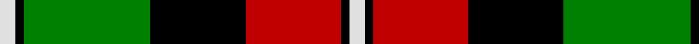
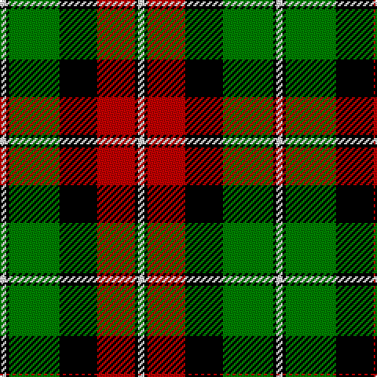

In pattern [WKGKRKW](/patterns/wkgkrkw/).

This was sourced from weddslist.  It is a [7 stripes tartan](/stripes/stripes7/).

Original link http://www.weddslist.com/cgi-bin/tartans/pg.pl?source=sts

## Thread count
LN/4 K2 G32 K24 R24 K2 LN/4

## Palette
Each colour and its ΔE from the base-6 reference it is a variant of.

| Colour | Shade | Base | ΔE (OKLab) |
|---|---|---|---|
| G | <code style="background-color:#008000;">#008000</code> `#008000` | G <code style="background-color:#006100;">#006100</code> | 0.10 |
| K | <code style="background-color:#000000;">#000000</code> `#000000` | K <code style="background-color:#000000;">#000000</code> | 0.00 |
| LN | <code style="background-color:#E0E0E0;">#E0E0E0</code> `#E0E0E0` | W <code style="background-color:#F7F7F7;">#F7F7F7</code> | 0.07 |
| R | <code style="background-color:#C00000;">#C00000</code> `#C00000` | R <code style="background-color:#CC0000;">#CC0000</code> | 0.03 |

# Sample pattern

## Nearest tartans

The nearest existing variants by ΔTartan distance.

1. [Logan, Dark](/setts/s7/k9r4k1r4g15ra4k1~g008000-k000000-rd03030-rac00000~x2/) — ΔT 0.53
1. [Prince Edward Island District Tartan Tartan Number: 1815. Earliest known date: 1960-70 The warmth and glow of the fertile soil, The green field and tree, The yellow and the brown of Autumn, The white of surf or a summer snow, Rust, green, yellow and white, Yes! That's our Island Tartan. See products available Copyright © Blair Urquhart, Comrie, 2015](/setts/s7/w2k1g16k12r12k1w2~g006818-k101010-rc80000-we0e0e0~x2/) — ΔT 0.75
1. [Prince Edward Island #2](/setts/s7/w2k1g16k12r12k1w2~g005020-k101010-rdc0000-we0e0e0~x2/) — ΔT 0.86
1. [Longford County Crest (Fashion)](/setts/s8/k44y9k3y8y16y15y6k7~k101010-ybc8c00~x2/) — ΔT 0.89
1. [Bannockbane, Light Tan](/setts/s8/k4y2k13y1w8r13y2r4~k000000-r906030-we0e0e0-yf0c000~x2/) — ΔT 0.90
1. [Blackstock, hunting](/setts/s7/k2r7k6g12y1g1k2~g008000-k000000-rc00000-yf0c000~x4/) — ΔT 0.97
1. [Garvock (2015)](/setts/s8/g28b3g3k10r2k10r20y4~b2888c4-g006818-k000000-rdc0000-yffe600~x2/) — ΔT 0.99
1. [Unidentified 12](/setts/s6/k6r2g17r16k1b2~b5480b0-g008000-k000000-rc00000~x2/) — ΔT 1.16
1. [Dickie](/setts/s8/g8r2g12k6g3b6r24k4~b00008c-g146400-k000000-rc82800~x2/) — ΔT 1.17
1. [United Distillers (Corporate)](/setts/s6/r2k14r1ka14r14y2~k000000-ka101010-r948860-ye8c000~x2/) — ΔT 1.18

## Neighbour map

Every grey dot is one of 15726 variants placed by the first two principal components of the ΔTartan feature space (44% of its variance). Red is this tartan; blue dots are its nearest — click one to open its page.

<svg viewBox="0 0 640 380" role="img" style="max-width:100%;height:auto;border:1px solid #e0e0e0;border-radius:4px;display:block" xmlns="http://www.w3.org/2000/svg"><image href="/nn/cloud.v1.png" width="640" height="380"/><a href="/setts/s7/k9r4k1r4g15ra4k1~g008000-k000000-rd03030-rac00000~x2/"><circle cx="187.2" cy="175.2" r="4" fill="#3465a4"><title>Logan, Dark</title></circle></a><a href="/setts/s7/w2k1g16k12r12k1w2~g006818-k101010-rc80000-we0e0e0~x2/"><circle cx="187.9" cy="169.2" r="4" fill="#3465a4"><title>Prince Edward Island District Tartan Tartan Number: 1815. Earliest known date: 1960-70 The warmth and glow of the fertile soil, The green field and tree, The yellow and the brown of Autumn, The white of surf or a summer snow, Rust, green, yellow and white, Yes! That's our Island Tartan. See products available Copyright © Blair Urquhart, Comrie, 2015</title></circle></a><a href="/setts/s7/w2k1g16k12r12k1w2~g005020-k101010-rdc0000-we0e0e0~x2/"><circle cx="189.1" cy="168.7" r="4" fill="#3465a4"><title>Prince Edward Island #2</title></circle></a><a href="/setts/s8/k44y9k3y8y16y15y6k7~k101010-ybc8c00~x2/"><circle cx="210.5" cy="167.9" r="4" fill="#3465a4"><title>Longford County Crest (Fashion)</title></circle></a><a href="/setts/s8/k4y2k13y1w8r13y2r4~k000000-r906030-we0e0e0-yf0c000~x2/"><circle cx="150.6" cy="171.9" r="4" fill="#3465a4"><title>Bannockbane, Light Tan</title></circle></a><a href="/setts/s7/k2r7k6g12y1g1k2~g008000-k000000-rc00000-yf0c000~x4/"><circle cx="197.2" cy="186.1" r="4" fill="#3465a4"><title>Blackstock, hunting</title></circle></a><a href="/setts/s8/g28b3g3k10r2k10r20y4~b2888c4-g006818-k000000-rdc0000-yffe600~x2/"><circle cx="161.6" cy="151.0" r="4" fill="#3465a4"><title>Garvock (2015)</title></circle></a><a href="/setts/s6/k6r2g17r16k1b2~b5480b0-g008000-k000000-rc00000~x2/"><circle cx="233.6" cy="173.6" r="4" fill="#3465a4"><title>Unidentified 12</title></circle></a><a href="/setts/s8/g8r2g12k6g3b6r24k4~b00008c-g146400-k000000-rc82800~x2/"><circle cx="198.6" cy="182.2" r="4" fill="#3465a4"><title>Dickie</title></circle></a><a href="/setts/s6/r2k14r1ka14r14y2~k000000-ka101010-r948860-ye8c000~x2/"><circle cx="176.7" cy="194.8" r="4" fill="#3465a4"><title>United Distillers (Corporate)</title></circle></a><circle cx="169.0" cy="164.5" r="5" fill="#c00000"/></svg>

ID: /setts/s7/w2k1g16k12r12k1w2~g008000-k000000-rc00000-we0e0e0~x2/
