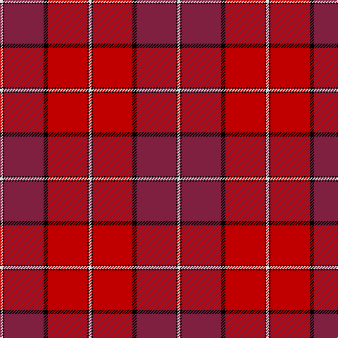

In pattern [WKRKRKW](/patterns/wkrkrkw/).

This was sourced from weddslist.  It is a [7 stripes tartan](/stripes/stripes7/).

Original link http://www.weddslist.com/cgi-bin/tartans/pg.pl?source=sts

## Thread count
LN/4 K2 DR56 K6 R56 K2 LN/4

## Palette
Each colour and its ΔE from the base-6 reference it is a variant of.

| Colour | Shade | Base | ΔE (OKLab) |
|---|---|---|---|
| DR | <code style="background-color:#802040;">#802040</code> `#802040` | R <code style="background-color:#CC0000;">#CC0000</code> | 0.17 |
| K | <code style="background-color:#000000;">#000000</code> `#000000` | K <code style="background-color:#000000;">#000000</code> | 0.00 |
| LN | <code style="background-color:#E0E0E0;">#E0E0E0</code> `#E0E0E0` | W <code style="background-color:#F7F7F7;">#F7F7F7</code> | 0.07 |
| R | <code style="background-color:#C00000;">#C00000</code> `#C00000` | R <code style="background-color:#CC0000;">#CC0000</code> | 0.03 |

# Sample pattern

## Nearest tartans

The nearest existing variants by ΔTartan distance.

1. [Aberdeen Football Club (1990)](/setts/s7/w2k1r28k3ra28k1w2x2~k101010-r781c38-radc0000-we0e0e0/) — ΔT 0.39
1. [Aberdeen F.C. Corporate Tartan Tartan Number: 2057. Earliest known date: 1990 The tartan of the Aberdeen Football Club launched on 12th April, 1990. See products available Copyright © Blair Urquhart, Comrie, 2015](/setts/s7/w2k1r28k3ra28k1w2x2~k101010-r901c38-rac80000-we0e0e0/) — ΔT 1.07
1. [Buccleuch](/setts/s7/r107k9r5b41r5g51r14~b780078-g006818-k000000-rc80000/) — ΔT 1.47
1. [Leslie Clan Tartan Tartan Number: 1142. Earliest known date: 1842 The Vestarium Scoticum See products available Copyright © Blair Urquhart, Comrie, 2015](/setts/s8/r4k6y1k6r4b16r32k1x2~b2c2c80-k101010-rc80000-ye8c000/) — ΔT 1.57
1. [MacPherson of Cluny](/setts/s11/r5b2r2g42r5b36r70b2y2r7g2x2~b800080-g008000-rc00000-yf0c000/) — ΔT 1.57
1. [MacDougall](/setts/s11/b4g8ba6b8r6g2r2g2r24g1r3x2~b5a008c-ba2c4084-g005020-rdc0000/) — ΔT 1.60
1. [MacPherson Of Cluny](/setts/s11/r3b1r1g21r3b18r35b1y1r4g1x2~b5a3094-g004c00-rc80000-yffc800/) — ΔT 1.61
1. [St. Andrews School (Delaware) (Corp)](/setts/s7/r52b26w5b3w2b6r2x2~b680028-rc80000-wf8f8f8/) — ΔT 1.65
1. [Chrysanthemum (Japanese Four Seasons)](/setts/s12/w5b1r20b4w2b4w2b24ra2b1ra4b4x2~b5a1c38-rdc0000-rac87814-we0e0e0/) — ΔT 1.68
1. [MacLeay](/setts/s7/r27g4k4g4k4b6y1x4~b5c8ca8-g789484-k101010-rc80000-yd09800/) — ΔT 1.69

## Neighbour map

Every grey dot is one of 15726 variants placed by the first two principal components of the ΔTartan feature space (44% of its variance). Red is this tartan; blue dots are its nearest — click one to open its page.

<svg viewBox="0 0 640 380" role="img" style="max-width:100%;height:auto;border:1px solid #e0e0e0;border-radius:4px;display:block" xmlns="http://www.w3.org/2000/svg"><image href="/nn/cloud.v1.png" width="640" height="380"/><a href="/setts/s7/w2k1r28k3ra28k1w2x2~k101010-r781c38-radc0000-we0e0e0/"><circle cx="345.8" cy="128.5" r="4" fill="#3465a4"><title>Aberdeen Football Club (1990)</title></circle></a><a href="/setts/s7/w2k1r28k3ra28k1w2x2~k101010-r901c38-rac80000-we0e0e0/"><circle cx="369.0" cy="138.2" r="4" fill="#3465a4"><title>Aberdeen F.C. Corporate Tartan Tartan Number: 2057. Earliest known date: 1990 The tartan of the Aberdeen Football Club launched on 12th April, 1990. See products available Copyright © Blair Urquhart, Comrie, 2015</title></circle></a><a href="/setts/s7/r107k9r5b41r5g51r14~b780078-g006818-k000000-rc80000/"><circle cx="364.3" cy="155.6" r="4" fill="#3465a4"><title>Buccleuch</title></circle></a><a href="/setts/s8/r4k6y1k6r4b16r32k1x2~b2c2c80-k101010-rc80000-ye8c000/"><circle cx="377.2" cy="129.1" r="4" fill="#3465a4"><title>Leslie Clan Tartan Tartan Number: 1142. Earliest known date: 1842 The Vestarium Scoticum See products available Copyright © Blair Urquhart, Comrie, 2015</title></circle></a><a href="/setts/s11/r5b2r2g42r5b36r70b2y2r7g2x2~b800080-g008000-rc00000-yf0c000/"><circle cx="368.4" cy="100.6" r="4" fill="#3465a4"><title>MacPherson of Cluny</title></circle></a><a href="/setts/s11/b4g8ba6b8r6g2r2g2r24g1r3x2~b5a008c-ba2c4084-g005020-rdc0000/"><circle cx="328.4" cy="130.1" r="4" fill="#3465a4"><title>MacDougall</title></circle></a><a href="/setts/s11/r3b1r1g21r3b18r35b1y1r4g1x2~b5a3094-g004c00-rc80000-yffc800/"><circle cx="368.4" cy="103.9" r="4" fill="#3465a4"><title>MacPherson Of Cluny</title></circle></a><a href="/setts/s7/r52b26w5b3w2b6r2x2~b680028-rc80000-wf8f8f8/"><circle cx="431.1" cy="148.6" r="4" fill="#3465a4"><title>St. Andrews School (Delaware) (Corp)</title></circle></a><a href="/setts/s12/w5b1r20b4w2b4w2b24ra2b1ra4b4x2~b5a1c38-rdc0000-rac87814-we0e0e0/"><circle cx="319.6" cy="108.4" r="4" fill="#3465a4"><title>Chrysanthemum (Japanese Four Seasons)</title></circle></a><a href="/setts/s7/r27g4k4g4k4b6y1x4~b5c8ca8-g789484-k101010-rc80000-yd09800/"><circle cx="325.3" cy="118.9" r="4" fill="#3465a4"><title>MacLeay</title></circle></a><circle cx="341.3" cy="129.7" r="5" fill="#c00000"/></svg>

ID: /setts/s7/w2k1r28k3ra28k1w2x2~k000000-r802040-rac00000-we0e0e0/
