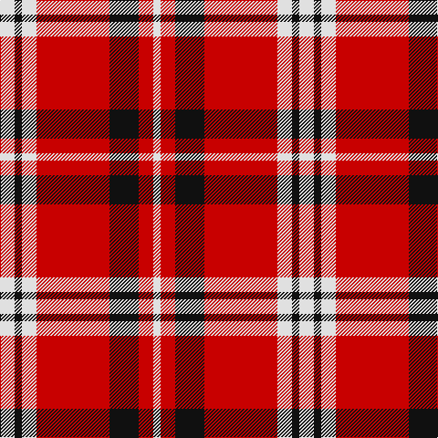

**Bands:** [WKWRKRW](/stripes/wkwrkrw/) · **Stripes:** [W K W R K R W](/stripes/stripes7/) W K W R K R W

This was sourced from tartans-authority.  It is a [7 band tartan](/bands/bands7/).

Original link http://www.tartansauthority.com/tartan-ferret/display/7950/

## Thread count
LN/16 K8 LN16 R80 K32 R16 LN/8

## Palette
Each colour and its ΔE from the base-6 reference it is a variant of.

| Colour | Shade | Base | ΔE (OKLab) |
|---|---|---|---|
| K | <code style="background-color:#101010;">#101010</code> `#101010` | K <code style="background-color:#000000;">#000000</code> | 0.17 |
| LN | <code style="background-color:#E0E0E0;">#E0E0E0</code> `#E0E0E0` | W <code style="background-color:#F7F7F7;">#F7F7F7</code> | 0.07 |
| R | <code style="background-color:#C80000;">#C80000</code> `#C80000` | R <code style="background-color:#CC0000;">#CC0000</code> | 0.01 |

# Sample pattern

## Nearest tartans

The nearest existing variants by ΔTartan distance.

1. [Brice](/setts/s10/k9r18w2k2w4k2w2r12k9r6~x2/) — ΔT 1.10
1. [Dunbar Ancient](/setts/s6/r28k4w2k13~x2/) — ΔT 1.23
1. [Nesbit, Rose](/setts/s6/r6lb3r37k16lb16g4~x2/) — ΔT 1.28
1. [Austin College Page](/setts/s10/r3ly2r2ly3r3ly7r3k7r14ly2~x2/) — ΔT 1.32
1. [Dunbar #2](/setts/s6/k4r26k4w2k13ly4~x2/) — ΔT 1.34
1. [Cameron, Hose](/setts/s7/k1r8g1r1w8r1k1~x6/) — ΔT 1.41
1. [MacPherson Red Cluny](/setts/s7/r6k3r29k23w4k7ly3~x2/) — ΔT 1.43
1. [Brice (Artefact)](/setts/s6/r6k9r12w2k2w4~x2/) — ΔT 1.47
1. [Unidentified #41](/setts/s9/w6o1r4w1db4o1r8w1r2~x2/) — ΔT 1.49
1. [MacKintosh #4](/setts/s6/r5w2r28k12dg16r3~x2/) — ΔT 1.50

## Neighbour map

Every grey dot is one of 14299 variants placed by the first two principal components of the ΔTartan feature space (44% of its variance). Red is this tartan; blue dots are its nearest — click one to open its page.

<svg viewBox="0 0 640 380" role="img" style="max-width:100%;height:auto;border:1px solid #e0e0e0;border-radius:4px;display:block" xmlns="http://www.w3.org/2000/svg"><image href="/nn/cloud.v1.png" width="640" height="380"/><a href="/setts/s10/k9r18w2k2w4k2w2r12k9r6~x2/"><circle cx="280.5" cy="184.4" r="4" fill="#3465a4"><title>Brice</title></circle></a><a href="/setts/s6/r28k4w2k13~x2/"><circle cx="334.4" cy="176.8" r="4" fill="#3465a4"><title>Dunbar Ancient</title></circle></a><a href="/setts/s6/r6lb3r37k16lb16g4~x2/"><circle cx="266.8" cy="172.0" r="4" fill="#3465a4"><title>Nesbit, Rose</title></circle></a><a href="/setts/s10/r3ly2r2ly3r3ly7r3k7r14ly2~x2/"><circle cx="258.2" cy="190.2" r="4" fill="#3465a4"><title>Austin College Page</title></circle></a><a href="/setts/s6/k4r26k4w2k13ly4~x2/"><circle cx="281.4" cy="165.5" r="4" fill="#3465a4"><title>Dunbar #2</title></circle></a><a href="/setts/s7/k1r8g1r1w8r1k1~x6/"><circle cx="236.5" cy="156.4" r="4" fill="#3465a4"><title>Cameron, Hose</title></circle></a><a href="/setts/s7/r6k3r29k23w4k7ly3~x2/"><circle cx="261.4" cy="174.4" r="4" fill="#3465a4"><title>MacPherson Red Cluny</title></circle></a><a href="/setts/s6/r6k9r12w2k2w4~x2/"><circle cx="234.0" cy="229.8" r="4" fill="#3465a4"><title>Brice (Artefact)</title></circle></a><a href="/setts/s9/w6o1r4w1db4o1r8w1r2~x2/"><circle cx="221.0" cy="167.9" r="4" fill="#3465a4"><title>Unidentified #41</title></circle></a><a href="/setts/s6/r5w2r28k12dg16r3~x2/"><circle cx="301.3" cy="181.1" r="4" fill="#3465a4"><title>MacKintosh #4</title></circle></a><circle cx="294.3" cy="177.6" r="5" fill="#c00000"/></svg>

ID: /setts/s7/w2k1w2r10k4r2w1~x8/
