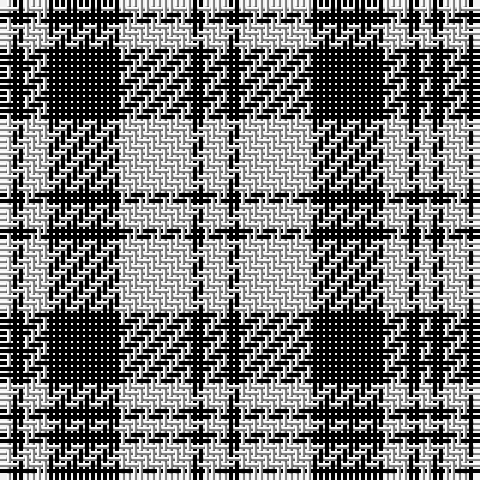

In pattern [WKWKWKW](/patterns/wkwkwkw/).

This was sourced from weddslist.  It is a [7 stripes tartan](/stripes/stripes7/).

Original link http://www.weddslist.com/cgi-bin/tartans/pg.pl?source=sts

## Thread count
LN/2 K2 LN4 K12 LN12 K2 LN/4

## Palette
Each colour and its ΔE from the base-6 reference it is a variant of.

| Colour | Shade | Base | ΔE (OKLab) |
|---|---|---|---|
| K | <code style="background-color:#000000;">#000000</code> `#000000` | K <code style="background-color:#000000;">#000000</code> | 0.00 |
| LN | <code style="background-color:#E0E0E0;">#E0E0E0</code> `#E0E0E0` | W <code style="background-color:#F7F7F7;">#F7F7F7</code> | 0.07 |

# Sample pattern

## Nearest tartans

The nearest existing variants by ΔTartan distance.

1. [Scott (Abbreviated)](/setts/s7/w2k1w6k6w2k1w1x2~k101010-we0e0e0/) — ΔT 0.64
1. [Cairn (Marton Mills)](/setts/s5/k2w1k8w8k1x8~k101010-we0e0e0/) — ΔT 0.89
1. [Scott, Sir Walter](/setts/s11/w6k6w2k1w1k1w2k6w6k1w2x2~k000000-we0e0e0/) — ΔT 0.97
1. [Erskine BW or Ramsay Clan Tartan Tartan Number: 1246. Earliest known date: pre 2003 Possibly a dress tartan based on the sett recorded in the Vestiarium Scoticum in 1842. The tartan is manufactured by Dalgliesh of Selkirk. See products available Copyright © Blair Urquhart, Comrie, 2015](/setts/s6/k2w1k9w9k1w2x6~k101010-we0e0e0/) — ΔT 1.02
1. [Erskine BW MINI Design Tartan Tartan Number: 12466. Earliest known date: Generated for display purposes. Reduced copy of the original 1246 Erskine BW. See products available Copyright © Blair Urquhart, Comrie, 2015](/setts/s6/k2w1k9w9k1w2x3~k101010-we0e0e0/) — ΔT 1.02
1. [MacLean (Black and White)](/setts/s11/w20k6w9k6w6k12w6k48w8k16w16x2~k101010-wffffff/) — ΔT 1.04
1. [Scott Black and White Personal Tartan Tartan Number: 1826. Earliest known date: 1822 Smibert (1850) publishes this design which he says, "..was produced for his own use by Sir Walter Scott in 1822, and that he wore it in private, in the form of a Lowland shepherd's plaid." See products available Copyright © Blair Urquhart, Comrie, 2015](/setts/s11/w6k6w2k1w1k1w2k6w6k1w2x4~k101010-we0e0e0/) — ΔT 1.09
1. [MacLean B & W (Clan)](/setts/s11/w20k6w9k6w6k12w6k48w8k16w16x2~k101010-we0e0e0/) — ΔT 1.11
1. [Erskine (Black and White)](/setts/s6/k2w1k9w9k1w2x6~k101010-wfcfcfc/) — ΔT 1.11
1. [Valley Forge (Artefact)](/setts/s6/w5k4w32k32w5k4x2~k00002c-we8ccb8/) — ΔT 1.12

## Neighbour map

Every grey dot is one of 15726 variants placed by the first two principal components of the ΔTartan feature space (44% of its variance). Red is this tartan; blue dots are its nearest — click one to open its page.

<svg viewBox="0 0 640 380" role="img" style="max-width:100%;height:auto;border:1px solid #e0e0e0;border-radius:4px;display:block" xmlns="http://www.w3.org/2000/svg"><image href="/nn/cloud.v1.png" width="640" height="380"/><a href="/setts/s7/w2k1w6k6w2k1w1x2~k101010-we0e0e0/"><circle cx="297.8" cy="240.0" r="4" fill="#3465a4"><title>Scott (Abbreviated)</title></circle></a><a href="/setts/s5/k2w1k8w8k1x8~k101010-we0e0e0/"><circle cx="310.2" cy="245.9" r="4" fill="#3465a4"><title>Cairn (Marton Mills)</title></circle></a><a href="/setts/s11/w6k6w2k1w1k1w2k6w6k1w2x2~k000000-we0e0e0/"><circle cx="273.4" cy="229.2" r="4" fill="#3465a4"><title>Scott, Sir Walter</title></circle></a><a href="/setts/s6/k2w1k9w9k1w2x6~k101010-we0e0e0/"><circle cx="296.8" cy="225.7" r="4" fill="#3465a4"><title>Erskine BW or Ramsay Clan Tartan Tartan Number: 1246. Earliest known date: pre 2003 Possibly a dress tartan based on the sett recorded in the Vestiarium Scoticum in 1842. The tartan is manufactured by Dalgliesh of Selkirk. See products available Copyright © Blair Urquhart, Comrie, 2015</title></circle></a><a href="/setts/s6/k2w1k9w9k1w2x3~k101010-we0e0e0/"><circle cx="296.8" cy="225.7" r="4" fill="#3465a4"><title>Erskine BW MINI Design Tartan Tartan Number: 12466. Earliest known date: Generated for display purposes. Reduced copy of the original 1246 Erskine BW. See products available Copyright © Blair Urquhart, Comrie, 2015</title></circle></a><a href="/setts/s11/w20k6w9k6w6k12w6k48w8k16w16x2~k101010-wffffff/"><circle cx="302.6" cy="208.1" r="4" fill="#3465a4"><title>MacLean (Black and White)</title></circle></a><a href="/setts/s11/w6k6w2k1w1k1w2k6w6k1w2x4~k101010-we0e0e0/"><circle cx="275.3" cy="226.4" r="4" fill="#3465a4"><title>Scott Black and White Personal Tartan Tartan Number: 1826. Earliest known date: 1822 Smibert (1850) publishes this design which he says, &quot;..was produced for his own use by Sir Walter Scott in 1822, and that he wore it in private, in the form of a Lowland shepherd's plaid.&quot; See products available Copyright © Blair Urquhart, Comrie, 2015</title></circle></a><a href="/setts/s11/w20k6w9k6w6k12w6k48w8k16w16x2~k101010-we0e0e0/"><circle cx="307.5" cy="211.6" r="4" fill="#3465a4"><title>MacLean B &amp; W (Clan)</title></circle></a><a href="/setts/s6/k2w1k9w9k1w2x6~k101010-wfcfcfc/"><circle cx="292.2" cy="222.1" r="4" fill="#3465a4"><title>Erskine (Black and White)</title></circle></a><a href="/setts/s6/w5k4w32k32w5k4x2~k00002c-we8ccb8/"><circle cx="301.9" cy="227.2" r="4" fill="#3465a4"><title>Valley Forge (Artefact)</title></circle></a><circle cx="295.6" cy="242.6" r="5" fill="#c00000"/></svg>

ID: /setts/s7/w2k1w6k6w2k1w1x2~k000000-we0e0e0/
