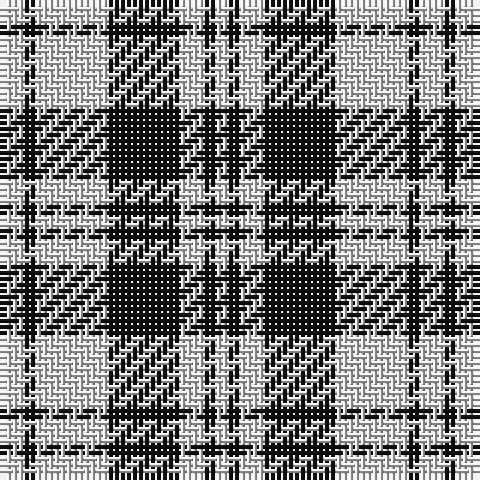

In pattern [WKWKWKW](/stripes/wkwkwkw/).

This was sourced from register-of-tartans.  It is a [7 stripe tartan](/stripes/stripes7/).

Original link https://www.tartanregister.gov.uk/tartanDetails.aspx?ref=3690

## Attestations

This cloth appears in 2 source records; the oldest owns this page.

- undated — Scott (Abbreviated) (register-of-tartans, [record](https://www.tartanregister.gov.uk/tartanDetails.aspx?ref=3690))
- undated — Scott (weddslist, [record](http://www.weddslist.com/cgi-bin/tartans/pg.pl?source=sts))

## Register references

External register numbers recorded for this tartan.

- Scottish Register of Tartans: [3690](https://www.tartanregister.gov.uk/tartanDetails.aspx?ref=3690)
- Scottish Tartans World Register: 1825

## Thread count
LN/4 K2 LN12 K12 LN4 K2 LN/2

## Palette
Each colour and the base-6 reference it is a variant of.

| Colour | Shade | Base |
|---|---|---|
| K | <code style="background-color:#101010;">#101010</code> `oklch(17.3% 0.000 89.9)` <small>#101010</small> | K <code style="background-color:#000000;">#000000</code> |
| LN | <code style="background-color:#E0E0E0;">#E0E0E0</code> `oklch(90.7% 0.000 89.9)` <small>#E0E0E0</small> | W <code style="background-color:#F7F7F7;">#F7F7F7</code> |

# Sample pattern

## Nearest tartans

The nearest existing variants by ΔTartan distance.

1. [Scott - 1850 B & W (Clan)](/setts/s11/w6k6w2k1w1k1w2k6w6k1w2~x4/) — ΔT 0.99
1. [Erskine (Black and White)](/setts/s6/k2w1k9w9k1w2~x6/) — ΔT 1.01
1. [MacMugen](/setts/s6/dt3w16dt4w3dt12w2~x3/) — ΔT 1.03
1. [Erskine BW MINI Design Tartan Tartan Number: 12466. Earliest known date: Generated for display purposes. Reduced copy of the original 1246 Erskine BW. See products available Copyright © Blair Urquhart, Comrie, 2015](/setts/s6/k2w1k9w9k1w2~x3/) — ΔT 1.11
1. [MacLeod Black & White](/setts/s5/w14k2w14k19w2~x2/) — ΔT 1.16
1. [Cairn (Marton Mills)](/setts/s5/k2w1k8w8k1~x8/) — ΔT 1.17
1. [MacLean (Black and White)](/setts/s11/w20k6w9k6w6k12w6k48w8k16w16~x2/) — ΔT 1.22
1. [Scott, Sir Walter](/setts/s11/w6k6w2k1w1k1w2k6w6k1w2~x2/) — ΔT 1.24
1. [Barbie's Moss Plaid (Blue & White)](/setts/s6/w20dt20w3dt3~x2/) — ΔT 1.29
1. [Valley Forge (Artefact)](/setts/s6/lb5k4lb32k32lb5k4~x2/) — ΔT 1.34

## Neighbour map

Every grey dot is one of 14299 variants placed by the first two principal components of the ΔTartan feature space (44% of its variance). Red is this tartan; blue dots are its nearest — click one to open its page.

<svg viewBox="0 0 640 380" role="img" style="max-width:100%;height:auto;border:1px solid #e0e0e0;border-radius:4px;display:block" xmlns="http://www.w3.org/2000/svg"><image href="/nn/cloud.v1.png" width="640" height="380"/><a href="/setts/s11/w6k6w2k1w1k1w2k6w6k1w2~x4/"><circle cx="273.1" cy="214.6" r="4" fill="#3465a4"><title>Scott - 1850 B &amp; W (Clan)</title></circle></a><a href="/setts/s6/k2w1k9w9k1w2~x6/"><circle cx="294.5" cy="213.5" r="4" fill="#3465a4"><title>Erskine (Black and White)</title></circle></a><a href="/setts/s6/dt3w16dt4w3dt12w2~x3/"><circle cx="294.2" cy="226.2" r="4" fill="#3465a4"><title>MacMugen</title></circle></a><a href="/setts/s6/k2w1k9w9k1w2~x3/"><circle cx="299.2" cy="217.4" r="4" fill="#3465a4"><title>Erskine BW MINI Design Tartan Tartan Number: 12466. Earliest known date: Generated for display purposes. Reduced copy of the original 1246 Erskine BW. See products available Copyright © Blair Urquhart, Comrie, 2015</title></circle></a><a href="/setts/s5/w14k2w14k19w2~x2/"><circle cx="313.1" cy="233.7" r="4" fill="#3465a4"><title>MacLeod Black &amp; White</title></circle></a><a href="/setts/s5/k2w1k8w8k1~x8/"><circle cx="312.6" cy="237.3" r="4" fill="#3465a4"><title>Cairn (Marton Mills)</title></circle></a><a href="/setts/s11/w20k6w9k6w6k12w6k48w8k16w16~x2/"><circle cx="304.9" cy="200.0" r="4" fill="#3465a4"><title>MacLean (Black and White)</title></circle></a><a href="/setts/s11/w6k6w2k1w1k1w2k6w6k1w2~x2/"><circle cx="275.8" cy="221.1" r="4" fill="#3465a4"><title>Scott, Sir Walter</title></circle></a><a href="/setts/s6/w20dt20w3dt3~x2/"><circle cx="325.2" cy="245.8" r="4" fill="#3465a4"><title>Barbie's Moss Plaid (Blue &amp; White)</title></circle></a><a href="/setts/s6/lb5k4lb32k32lb5k4~x2/"><circle cx="304.6" cy="219.1" r="4" fill="#3465a4"><title>Valley Forge (Artefact)</title></circle></a><circle cx="299.8" cy="231.1" r="5" fill="#c00000"/></svg>

ID: /setts/s7/w2k1w6k6w2k1w1~x2/
