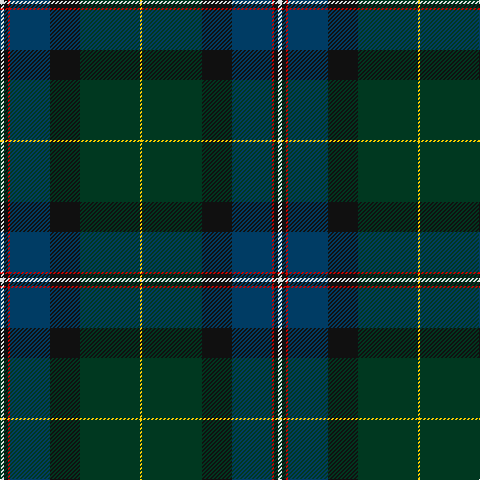

In pattern [WKRBKGY](/patterns/wkrbkgy/).

This was sourced from tartans-authority.  It is a [7 stripes tartan](/stripes/stripes7/).

Original link http://www.tartansauthority.com/tartan-ferret/display/8462/

## Thread count
LN/4 K4 R2 DB40 K30 DG60 Y/2

## Palette
Each colour and its ΔE from the base-6 reference it is a variant of.

| Colour | Shade | Base | ΔE (OKLab) |
|---|---|---|---|
| DB | <code style="background-color:#003C64;">#003C64</code> `#003C64` | B <code style="background-color:#2A418A;">#2A418A</code> | 0.08 |
| DG | <code style="background-color:#003820;">#003820</code> `#003820` | G <code style="background-color:#006100;">#006100</code> | 0.15 |
| K | <code style="background-color:#101010;">#101010</code> `#101010` | K <code style="background-color:#000000;">#000000</code> | 0.17 |
| LN | <code style="background-color:#E0E0E0;">#E0E0E0</code> `#E0E0E0` | W <code style="background-color:#F7F7F7;">#F7F7F7</code> | 0.07 |
| R | <code style="background-color:#C80000;">#C80000</code> `#C80000` | R <code style="background-color:#CC0000;">#CC0000</code> | 0.01 |
| Y | <code style="background-color:#FCCC00;">#FCCC00</code> `#FCCC00` | Y <code style="background-color:#F2BF00;">#F2BF00</code> | 0.04 |

# Sample pattern

## Nearest tartans

The nearest existing variants by ΔTartan distance.

1. [Chesters, Eric (Personal)](/setts/s7/k12g8y1ga13b1ba31k8~b5c8ca8-ba202060-g006818-ga003820-k101010-ye8c000~x2/) — ΔT 0.97
1. [Nova Scotia Int. Tattoo (Corporate)](/setts/s7/b3ba2b21k12g24r1y3~b000054-ba787ca8-g003820-k101010-rc80000-ybc8c00~x2/) — ΔT 1.12
1. [Rikaco Heirloom](/setts/s10/k3b3k1g26k10ga1k3ba5b4gb2~b39586c-ba241029-g015313-ga6c7467-gb877047-k07042f~x2/) — ΔT 1.21
1. [Chan (Name?)](/setts/s8/r2g13r2g13k13b30k1y2~b003c64-g285800-k101010-r880000-ye8c000~x2/) — ΔT 1.21
1. [Purves (2014)](/setts/s8/b4w1g12k3ba16r1ba1r1~b4c3428-ba141e46-g003c14-k101010-rfa4b00-wffffff~x2/) — ΔT 1.27
1. [Chesters, Eric (Personal)](/setts/s7/k12g8y1ga13w1b31k8~b000064-g006818-ga003c14-k101010-w98c8e8-yfccc00~x2/) — ΔT 1.35
1. [Stansbury](/setts/s8/g28r3k28b8ba1g8r2k3~b2c2c80-ba5c8ca8-g003820-k101010-rc80000~x2/) — ΔT 1.36
1. [Henschke, Felix (Personal)](/setts/s7/g42y1k23r7w1b4y3~b00008c-g002814-k1c1714-r960000-wf8f8f8-yd87c00~x2/) — ΔT 1.37
1. [Robb (Personal) Personal Tartan Tartan Number: 3157. Earliest known date: 1994 Designed by Peter MacDonald for Martin Robb of Carroglen, Comrie, Perthshire. Can be worn by anyone of the name but Martin Robb would appreciate being advised. See products available Copyright © Blair Urquhart, Comrie, 2015](/setts/s9/b2r1g26y1k18b26ga1r1b2~b202060-g003820-ga789484-k101010-rc80000-ye8c000~x2/) — ΔT 1.37
1. [Pictou County](/setts/s8/b23w1r3w1b12y9g40b3~b181034-g003c28-r700014-wfcf8ec-yb0840c~x2/) — ΔT 1.38

## Neighbour map

Every grey dot is one of 15726 variants placed by the first two principal components of the ΔTartan feature space (44% of its variance). Red is this tartan; blue dots are its nearest — click one to open its page.

<svg viewBox="0 0 640 380" role="img" style="max-width:100%;height:auto;border:1px solid #e0e0e0;border-radius:4px;display:block" xmlns="http://www.w3.org/2000/svg"><image href="/nn/cloud.v1.png" width="640" height="380"/><a href="/setts/s7/k12g8y1ga13b1ba31k8~b5c8ca8-ba202060-g006818-ga003820-k101010-ye8c000~x2/"><circle cx="282.7" cy="165.1" r="4" fill="#3465a4"><title>Chesters, Eric (Personal)</title></circle></a><a href="/setts/s7/b3ba2b21k12g24r1y3~b000054-ba787ca8-g003820-k101010-rc80000-ybc8c00~x2/"><circle cx="242.4" cy="162.7" r="4" fill="#3465a4"><title>Nova Scotia Int. Tattoo (Corporate)</title></circle></a><a href="/setts/s10/k3b3k1g26k10ga1k3ba5b4gb2~b39586c-ba241029-g015313-ga6c7467-gb877047-k07042f~x2/"><circle cx="283.7" cy="124.1" r="4" fill="#3465a4"><title>Rikaco Heirloom</title></circle></a><a href="/setts/s8/r2g13r2g13k13b30k1y2~b003c64-g285800-k101010-r880000-ye8c000~x2/"><circle cx="281.6" cy="159.9" r="4" fill="#3465a4"><title>Chan (Name?)</title></circle></a><a href="/setts/s8/b4w1g12k3ba16r1ba1r1~b4c3428-ba141e46-g003c14-k101010-rfa4b00-wffffff~x2/"><circle cx="253.3" cy="152.9" r="4" fill="#3465a4"><title>Purves (2014)</title></circle></a><a href="/setts/s7/k12g8y1ga13w1b31k8~b000064-g006818-ga003c14-k101010-w98c8e8-yfccc00~x2/"><circle cx="250.4" cy="155.3" r="4" fill="#3465a4"><title>Chesters, Eric (Personal)</title></circle></a><a href="/setts/s8/g28r3k28b8ba1g8r2k3~b2c2c80-ba5c8ca8-g003820-k101010-rc80000~x2/"><circle cx="347.0" cy="172.8" r="4" fill="#3465a4"><title>Stansbury</title></circle></a><a href="/setts/s7/g42y1k23r7w1b4y3~b00008c-g002814-k1c1714-r960000-wf8f8f8-yd87c00~x2/"><circle cx="360.7" cy="127.0" r="4" fill="#3465a4"><title>Henschke, Felix (Personal)</title></circle></a><a href="/setts/s9/b2r1g26y1k18b26ga1r1b2~b202060-g003820-ga789484-k101010-rc80000-ye8c000~x2/"><circle cx="305.1" cy="144.7" r="4" fill="#3465a4"><title>Robb (Personal) Personal Tartan Tartan Number: 3157. Earliest known date: 1994 Designed by Peter MacDonald for Martin Robb of Carroglen, Comrie, Perthshire. Can be worn by anyone of the name but Martin Robb would appreciate being advised. See products available Copyright © Blair Urquhart, Comrie, 2015</title></circle></a><a href="/setts/s8/b23w1r3w1b12y9g40b3~b181034-g003c28-r700014-wfcf8ec-yb0840c~x2/"><circle cx="291.6" cy="117.8" r="4" fill="#3465a4"><title>Pictou County</title></circle></a><circle cx="288.5" cy="150.2" r="5" fill="#c00000"/></svg>

ID: /setts/s7/w2k2r1b20k15g30y1~b003c64-g003820-k101010-rc80000-we0e0e0-yfccc00~x2/
