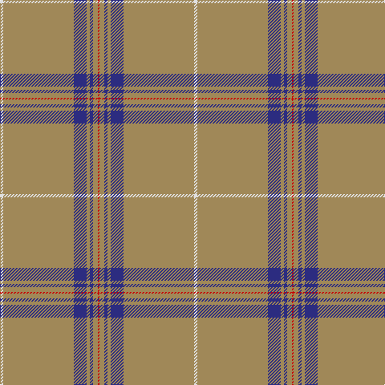

This page is one **sett** — a single exact thread-count. It belongs to the [tartan](/tartans/ln2lt44db8lt2db2lt3r1/)
(the same proportion at any scale), whose colour order is pattern [RYBYBYW](/stripes/rybybyw/).

Sourced from tartans-authority.  It is a [7 stripe tartan](/stripes/stripes7/).

Original link http://www.tartansauthority.com/tartan-ferret/display/10327/

## Thread count
LN/4 LT88 DB16 LT4 DB4 LT6 R/2

## Palette
Each colour and the base-6 reference it is a variant of.

| Colour | Shade | Base |
|---|---|---|
| DB | <code style="background-color:#2C2C80;">#2C2C80</code> `oklch(35.0% 0.138 276.6)` <small>#2C2C80</small> | B <code style="background-color:#2A418A;">#2A418A</code> |
| LN | <code style="background-color:#E0E0E0;">#E0E0E0</code> `oklch(90.7% 0.000 89.9)` <small>#E0E0E0</small> | W <code style="background-color:#F7F7F7;">#F7F7F7</code> |
| LT | <code style="background-color:#A08858;">#A08858</code> `oklch(63.7% 0.071 84.0)` <small>#A08858</small> | Y <code style="background-color:#F2BF00;">#F2BF00</code> |
| R | <code style="background-color:#C80000;">#C80000</code> `oklch(52.3% 0.215 29.2)` <small>#C80000</small> | R <code style="background-color:#CC0000;">#CC0000</code> |

# Sample pattern

## Nearest tartans

The nearest existing variants by ΔTartan distance, with this tartan at the top so the swatches line up against it.

ΔTartan

Tartan

Sett

—

<a href="/ttd/edit/#slug=w2lo44db8lo2db2lo3r1~x2">Reece (Name)</a> <a class="nn-out" href="/setts/s7/w2lo44db8lo2db2lo3r1~x2/" title="open its dictionary page">↗</a>

1.33

<a href="/ttd/edit/#slug=lo83k6lo3k9r2k5lo2ly2~x2">Crane of Cluny Hunting (Personal)</a> <a class="nn-out" href="/setts/s8/lo83k6lo3k9r2k5lo2ly2~x2/" title="open its dictionary page">↗</a>

1.36

<a href="/ttd/edit/#slug=w2o44dt8o2dt2o3r1~x2">Reece, Mathew</a> <a class="nn-out" href="/setts/s7/w2o44dt8o2dt2o3r1~x2/" title="open its dictionary page">↗</a>

1.42

<a href="/ttd/edit/#slug=n70ly4n3ly4n7k2n2r7~x2">European</a> <a class="nn-out" href="/setts/s8/n70ly4n3ly4n7k2n2r7~x2/" title="open its dictionary page">↗</a>

1.49

<a href="/ttd/edit/#slug=db3o1w1o25w1o1dp3~x4">St. Giles Check (Corporate)</a> <a class="nn-out" href="/setts/s7/db3o1w1o25w1o1dp3~x4/" title="open its dictionary page">↗</a>

1.54

<a href="/ttd/edit/#slug=db3o1w1o25w1o1dp3~x2">St Giles Check Tartan Tartan Number: 387. Earliest known date: 1984 St Giles Church is in the Royal Mile, Edinburgh See products available Copyright © Blair Urquhart, Comrie, 2015</a> <a class="nn-out" href="/setts/s7/db3o1w1o25w1o1dp3~x2/" title="open its dictionary page">↗</a>

1.66

<a href="/ttd/edit/#slug=dy2lb2lo4dy5lo5dy46lo7dy1w2~x2">KIltwalk, The (Corporate)</a> <a class="nn-out" href="/setts/s9/dy2lb2lo4dy5lo5dy46lo7dy1w2~x2/" title="open its dictionary page">↗</a>

1.76

<a href="/ttd/edit/#slug=db3y1w1y25w1y1p3~x2">St Giles, Check</a> <a class="nn-out" href="/setts/s7/db3y1w1y25w1y1p3~x2/" title="open its dictionary page">↗</a>

1.83

<a href="/ttd/edit/#slug=n45ly3n10o4k1w2~x4">Wylie (Name)</a> <a class="nn-out" href="/setts/s6/n45ly3n10o4k1w2~x4/" title="open its dictionary page">↗</a>

1.93

<a href="/setts/s12/db3o1w1o25w1o1dp3~x4/">St. Giles Check</a>

1.99

<a href="/ttd/edit/#slug=lr10k2w5k4lr50b2~x2">London Fog Safari (Fashion)</a> <a class="nn-out" href="/setts/s6/lr10k2w5k4lr50b2~x2/" title="open its dictionary page">↗</a>

## Neighbour map

Every grey dot is one of 14299 variants placed by the first two principal components of the ΔTartan feature space (44% of its variance). Red is this tartan; blue dots are its nearest — click one to open its page.

<svg viewBox="0 0 640 380" role="img" style="max-width:100%;height:auto;border:1px solid #e0e0e0;border-radius:4px;display:block" xmlns="http://www.w3.org/2000/svg"><image href="/nn/cloud.v1.png" width="640" height="380"/><a href="/setts/s8/lo83k6lo3k9r2k5lo2ly2~x2/"><circle cx="561.7" cy="93.1" r="4" fill="#3465a4"><title>Crane of Cluny Hunting (Personal)</title></circle></a><a href="/setts/s7/w2o44dt8o2dt2o3r1~x2/"><circle cx="626.0" cy="136.1" r="4" fill="#3465a4"><title>Reece, Mathew</title></circle></a><a href="/setts/s8/n70ly4n3ly4n7k2n2r7~x2/"><circle cx="626.0" cy="132.9" r="4" fill="#3465a4"><title>European</title></circle></a><a href="/setts/s7/db3o1w1o25w1o1dp3~x4/"><circle cx="545.2" cy="137.6" r="4" fill="#3465a4"><title>St. Giles Check (Corporate)</title></circle></a><a href="/setts/s7/db3o1w1o25w1o1dp3~x2/"><circle cx="557.5" cy="144.0" r="4" fill="#3465a4"><title>St Giles Check Tartan Tartan Number: 387. Earliest known date: 1984 St Giles Church is in the Royal Mile, Edinburgh See products available Copyright © Blair Urquhart, Comrie, 2015</title></circle></a><a href="/setts/s9/dy2lb2lo4dy5lo5dy46lo7dy1w2~x2/"><circle cx="551.2" cy="113.8" r="4" fill="#3465a4"><title>KIltwalk, The (Corporate)</title></circle></a><a href="/setts/s7/db3y1w1y25w1y1p3~x2/"><circle cx="574.4" cy="153.7" r="4" fill="#3465a4"><title>St Giles, Check</title></circle></a><a href="/setts/s6/n45ly3n10o4k1w2~x4/"><circle cx="622.7" cy="133.5" r="4" fill="#3465a4"><title>Wylie (Name)</title></circle></a><a href="/setts/s12/db3o1w1o25w1o1dp3~x4/"><circle cx="611.7" cy="123.9" r="4" fill="#3465a4"><title>St. Giles Check</title></circle></a><a href="/setts/s6/lr10k2w5k4lr50b2~x2/"><circle cx="552.1" cy="138.8" r="4" fill="#3465a4"><title>London Fog Safari (Fashion)</title></circle></a><circle cx="589.6" cy="118.6" r="5" fill="#c00000"/></svg>

ID: /setts/s7/w2lo44db8lo2db2lo3r1~x2/
