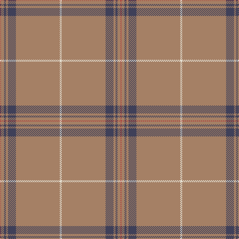

This page is one **sett** — a single exact thread-count. It belongs to the [tartan](/tartans/w2o44dt8o2dt2o3r1/)
(the same proportion at any scale), whose colour order is pattern [RRBRBRW](/stripes/rrbrbrw/).

Sourced from register-of-tartans.  It is a [7 stripe tartan](/stripes/stripes7/).

Original link https://www.tartanregister.gov.uk/tartanDetails.aspx?ref=10327

## Register references

External register numbers recorded for this tartan.

- Scottish Register of Tartans: [10327](https://www.tartanregister.gov.uk/tartanDetails.aspx?ref=10327)

## Thread count
W/4 LT88 N16 LT4 N4 LT6 R/2

## Palette

Palette: <strong>custom</strong>
<table><thead><tr><th>Colour</th><th>Threads</th><th>Shade</th><th>Base</th><th>OKLCh</th></tr></thead><tbody><tr><td>W/</td><td style="text-align:right;font-variant-numeric:tabular-nums">4</td><td><code style="background-color:#E5E0D2;">#E5E0D2</code> <small style="color:#888">#E5E0D2</small></td><td>W <code style="background-color:#F7F7F7;">#F7F7F7</code></td><td><small style="color:#888">oklch(90.7% 0.020 90.6)</small></td></tr><tr><td>LT</td><td style="text-align:right;font-variant-numeric:tabular-nums">88</td><td><code style="background-color:#A58065;">#A58065</code> <small style="color:#888">#A58065</small></td><td>R <code style="background-color:#CC0000;">#CC0000</code></td><td><small style="color:#888">oklch(62.9% 0.060 57.5)</small></td></tr><tr><td>N</td><td style="text-align:right;font-variant-numeric:tabular-nums">16</td><td><code style="background-color:#3F4059;">#3F4059</code> <small style="color:#888">#3F4059</small></td><td>B <code style="background-color:#2A418A;">#2A418A</code></td><td><small style="color:#888">oklch(38.1% 0.042 282.4)</small></td></tr><tr><td>LT</td><td style="text-align:right;font-variant-numeric:tabular-nums">4</td><td><code style="background-color:#A58065;">#A58065</code> <small style="color:#888">#A58065</small></td><td>R <code style="background-color:#CC0000;">#CC0000</code></td><td><small style="color:#888">oklch(62.9% 0.060 57.5)</small></td></tr><tr><td>N</td><td style="text-align:right;font-variant-numeric:tabular-nums">4</td><td><code style="background-color:#3F4059;">#3F4059</code> <small style="color:#888">#3F4059</small></td><td>B <code style="background-color:#2A418A;">#2A418A</code></td><td><small style="color:#888">oklch(38.1% 0.042 282.4)</small></td></tr><tr><td>LT</td><td style="text-align:right;font-variant-numeric:tabular-nums">6</td><td><code style="background-color:#A58065;">#A58065</code> <small style="color:#888">#A58065</small></td><td>R <code style="background-color:#CC0000;">#CC0000</code></td><td><small style="color:#888">oklch(62.9% 0.060 57.5)</small></td></tr><tr><td>R/</td><td style="text-align:right;font-variant-numeric:tabular-nums">2</td><td><code style="background-color:#B13836;">#B13836</code> <small style="color:#888">#B13836</small></td><td>R <code style="background-color:#CC0000;">#CC0000</code></td><td><small style="color:#888">oklch(51.8% 0.157 25.3)</small></td></tr></tbody></table>

# Sample pattern

## Nearest tartans

The nearest existing variants by ΔTartan distance, with this tartan at the top so the swatches line up against it.

ΔTartan

Tartan

Sett

—

<a href="/ttd/edit/#slug=w2o44dt8o2dt2o3r1~x2">Reece, Mathew</a> <a class="nn-out" href="/setts/s7/w2o44dt8o2dt2o3r1~x2/" title="open its dictionary page">↗</a>

1.36

<a href="/ttd/edit/#slug=w2lo44db8lo2db2lo3r1~x2">Reece (Name)</a> <a class="nn-out" href="/setts/s7/w2lo44db8lo2db2lo3r1~x2/" title="open its dictionary page">↗</a>

1.52

<a href="/ttd/edit/#slug=db3y1w1y25w1y1p3~x2">St Giles, Check</a> <a class="nn-out" href="/setts/s7/db3y1w1y25w1y1p3~x2/" title="open its dictionary page">↗</a>

1.69

<a href="/ttd/edit/#slug=n70ly4n3ly4n7k2n2r7~x2">European</a> <a class="nn-out" href="/setts/s8/n70ly4n3ly4n7k2n2r7~x2/" title="open its dictionary page">↗</a>

1.76

<a href="/ttd/edit/#slug=db3o1w1o25w1o1dp3~x2">St Giles Check Tartan Tartan Number: 387. Earliest known date: 1984 St Giles Church is in the Royal Mile, Edinburgh See products available Copyright © Blair Urquhart, Comrie, 2015</a> <a class="nn-out" href="/setts/s7/db3o1w1o25w1o1dp3~x2/" title="open its dictionary page">↗</a>

1.90

<a href="/ttd/edit/#slug=y40r8y4w2y4ly5~x2">Reid (1939)</a> <a class="nn-out" href="/setts/s6/y40r8y4w2y4ly5~x2/" title="open its dictionary page">↗</a>

1.91

<a href="/ttd/edit/#slug=n65k2n4lr2n10r24~x2">Norsemen (Corporate)</a> <a class="nn-out" href="/setts/s6/n65k2n4lr2n10r24~x2/" title="open its dictionary page">↗</a>

1.95

<a href="/ttd/edit/#slug=o5g1o32r1o8r9o2g2g3r3g1~x2">Portosalvo (Corporate)</a> <a class="nn-out" href="/setts/s11/o5g1o32r1o8r9o2g2g3r3g1~x2/" title="open its dictionary page">↗</a>

1.97

<a href="/ttd/edit/#slug=dy2lb2lo4dy5lo5dy46lo7dy1w2~x2">KIltwalk, The (Corporate)</a> <a class="nn-out" href="/setts/s9/dy2lb2lo4dy5lo5dy46lo7dy1w2~x2/" title="open its dictionary page">↗</a>

2.01

<a href="/ttd/edit/#slug=db3o1w1o25w1o1dp3~x4">St. Giles Check (Corporate)</a> <a class="nn-out" href="/setts/s7/db3o1w1o25w1o1dp3~x4/" title="open its dictionary page">↗</a>

2.02

<a href="/ttd/edit/#slug=y40n3y8r2y2w2y10n6do2n2w2~x2">Spencer</a> <a class="nn-out" href="/setts/s11/y40n3y8r2y2w2y10n6do2n2w2~x2/" title="open its dictionary page">↗</a>

## Neighbour map

Every grey dot is one of 14359 variants placed by the first two principal components of the ΔTartan feature space (44% of its variance). Red is this tartan; blue dots are its nearest — click one to open its page.

<svg viewBox="0 0 640 380" role="img" style="max-width:100%;height:auto;border:1px solid #e0e0e0;border-radius:4px;display:block" xmlns="http://www.w3.org/2000/svg"><image href="/nn/cloud.v1.png" width="640" height="380"/><a href="/setts/s7/w2lo44db8lo2db2lo3r1~x2/"><circle cx="588.1" cy="118.4" r="4" fill="#3465a4"><title>Reece (Name)</title></circle></a><a href="/setts/s7/db3y1w1y25w1y1p3~x2/"><circle cx="573.3" cy="153.6" r="4" fill="#3465a4"><title>St Giles, Check</title></circle></a><a href="/setts/s8/n70ly4n3ly4n7k2n2r7~x2/"><circle cx="626.0" cy="132.6" r="4" fill="#3465a4"><title>European</title></circle></a><a href="/setts/s7/db3o1w1o25w1o1dp3~x2/"><circle cx="556.2" cy="144.0" r="4" fill="#3465a4"><title>St Giles Check Tartan Tartan Number: 387. Earliest known date: 1984 St Giles Church is in the Royal Mile, Edinburgh See products available Copyright © Blair Urquhart, Comrie, 2015</title></circle></a><a href="/setts/s6/y40r8y4w2y4ly5~x2/"><circle cx="564.5" cy="187.4" r="4" fill="#3465a4"><title>Reid (1939)</title></circle></a><a href="/setts/s6/n65k2n4lr2n10r24~x2/"><circle cx="578.6" cy="186.4" r="4" fill="#3465a4"><title>Norsemen (Corporate)</title></circle></a><a href="/setts/s11/o5g1o32r1o8r9o2g2g3r3g1~x2/"><circle cx="538.0" cy="141.2" r="4" fill="#3465a4"><title>Portosalvo (Corporate)</title></circle></a><a href="/setts/s9/dy2lb2lo4dy5lo5dy46lo7dy1w2~x2/"><circle cx="550.0" cy="113.5" r="4" fill="#3465a4"><title>KIltwalk, The (Corporate)</title></circle></a><a href="/setts/s7/db3o1w1o25w1o1dp3~x4/"><circle cx="543.9" cy="137.6" r="4" fill="#3465a4"><title>St. Giles Check (Corporate)</title></circle></a><a href="/setts/s11/y40n3y8r2y2w2y10n6do2n2w2~x2/"><circle cx="537.7" cy="140.6" r="4" fill="#3465a4"><title>Spencer</title></circle></a><circle cx="626.0" cy="135.7" r="5" fill="#c00000"/></svg>

ID: /setts/s7/w2o44dt8o2dt2o3r1~x2/
