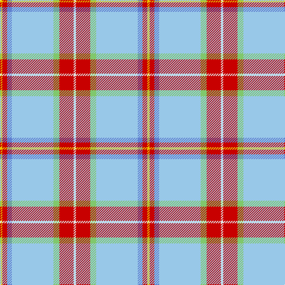

In pattern [WRYWBRY](/stripes/wrywbry/).

This was sourced from tartans-authority.  It is a [7 stripe tartan](/stripes/stripes7/).

Original link http://www.tartansauthority.com/tartan-ferret/display/7470/

## Attestations

This cloth appears in 2 source records; the oldest owns this page.

- Jan 2008 — Nicolson of the Isles (Personal) (tartans-authority, [record](http://www.tartansauthority.com/tartan-ferret/display/7470/))
- undated — Nicolson of the Isles (Personal) (register-of-tartans, [record](https://www.tartanregister.gov.uk/tartanDetails.aspx?ref=5515))

## Register references

External register numbers recorded for this tartan.

- Scottish Register of Tartans: [5515](https://www.tartanregister.gov.uk/tartanDetails.aspx?ref=5515)
- Scottish Tartans Authority (ITI): 7470

## Thread count
Y/4 R8 B8 LB70 LG10 R24 LN/4

## Palette
Each colour and the base-6 reference it is a variant of.

| Colour | Shade | Base |
|---|---|---|
| B | <code style="background-color:#6080D0;">#6080D0</code> `oklch(61.2% 0.127 266.3)` <small>#6080D0</small> | B <code style="background-color:#2A418A;">#2A418A</code> |
| LB | <code style="background-color:#98C8E8;">#98C8E8</code> `oklch(81.0% 0.068 237.9)` <small>#98C8E8</small> | W <code style="background-color:#F7F7F7;">#F7F7F7</code> |
| LG | <code style="background-color:#80C86C;">#80C86C</code> `oklch(76.4% 0.144 139.1)` <small>#80C86C</small> | Y <code style="background-color:#F2BF00;">#F2BF00</code> |
| LN | <code style="background-color:#E0E0E0;">#E0E0E0</code> `oklch(90.7% 0.000 89.9)` <small>#E0E0E0</small> | W <code style="background-color:#F7F7F7;">#F7F7F7</code> |
| R | <code style="background-color:#C80000;">#C80000</code> `oklch(52.3% 0.215 29.2)` <small>#C80000</small> | R <code style="background-color:#CC0000;">#CC0000</code> |
| Y | <code style="background-color:#E8C000;">#E8C000</code> `oklch(81.9% 0.168 93.7)` <small>#E8C000</small> | Y <code style="background-color:#F2BF00;">#F2BF00</code> |

# Sample pattern

## Nearest tartans

The nearest existing variants by ΔTartan distance, with this tartan at the top so the swatches line up against it.

ΔTartan

Tartan

Sett

—

<a href="/ttd/edit/#slug=w2r12lg5lb35b4r4ly2~x2">Nicolson of the Isles (Personal)</a> <a class="nn-out" href="/setts/s7/w2r12lg5lb35b4r4ly2~x2/" title="open its dictionary page">↗</a>

1.15

<a href="/ttd/edit/#slug=lb55t8w8t8g5lb8ly4w4k4~x2">Ofsharick, Matthew (Personal)</a> <a class="nn-out" href="/setts/s9/lb55t8w8t8g5lb8ly4w4k4~x2/" title="open its dictionary page">↗</a>

1.20

<a href="/ttd/edit/#slug=lg8lr2r3lr2ly2lr28r10lb1db3lb2~x2">Confederate Memorial Commemmorative Tartan Tartan Number: 2501. Earliest known date: 1995 Designed by Dr. Philip Smith in 1995. Grey is the colour of the Confederate States of America. The fields represent the Confederate Army in line of battle-- light blue for infantry, flanked by red for artilllery and yellow for outriding cavalry. The red field represents the Confederate flag in true proportions. See products available Copyright © Blair Urquhart, Comrie, 2015</a> <a class="nn-out" href="/setts/s10/lg8lr2r3lr2ly2lr28r10lb1db3lb2~x2/" title="open its dictionary page">↗</a>

1.20

<a href="/ttd/edit/#slug=n1w1o2w1n1w16o6db1ly1t1~x4">Gray, Thomas (Personal)</a> <a class="nn-out" href="/setts/s10/n1w1o2w1n1w16o6db1ly1t1~x4/" title="open its dictionary page">↗</a>

1.36

<a href="/ttd/edit/#slug=o55b8w8b8g5o8ly4w4k4~x2">Ofsharick, Matthew (Personal)</a> <a class="nn-out" href="/setts/s9/o55b8w8b8g5o8ly4w4k4~x2/" title="open its dictionary page">↗</a>

1.48

<a href="/ttd/edit/#slug=o18ly1o2ly1o2db6w4dy1g6~x2">Nickel Lodge Centennial Corporate Tartan Tartan Number: 920. Earliest known date: 1988 1989 See products available Copyright © Blair Urquhart, Comrie, 2015</a> <a class="nn-out" href="/setts/s9/o18ly1o2ly1o2db6w4dy1g6~x2/" title="open its dictionary page">↗</a>

1.49

<a href="/ttd/edit/#slug=t4t24ly5g2t3db5ly33db2~x2">Los Angeles (District)</a> <a class="nn-out" href="/setts/s8/t4t24ly5g2t3db5ly33db2~x2/" title="open its dictionary page">↗</a>

1.50

<a href="/ttd/edit/#slug=w50o4lo2k2lo2o4lo10o15t2~x2">Australian, dress</a> <a class="nn-out" href="/setts/s9/w50o4lo2k2lo2o4lo10o15t2~x2/" title="open its dictionary page">↗</a>

1.52

<a href="/ttd/edit/#slug=lb40db4lb4p5g5lb3ly6r3~x2">Miller Hargreaves (Personal)</a> <a class="nn-out" href="/setts/s8/lb40db4lb4p5g5lb3ly6r3~x2/" title="open its dictionary page">↗</a>

1.56

<a href="/ttd/edit/#slug=t14db1n3g1n3db1n4w24r1~x4">Musselburgh Dress (Dance)</a> <a class="nn-out" href="/setts/s9/t14db1n3g1n3db1n4w24r1~x4/" title="open its dictionary page">↗</a>

1.58

<a href="/ttd/edit/#slug=o2w3k1t9k1lr6g1lr3g1lr19k2w7o1~x2">Cahaba Memorial (Commemorative)</a> <a class="nn-out" href="/setts/s13/o2w3k1t9k1lr6g1lr3g1lr19k2w7o1~x2/" title="open its dictionary page">↗</a>

## Neighbour map

Every grey dot is one of 14299 variants placed by the first two principal components of the ΔTartan feature space (44% of its variance). Red is this tartan; blue dots are its nearest — click one to open its page.

<svg viewBox="0 0 640 380" role="img" style="max-width:100%;height:auto;border:1px solid #e0e0e0;border-radius:4px;display:block" xmlns="http://www.w3.org/2000/svg"><image href="/nn/cloud.v1.png" width="640" height="380"/><a href="/setts/s9/lb55t8w8t8g5lb8ly4w4k4~x2/"><circle cx="302.6" cy="103.5" r="4" fill="#3465a4"><title>Ofsharick, Matthew (Personal)</title></circle></a><a href="/setts/s10/lg8lr2r3lr2ly2lr28r10lb1db3lb2~x2/"><circle cx="287.3" cy="79.5" r="4" fill="#3465a4"><title>Confederate Memorial Commemmorative Tartan Tartan Number: 2501. Earliest known date: 1995 Designed by Dr. Philip Smith in 1995. Grey is the colour of the Confederate States of America. The fields represent the Confederate Army in line of battle-- light blue for infantry, flanked by red for artilllery and yellow for outriding cavalry. The red field represents the Confederate flag in true proportions. See products available Copyright © Blair Urquhart, Comrie, 2015</title></circle></a><a href="/setts/s10/n1w1o2w1n1w16o6db1ly1t1~x4/"><circle cx="319.1" cy="92.7" r="4" fill="#3465a4"><title>Gray, Thomas (Personal)</title></circle></a><a href="/setts/s9/o55b8w8b8g5o8ly4w4k4~x2/"><circle cx="318.4" cy="118.2" r="4" fill="#3465a4"><title>Ofsharick, Matthew (Personal)</title></circle></a><a href="/setts/s9/o18ly1o2ly1o2db6w4dy1g6~x2/"><circle cx="271.9" cy="121.4" r="4" fill="#3465a4"><title>Nickel Lodge Centennial Corporate Tartan Tartan Number: 920. Earliest known date: 1988 1989 See products available Copyright © Blair Urquhart, Comrie, 2015</title></circle></a><a href="/setts/s8/t4t24ly5g2t3db5ly33db2~x2/"><circle cx="255.4" cy="119.4" r="4" fill="#3465a4"><title>Los Angeles (District)</title></circle></a><a href="/setts/s9/w50o4lo2k2lo2o4lo10o15t2~x2/"><circle cx="319.0" cy="83.9" r="4" fill="#3465a4"><title>Australian, dress</title></circle></a><a href="/setts/s8/lb40db4lb4p5g5lb3ly6r3~x2/"><circle cx="361.2" cy="114.2" r="4" fill="#3465a4"><title>Miller Hargreaves (Personal)</title></circle></a><a href="/setts/s9/t14db1n3g1n3db1n4w24r1~x4/"><circle cx="226.4" cy="75.7" r="4" fill="#3465a4"><title>Musselburgh Dress (Dance)</title></circle></a><a href="/setts/s13/o2w3k1t9k1lr6g1lr3g1lr19k2w7o1~x2/"><circle cx="232.2" cy="89.7" r="4" fill="#3465a4"><title>Cahaba Memorial (Commemorative)</title></circle></a><circle cx="290.5" cy="114.6" r="5" fill="#c00000"/></svg>

ID: /setts/s7/w2r12lg5lb35b4r4ly2~x2/
