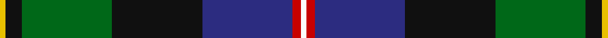
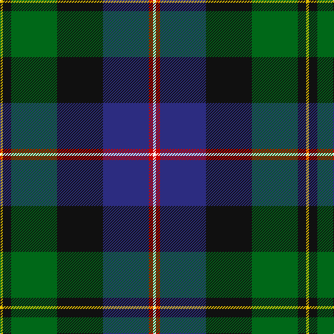

In pattern [WRBKGKY](/stripes/wrbkgky/).

This was sourced from tartans-authority.  It is a [7 stripe tartan](/stripes/stripes7/).

Original link http://www.tartansauthority.com/tartan-ferret/display/1839/

## Thread count
Y/4 K12 G66 K66 DB66 R6 W/4

## Palette
Each colour and the base-6 reference it is a variant of.

| Colour | Shade | Base |
|---|---|---|
| DB | <code style="background-color:#2C2C80;">#2C2C80</code> `oklch(35.0% 0.138 276.6)` <small>#2C2C80</small> | B <code style="background-color:#2A418A;">#2A418A</code> |
| G | <code style="background-color:#006818;">#006818</code> `oklch(45.0% 0.142 145.0)` <small>#006818</small> | G <code style="background-color:#006100;">#006100</code> |
| K | <code style="background-color:#101010;">#101010</code> `oklch(17.3% 0.000 89.9)` <small>#101010</small> | K <code style="background-color:#000000;">#000000</code> |
| R | <code style="background-color:#C80000;">#C80000</code> `oklch(52.3% 0.215 29.2)` <small>#C80000</small> | R <code style="background-color:#CC0000;">#CC0000</code> |
| W | <code style="background-color:#FCFCFC;">#FCFCFC</code> `oklch(99.1% 0.000 89.9)` <small>#FCFCFC</small> | W <code style="background-color:#F7F7F7;">#F7F7F7</code> |
| Y | <code style="background-color:#E8C000;">#E8C000</code> `oklch(81.9% 0.168 93.7)` <small>#E8C000</small> | Y <code style="background-color:#F2BF00;">#F2BF00</code> |

# Sample pattern

## Nearest tartans

The nearest existing variants by ΔTartan distance.

1. [Christian Hunting (Personal)](/setts/s7/r3g2db27k19g27dp2ly3~x2/) — ΔT 0.43
1. [Sey (Name)](/setts/s8/r2k8ly1k8g13db13lo1r2~x2/) — ΔT 0.77
1. [Macneil of Barra - Chief (Personal)](/setts/s7/w1r2b16k14g15k3ly1~x2/) — ΔT 0.83
1. [Cornish Hunting District Tartan Tartan Number: 1568. Earliest known date: 1984 The Cornish Hunting tartan was first produced in 1984, and was marketed by the firm, Cornovi Creations, Cornwall. It is based on the Cornish National tartan designed by E.E. Morton-Nance, who regarded tartan as the heritage of all Celts, not Scots alone. (P Smith and G Teall, District Tartans, 1992) The hunting sett replaces the 'National' yellow with dark green and the azure with a darker shade of blue. Cornish Hunting is a registered design (No. 514267). See products available Copyright © Blair Urquhart, Comrie, 2015](/setts/s7/w5k26ly2dg24dt7k3r3~x2/) — ΔT 0.88
1. [James (Personal)](/setts/s7/r2k6ly1dg12ly1db6lr2~x4/) — ΔT 0.88
1. [Jones, The](/setts/s7/r3w2dy10dg37k12db21w2~x2/) — ΔT 0.89
1. [Ayre (Personal)](/setts/s8/ly3y14k9r2k9db18k3w1~x2/) — ΔT 0.96
1. [Froben, Christian (Personal)](/setts/s8/k2w2k8lo8db24dg13k3m1~x2/) — ΔT 0.97
1. [St. Andrews Golf Club (Corporate)](/setts/s9/w1db12k9g1k1g5lb1g3lo1~x4/) — ΔT 0.98
1. [Grandfather Mountain Games (District](/setts/s7/r3dg20k2n11k2db20lr2~x2/) — ΔT 0.99

## Neighbour map

Every grey dot is one of 14299 variants placed by the first two principal components of the ΔTartan feature space (44% of its variance). Red is this tartan; blue dots are its nearest — click one to open its page.

<svg viewBox="0 0 640 380" role="img" style="max-width:100%;height:auto;border:1px solid #e0e0e0;border-radius:4px;display:block" xmlns="http://www.w3.org/2000/svg"><image href="/nn/cloud.v1.png" width="640" height="380"/><a href="/setts/s7/r3g2db27k19g27dp2ly3~x2/"><circle cx="175.0" cy="166.8" r="4" fill="#3465a4"><title>Christian Hunting (Personal)</title></circle></a><a href="/setts/s8/r2k8ly1k8g13db13lo1r2~x2/"><circle cx="148.0" cy="169.1" r="4" fill="#3465a4"><title>Sey (Name)</title></circle></a><a href="/setts/s7/w1r2b16k14g15k3ly1~x2/"><circle cx="152.3" cy="155.8" r="4" fill="#3465a4"><title>Macneil of Barra - Chief (Personal)</title></circle></a><a href="/setts/s7/w5k26ly2dg24dt7k3r3~x2/"><circle cx="196.2" cy="163.3" r="4" fill="#3465a4"><title>Cornish Hunting District Tartan Tartan Number: 1568. Earliest known date: 1984 The Cornish Hunting tartan was first produced in 1984, and was marketed by the firm, Cornovi Creations, Cornwall. It is based on the Cornish National tartan designed by E.E. Morton-Nance, who regarded tartan as the heritage of all Celts, not Scots alone. (P Smith and G Teall, District Tartans, 1992) The hunting sett replaces the 'National' yellow with dark green and the azure with a darker shade of blue. Cornish Hunting is a registered design (No. 514267). See products available Copyright © Blair Urquhart, Comrie, 2015</title></circle></a><a href="/setts/s7/r2k6ly1dg12ly1db6lr2~x4/"><circle cx="163.5" cy="169.8" r="4" fill="#3465a4"><title>James (Personal)</title></circle></a><a href="/setts/s7/r3w2dy10dg37k12db21w2~x2/"><circle cx="199.4" cy="153.9" r="4" fill="#3465a4"><title>Jones, The</title></circle></a><a href="/setts/s8/ly3y14k9r2k9db18k3w1~x2/"><circle cx="159.5" cy="153.5" r="4" fill="#3465a4"><title>Ayre (Personal)</title></circle></a><a href="/setts/s8/k2w2k8lo8db24dg13k3m1~x2/"><circle cx="187.9" cy="130.5" r="4" fill="#3465a4"><title>Froben, Christian (Personal)</title></circle></a><a href="/setts/s9/w1db12k9g1k1g5lb1g3lo1~x4/"><circle cx="164.5" cy="149.8" r="4" fill="#3465a4"><title>St. Andrews Golf Club (Corporate)</title></circle></a><a href="/setts/s7/r3dg20k2n11k2db20lr2~x2/"><circle cx="155.2" cy="183.6" r="4" fill="#3465a4"><title>Grandfather Mountain Games (District</title></circle></a><circle cx="182.4" cy="160.5" r="5" fill="#c00000"/></svg>

ID: /setts/s7/w2r3db33k33g33k6ly2~x2/
