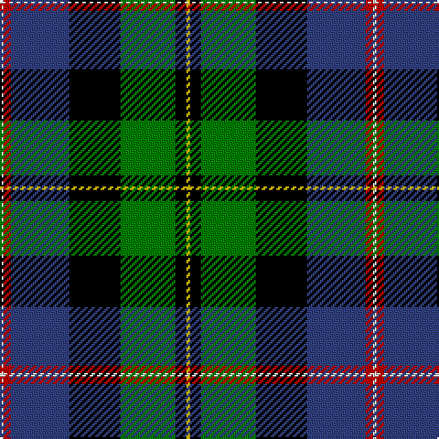

In pattern [WRBKGKY](/patterns/wrbkgky/).

This was sourced from weddslist.  It is a [7 stripes tartan](/stripes/stripes7/).

Original link http://www.weddslist.com/cgi-bin/tartans/pg.pl?source=sts

## Thread count
LN/2 R4 B32 K28 G30 K6 Y/2

## Palette
Each colour and its ΔE from the base-6 reference it is a variant of.

| Colour | Shade | Base | ΔE (OKLab) |
|---|---|---|---|
| B | <code style="background-color:#304080;">#304080</code> `#304080` | B <code style="background-color:#2C4084;">#2C4084</code> | 0.01 |
| G | <code style="background-color:#008000;">#008000</code> `#008000` | G <code style="background-color:#006400;">#006400</code> | 0.09 |
| K | <code style="background-color:#000000;">#000000</code> `#000000` | K <code style="background-color:#000000;">#000000</code> | 0.00 |
| LN | <code style="background-color:#E0E0E0;">#E0E0E0</code> `#E0E0E0` | W <code style="background-color:#F4F4F0;">#F4F4F0</code> | 0.06 |
| R | <code style="background-color:#C00000;">#C00000</code> `#C00000` | R <code style="background-color:#C80000;">#C80000</code> | 0.02 |
| Y | <code style="background-color:#F0C000;">#F0C000</code> `#F0C000` | Y <code style="background-color:#E8C000;">#E8C000</code> | 0.01 |

# Sample pattern

## Nearest tartans

The nearest existing variants by ΔTartan distance.

1. [Whitson](/setts/s9/w8k2g38y2k38b26r4b8r4-b304080-g008000-k000000-rc00000-we0e0e0-yf0c000/) — ΔT 0.81
1. [Cusack](/setts/s9/b8k4b32k24w2g26r4g4y8-b00008c-g007800-k000000-r8c0000-wfcfcfc-yc88c00/) — ΔT 0.94
1. [Wilson's, No 221](/setts/s6/b2ba28r4k28g28r2-b5480b0-ba304080-g008000-k000000-rc00000/) — ΔT 0.98
1. [Whitson](/setts/s8/w8k2g36k34b26r2b6r2-b304080-g008000-k000000-rc00000-we0e0e0/) — ΔT 0.98
1. [James](/setts/s7/b10ba24y4g50y4k24r10-b5480b0-ba000050-g003000-k000000-rc00000-yf0c000/) — ΔT 0.99
1. [MacCaskill](/setts/s7/k4r2g30k30b30y2k4-b304080-g008000-k000000-rc00000-yf0c000/) — ΔT 0.99
1. [Cornish Htg (District)](/setts/s7/w10k52y4g48b16k8r6-b00008c-g004c00-k000000-rc80000-we0e0e0-y9c9c00/) — ΔT 1.00
1. [MacNeil](/setts/s7/w2r4b32k28g30k6y2-b000064-g004c00-k000000-rc80000-wd0d0d0-yffff00/) — ΔT 1.02
1. [Smith](/setts/s6/b6ba36k40g40k2y6-b5480b0-ba304080-g008000-k000000-yf0c000/) — ΔT 1.05
1. [Birch](/setts/s9/g6b8g46k20r4k20ba36k2w6-b800080-ba5480b0-g008000-k000000-rc00020-we0e0e0/) — ΔT 1.06

## Neighbour map

Every grey dot is one of 15726 variants placed by the first two principal components of the ΔTartan feature space (44% of its variance). Red is this tartan; blue dots are its nearest — click one to open its page.

<svg viewBox="0 0 640 380" role="img" style="max-width:100%;height:auto;border:1px solid #e0e0e0;border-radius:4px;display:block" xmlns="http://www.w3.org/2000/svg"><image href="/nn/cloud.v1.png" width="640" height="380"/><a href="/setts/s9/w8k2g38y2k38b26r4b8r4-b304080-g008000-k000000-rc00000-we0e0e0-yf0c000/"><circle cx="114.5" cy="116.5" r="4" fill="#3465a4"><title>Whitson</title></circle></a><a href="/setts/s9/b8k4b32k24w2g26r4g4y8-b00008c-g007800-k000000-r8c0000-wfcfcfc-yc88c00/"><circle cx="123.5" cy="138.0" r="4" fill="#3465a4"><title>Cusack</title></circle></a><a href="/setts/s6/b2ba28r4k28g28r2-b5480b0-ba304080-g008000-k000000-rc00000/"><circle cx="137.1" cy="180.1" r="4" fill="#3465a4"><title>Wilson's, No 221</title></circle></a><a href="/setts/s8/w8k2g36k34b26r2b6r2-b304080-g008000-k000000-rc00000-we0e0e0/"><circle cx="137.8" cy="143.2" r="4" fill="#3465a4"><title>Whitson</title></circle></a><a href="/setts/s7/b10ba24y4g50y4k24r10-b5480b0-ba000050-g003000-k000000-rc00000-yf0c000/"><circle cx="138.3" cy="163.0" r="4" fill="#3465a4"><title>James</title></circle></a><a href="/setts/s7/k4r2g30k30b30y2k4-b304080-g008000-k000000-rc00000-yf0c000/"><circle cx="173.4" cy="165.8" r="4" fill="#3465a4"><title>MacCaskill</title></circle></a><a href="/setts/s7/w10k52y4g48b16k8r6-b00008c-g004c00-k000000-rc80000-we0e0e0-y9c9c00/"><circle cx="160.8" cy="154.2" r="4" fill="#3465a4"><title>Cornish Htg (District)</title></circle></a><a href="/setts/s7/w2r4b32k28g30k6y2-b000064-g004c00-k000000-rc80000-wd0d0d0-yffff00/"><circle cx="144.6" cy="157.2" r="4" fill="#3465a4"><title>MacNeil</title></circle></a><a href="/setts/s6/b6ba36k40g40k2y6-b5480b0-ba304080-g008000-k000000-yf0c000/"><circle cx="143.9" cy="169.0" r="4" fill="#3465a4"><title>Smith</title></circle></a><a href="/setts/s9/g6b8g46k20r4k20ba36k2w6-b800080-ba5480b0-g008000-k000000-rc00020-we0e0e0/"><circle cx="129.8" cy="116.8" r="4" fill="#3465a4"><title>Birch</title></circle></a><circle cx="129.4" cy="146.6" r="5" fill="#c00000"/></svg>

ID: /setts/s7/w2r4b32k28g30k6y2-b304080-g008000-k000000-rc00000-we0e0e0-yf0c000/
