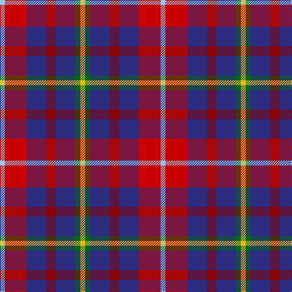

In pattern [WRBRBGY](/patterns/wrbrbgy/).

This was sourced from tartans-authority.  It is a [7 stripes tartan](/stripes/stripes7/).

Original link http://www.tartansauthority.com/tartan-ferret/display/7137/

## Thread count
LB/8 R36 DB32 DR16 DB32 G8 Y/8

## Palette
Each colour and its ΔE from the base-6 reference it is a variant of.

| Colour | Shade | Base | ΔE (OKLab) |
|---|---|---|---|
| DB | <code style="background-color:#2C2C80;">#2C2C80</code> `#2C2C80` | B <code style="background-color:#2A418A;">#2A418A</code> | 0.06 |
| DR | <code style="background-color:#880000;">#880000</code> `#880000` | R <code style="background-color:#CC0000;">#CC0000</code> | 0.15 |
| G | <code style="background-color:#006818;">#006818</code> `#006818` | G <code style="background-color:#006100;">#006100</code> | 0.02 |
| LB | <code style="background-color:#98C8E8;">#98C8E8</code> `#98C8E8` | W <code style="background-color:#F7F7F7;">#F7F7F7</code> | 0.18 |
| R | <code style="background-color:#C80000;">#C80000</code> `#C80000` | R <code style="background-color:#CC0000;">#CC0000</code> | 0.01 |
| Y | <code style="background-color:#E8C000;">#E8C000</code> `#E8C000` | Y <code style="background-color:#F2BF00;">#F2BF00</code> | 0.02 |

# Sample pattern

## Nearest tartans

The nearest existing variants by ΔTartan distance.

1. [Feis An Eilein](/setts/s7/g2r9b8ra4b8ga2y2~b2c4084-g808080-ga005020-rdc0000-ra781c38-ye8c000~x8/) — ΔT 0.59
1. [Sustainability (Fashion)](/setts/s8/b20k3g18r12ba4r12b15y4~b2c2c80-ba2888c4-g006818-k101010-rc80000-ye8c000~x2/) — ΔT 1.11
1. [Nicolson of Tiree & Coll (Clan)](/setts/s6/g3b8r11ba3k2bb2~b2c2c80-ba003c64-bb780078-g289c18-k101010-rc80000~x4/) — ΔT 1.12
1. [Commonwealth](/setts/s10/b12w4r12w5k4ra12b20r4b5r4~b304080-k000000-rc00000-ra703000-we0e0e0~x2/) — ΔT 1.17
1. [Isle of Gigha (District)](/setts/s7/y2b4k1b4r4y4b1~b202060-k101010-ra00048-ybc8c00~x8/) — ΔT 1.23
1. [Hueg (Formal) (Personal)](/setts/s11/b4ba3b13g8r12ga4r12b4r5w4r4~b1474b4-ba003c64-g006818-ga00643c-rc8002c-wfcfcfc~x2/) — ΔT 1.29
1. [Lord's Own Highlanders (Corporate)](/setts/s6/w5r20k8ra5b36y5~b501850-k101010-r888888-rac80000-we0e0e0-ybc8c00~x2/) — ΔT 1.33
1. [Nicolson of Lewis (Clan?)](/setts/s6/b3ba5bb2g5r11w3~b344054-ba003c64-bb5c5c5c-g003820-rc80000-we0e0e0~x4/) — ΔT 1.36
1. [Commonwealth](/setts/s10/b6y2r6w3k2y6b10r2b3r2~b14283c-k101010-rc80000-wc0c0c0-ya08858~x4/) — ΔT 1.44
1. [Stewart /Stuart- Fragment Cf 1452 & 1445](/setts/s7/r3b4k11r11g11ba3r3~b5c8ca8-ba441800-g408060-k00002c-rc80000~x4/) — ΔT 1.49

## Neighbour map

Every grey dot is one of 15726 variants placed by the first two principal components of the ΔTartan feature space (44% of its variance). Red is this tartan; blue dots are its nearest — click one to open its page.

<svg viewBox="0 0 640 380" role="img" style="max-width:100%;height:auto;border:1px solid #e0e0e0;border-radius:4px;display:block" xmlns="http://www.w3.org/2000/svg"><image href="/nn/cloud.v1.png" width="640" height="380"/><a href="/setts/s7/g2r9b8ra4b8ga2y2~b2c4084-g808080-ga005020-rdc0000-ra781c38-ye8c000~x8/"><circle cx="150.9" cy="218.4" r="4" fill="#3465a4"><title>Feis An Eilein</title></circle></a><a href="/setts/s8/b20k3g18r12ba4r12b15y4~b2c2c80-ba2888c4-g006818-k101010-rc80000-ye8c000~x2/"><circle cx="119.2" cy="200.7" r="4" fill="#3465a4"><title>Sustainability (Fashion)</title></circle></a><a href="/setts/s6/g3b8r11ba3k2bb2~b2c2c80-ba003c64-bb780078-g289c18-k101010-rc80000~x4/"><circle cx="126.5" cy="202.0" r="4" fill="#3465a4"><title>Nicolson of Tiree &amp; Coll (Clan)</title></circle></a><a href="/setts/s10/b12w4r12w5k4ra12b20r4b5r4~b304080-k000000-rc00000-ra703000-we0e0e0~x2/"><circle cx="145.1" cy="203.1" r="4" fill="#3465a4"><title>Commonwealth</title></circle></a><a href="/setts/s7/y2b4k1b4r4y4b1~b202060-k101010-ra00048-ybc8c00~x8/"><circle cx="113.4" cy="249.4" r="4" fill="#3465a4"><title>Isle of Gigha (District)</title></circle></a><a href="/setts/s11/b4ba3b13g8r12ga4r12b4r5w4r4~b1474b4-ba003c64-g006818-ga00643c-rc8002c-wfcfcfc~x2/"><circle cx="125.7" cy="197.2" r="4" fill="#3465a4"><title>Hueg (Formal) (Personal)</title></circle></a><a href="/setts/s6/w5r20k8ra5b36y5~b501850-k101010-r888888-rac80000-we0e0e0-ybc8c00~x2/"><circle cx="177.1" cy="176.1" r="4" fill="#3465a4"><title>Lord's Own Highlanders (Corporate)</title></circle></a><a href="/setts/s6/b3ba5bb2g5r11w3~b344054-ba003c64-bb5c5c5c-g003820-rc80000-we0e0e0~x4/"><circle cx="97.9" cy="206.2" r="4" fill="#3465a4"><title>Nicolson of Lewis (Clan?)</title></circle></a><a href="/setts/s10/b6y2r6w3k2y6b10r2b3r2~b14283c-k101010-rc80000-wc0c0c0-ya08858~x4/"><circle cx="147.8" cy="209.7" r="4" fill="#3465a4"><title>Commonwealth</title></circle></a><a href="/setts/s7/r3b4k11r11g11ba3r3~b5c8ca8-ba441800-g408060-k00002c-rc80000~x4/"><circle cx="95.5" cy="233.6" r="4" fill="#3465a4"><title>Stewart /Stuart- Fragment Cf 1452 &amp; 1445</title></circle></a><circle cx="135.9" cy="212.5" r="5" fill="#c00000"/></svg>

ID: /setts/s7/w2r9b8ra4b8g2y2~b2c2c80-g006818-rc80000-ra880000-w98c8e8-ye8c000~x4/
