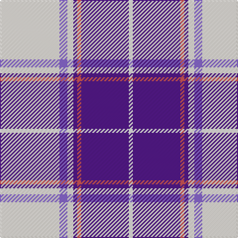

This page is one **sett** — a single exact thread-count. It belongs to the [tartan](/tartans/w30b4w3dp2r2dp24w2/)
(the same proportion at any scale), whose colour order is pattern [WBRBWBW](/stripes/wbrbwbw/).

Sourced from register-of-tartans.  It is a [7 stripe tartan](/stripes/stripes7/).

Original link https://www.tartanregister.gov.uk/tartanDetails.aspx?ref=10506

2 attestations — the source records this cloth was collapsed from (oldest owns this page)

<ul>
<li>01/04/2011 — St Andrews Links Dress (register-of-tartans, <a href="https://www.tartanregister.gov.uk/tartanDetails.aspx?ref=10506">record</a>)</li>
<li>undated — St Andrews Links Dress Corporate Tartan Tartan Number: 10506. Earliest known date: 01/04/2011 A Dress variation of the St Andrews Links tartan (Scottish Tartan Register ref.3880). See products available Copyright © Blair Urquhart, Comrie, 2015 (house-of-tartan, <a href="http://www.house-of-tartan.scotland.net/house/TartanViewjs.asp?colr=Def&tnam=10506">record</a>)</li>
</ul>

## Register references

External register numbers recorded for this tartan.

- Scottish Register of Tartans: [10506](https://www.tartanregister.gov.uk/tartanDetails.aspx?ref=10506)

## Thread count
Wa/60 Pa8 Wa6 P4 DO4 P48 W/4

## Palette

Palette: <strong>Tartan Register</strong> <small style="color:#888">(1 of 5 colours)</small>
<table><thead><tr><th>Colour</th><th>Threads</th><th>Shade</th><th>Base</th><th>OKLCh</th></tr></thead><tbody><tr><td>Wa/</td><td style="text-align:right;font-variant-numeric:tabular-nums">60</td><td><code style="background-color:#FDF5E6;">#FDF5E6</code> <small style="color:#888">#FDF5E6</small></td><td>W <code style="background-color:#F7F7F7;">#F7F7F7</code></td><td><small style="color:#888">oklch(97.2% 0.022 83.3)</small></td></tr><tr><td>Pa</td><td style="text-align:right;font-variant-numeric:tabular-nums">8</td><td><code style="background-color:#8968CD;">#8968CD</code> <small style="color:#888">#8968CD</small></td><td>B <code style="background-color:#2A418A;">#2A418A</code></td><td><small style="color:#888">oklch(59.6% 0.151 296.6)</small></td></tr><tr><td>Wa</td><td style="text-align:right;font-variant-numeric:tabular-nums">6</td><td><code style="background-color:#FDF5E6;">#FDF5E6</code> <small style="color:#888">#FDF5E6</small></td><td>W <code style="background-color:#F7F7F7;">#F7F7F7</code></td><td><small style="color:#888">oklch(97.2% 0.022 83.3)</small></td></tr><tr><td>P</td><td style="text-align:right;font-variant-numeric:tabular-nums">4</td><td><code style="background-color:#551A8B;">#551A8B</code> <small style="color:#888">#551A8B</small></td><td>B <code style="background-color:#2A418A;">#2A418A</code></td><td><small style="color:#888">oklch(37.8% 0.172 302.2)</small></td></tr><tr><td>DO</td><td style="text-align:right;font-variant-numeric:tabular-nums">4</td><td><code style="background-color:#CD5555;">#CD5555</code> <small style="color:#888">#CD5555</small></td><td>R <code style="background-color:#CC0000;">#CC0000</code></td><td><small style="color:#888">oklch(60.4% 0.153 22.8)</small></td></tr><tr><td>P</td><td style="text-align:right;font-variant-numeric:tabular-nums">48</td><td><code style="background-color:#551A8B;">#551A8B</code> <small style="color:#888">#551A8B</small></td><td>B <code style="background-color:#2A418A;">#2A418A</code></td><td><small style="color:#888">oklch(37.8% 0.172 302.2)</small></td></tr><tr><td>W/</td><td style="text-align:right;font-variant-numeric:tabular-nums">4</td><td><code style="background-color:#FFFFFF;">#FFFFFF</code> <small style="color:#888">#FFFFFF</small></td><td>W <code style="background-color:#F7F7F7;">#F7F7F7</code></td><td><small style="color:#888">oklch(100.0% 0.000 89.9)</small></td></tr></tbody></table>

# Sample pattern

## Nearest tartans

The nearest existing variants by ΔTartan distance, with this tartan at the top so the swatches line up against it.

ΔTartan

Tartan

Sett

—

<a href="/ttd/edit/#slug=w30b4w3dp2r2dp24w2~x2">St Andrews Links Dress</a> <a class="nn-out" href="/setts/s7/w30b4w3dp2r2dp24w2~x2/" title="open its dictionary page">↗</a>

1.11

<a href="/ttd/edit/#slug=w5dp2w34dp34k2dp2t4~x2">Cunningham Dress Purple (Dance)</a> <a class="nn-out" href="/setts/s7/w5dp2w34dp34k2dp2t4~x2/" title="open its dictionary page">↗</a>

1.27

<a href="/ttd/edit/#slug=w3db2w30db30k2db2ly3~x2">Torridon, Saphire (Dance)</a> <a class="nn-out" href="/setts/s7/w3db2w30db30k2db2ly3~x2/" title="open its dictionary page">↗</a>

1.30

<a href="/ttd/edit/#slug=lr30lp4lr3dp2r2dp24w2~x2">St. Andrew's Links Dress (Corporate)</a> <a class="nn-out" href="/setts/s7/lr30lp4lr3dp2r2dp24w2~x2/" title="open its dictionary page">↗</a>

1.35

<a href="/ttd/edit/#slug=t2dp1k1dp20w20dp1w2~x4">Cunningham Dress Purple (Dance) Fashion Tartan Tartan Number: 6531. Earliest known date: 01/01/1986 A dancers' tartan from D C Dalgliesh of Selkirk. See products available Copyright © Blair Urquhart, Comrie, 2015</a> <a class="nn-out" href="/setts/s7/t2dp1k1dp20w20dp1w2~x4/" title="open its dictionary page">↗</a>

1.42

<a href="/ttd/edit/#slug=w8k4w54db18m6db8m49w6">Merida Dance</a> <a class="nn-out" href="/setts/s8/w8k4w54db18m6db8m49w6/" title="open its dictionary page">↗</a>

1.46

<a href="/ttd/edit/#slug=w5k3w31dp26w4dp10t4~x2">MacPherson Dress Purple</a> <a class="nn-out" href="/setts/s7/w5k3w31dp26w4dp10t4~x2/" title="open its dictionary page">↗</a>

1.47

<a href="/ttd/edit/#slug=w3db2w30db4m26w2m2dp4m2w3~x2">Harris, Lilac (Dance)</a> <a class="nn-out" href="/setts/s10/w3db2w30db4m26w2m2dp4m2w3~x2/" title="open its dictionary page">↗</a>

1.47

<a href="/ttd/edit/#slug=w5k3w31p26w4p10t4~x2">MacPherson, dress (purple)</a> <a class="nn-out" href="/setts/s7/w5k3w31p26w4p10t4~x2/" title="open its dictionary page">↗</a>

1.48

<a href="/ttd/edit/#slug=w8k6w54db16m6db8m49w6">Meridia Dance</a> <a class="nn-out" href="/setts/s8/w8k6w54db16m6db8m49w6/" title="open its dictionary page">↗</a>

1.51

<a href="/ttd/edit/#slug=b4r2b40k11g2w16r2~x2">Jack Sinclair (Personal)</a> <a class="nn-out" href="/setts/s7/b4r2b40k11g2w16r2~x2/" title="open its dictionary page">↗</a>

## Neighbour map

Every grey dot is one of 14299 variants placed by the first two principal components of the ΔTartan feature space (44% of its variance). Red is this tartan; blue dots are its nearest — click one to open its page.

<svg viewBox="0 0 640 380" role="img" style="max-width:100%;height:auto;border:1px solid #e0e0e0;border-radius:4px;display:block" xmlns="http://www.w3.org/2000/svg"><image href="/nn/cloud.v1.png" width="640" height="380"/><a href="/setts/s7/w5dp2w34dp34k2dp2t4~x2/"><circle cx="280.2" cy="123.8" r="4" fill="#3465a4"><title>Cunningham Dress Purple (Dance)</title></circle></a><a href="/setts/s7/w3db2w30db30k2db2ly3~x2/"><circle cx="239.6" cy="121.8" r="4" fill="#3465a4"><title>Torridon, Saphire (Dance)</title></circle></a><a href="/setts/s7/lr30lp4lr3dp2r2dp24w2~x2/"><circle cx="283.7" cy="130.0" r="4" fill="#3465a4"><title>St. Andrew's Links Dress (Corporate)</title></circle></a><a href="/setts/s7/t2dp1k1dp20w20dp1w2~x4/"><circle cx="301.0" cy="119.8" r="4" fill="#3465a4"><title>Cunningham Dress Purple (Dance) Fashion Tartan Tartan Number: 6531. Earliest known date: 01/01/1986 A dancers' tartan from D C Dalgliesh of Selkirk. See products available Copyright © Blair Urquhart, Comrie, 2015</title></circle></a><a href="/setts/s8/w8k4w54db18m6db8m49w6/"><circle cx="218.5" cy="130.9" r="4" fill="#3465a4"><title>Merida Dance</title></circle></a><a href="/setts/s7/w5k3w31dp26w4dp10t4~x2/"><circle cx="251.6" cy="164.2" r="4" fill="#3465a4"><title>MacPherson Dress Purple</title></circle></a><a href="/setts/s10/w3db2w30db4m26w2m2dp4m2w3~x2/"><circle cx="280.4" cy="116.2" r="4" fill="#3465a4"><title>Harris, Lilac (Dance)</title></circle></a><a href="/setts/s7/w5k3w31p26w4p10t4~x2/"><circle cx="250.3" cy="163.0" r="4" fill="#3465a4"><title>MacPherson, dress (purple)</title></circle></a><a href="/setts/s8/w8k6w54db16m6db8m49w6/"><circle cx="205.8" cy="149.5" r="4" fill="#3465a4"><title>Meridia Dance</title></circle></a><a href="/setts/s7/b4r2b40k11g2w16r2~x2/"><circle cx="287.2" cy="119.3" r="4" fill="#3465a4"><title>Jack Sinclair (Personal)</title></circle></a><circle cx="248.3" cy="114.5" r="5" fill="#c00000"/></svg>

ID: /setts/s7/w30b4w3dp2r2dp24w2~x2/
