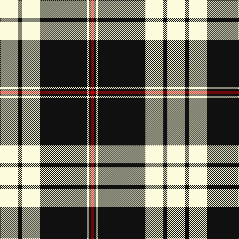

**Bands:** [RKWKWKW](/stripes/rkwkwkw/) · **Stripes:** [R K W K W K W](/stripes/stripes7/) R K W K W K W

This was sourced from tartans-authority.  It is a [7 band tartan](/bands/bands7/).

Original link http://www.tartansauthority.com/tartan-ferret/display/6841/

## Thread count
LY/36 K8 LY36 K95 LY4 K4 R/6

## Palette
Each colour and its ΔE from the base-6 reference it is a variant of.

| Colour | Shade | Base | ΔE (OKLab) |
|---|---|---|---|
| K | <code style="background-color:#101010;">#101010</code> `#101010` | K <code style="background-color:#000000;">#000000</code> | 0.17 |
| LY | <code style="background-color:#FCFCDC;">#FCFCDC</code> `#FCFCDC` | W <code style="background-color:#F7F7F7;">#F7F7F7</code> | 0.04 |
| R | <code style="background-color:#C80000;">#C80000</code> `#C80000` | R <code style="background-color:#CC0000;">#CC0000</code> | 0.01 |

# Sample pattern

## Nearest tartans

The nearest existing variants by ΔTartan distance.

1. [MacPherson Dress](/setts/s7/lb3r1lb30k20lb3k9ly1/) — ΔT 1.03
1. [Highland Park High School (Texas)](/setts/s9/db19w1db6w1db2w2ly2w1ly18~x4/) — ΔT 1.07
1. [Cornish Flag (District)](/setts/s5/w5k20w10k1r2~x2/) — ΔT 1.08
1. [Menzies Dress Tartan Tartan Number: 12444. Earliest known date: See products available Copyright © Blair Urquhart, Comrie, 2015](/setts/s9/w6k1w2k4w4k2w4k15r1~x2/) — ΔT 1.11
1. [Highland Park High School (Texas)](/setts/s9/db19w1db6w1db2w2lo2w1lo18~x4/) — ΔT 1.11
1. [Gleneagles Gold (Dalgleish)](/setts/s7/k4lo4lb32lo1k32lo4k2~x4/) — ΔT 1.14
1. [Richecourt, Baron of (Personal)](/setts/s7/w4k30r1k1r3w12ly3~x2/) — ΔT 1.16
1. [St. Piran Cornish Flag](/setts/s8/r2k1w10k20w5k20w10k1~x2/) — ΔT 1.17
1. [MacKnight (Name)](/setts/s9/k12lr1k2lr6k4lr3k4lr21r4~x2/) — ΔT 1.17
1. [MacPherson of Cluny (Black and White)](/setts/s7/w5r3w35k28w4k11w2~x2/) — ΔT 1.18

## Neighbour map

Every grey dot is one of 14313 variants placed by the first two principal components of the ΔTartan feature space (44% of its variance). Red is this tartan; blue dots are its nearest — click one to open its page.

<svg viewBox="0 0 640 380" role="img" style="max-width:100%;height:auto;border:1px solid #e0e0e0;border-radius:4px;display:block" xmlns="http://www.w3.org/2000/svg"><image href="/nn/cloud.v1.png" width="640" height="380"/><a href="/setts/s7/lb3r1lb30k20lb3k9ly1/"><circle cx="322.9" cy="125.5" r="4" fill="#3465a4"><title>MacPherson Dress</title></circle></a><a href="/setts/s9/db19w1db6w1db2w2ly2w1ly18~x4/"><circle cx="306.7" cy="136.4" r="4" fill="#3465a4"><title>Highland Park High School (Texas)</title></circle></a><a href="/setts/s5/w5k20w10k1r2~x2/"><circle cx="325.4" cy="181.8" r="4" fill="#3465a4"><title>Cornish Flag (District)</title></circle></a><a href="/setts/s9/w6k1w2k4w4k2w4k15r1~x2/"><circle cx="316.3" cy="166.6" r="4" fill="#3465a4"><title>Menzies Dress Tartan Tartan Number: 12444. Earliest known date: See products available Copyright © Blair Urquhart, Comrie, 2015</title></circle></a><a href="/setts/s9/db19w1db6w1db2w2lo2w1lo18~x4/"><circle cx="316.1" cy="140.0" r="4" fill="#3465a4"><title>Highland Park High School (Texas)</title></circle></a><a href="/setts/s7/k4lo4lb32lo1k32lo4k2~x4/"><circle cx="314.1" cy="135.5" r="4" fill="#3465a4"><title>Gleneagles Gold (Dalgleish)</title></circle></a><a href="/setts/s7/w4k30r1k1r3w12ly3~x2/"><circle cx="330.1" cy="112.8" r="4" fill="#3465a4"><title>Richecourt, Baron of (Personal)</title></circle></a><a href="/setts/s8/r2k1w10k20w5k20w10k1~x2/"><circle cx="344.9" cy="171.3" r="4" fill="#3465a4"><title>St. Piran Cornish Flag</title></circle></a><a href="/setts/s9/k12lr1k2lr6k4lr3k4lr21r4~x2/"><circle cx="326.3" cy="159.6" r="4" fill="#3465a4"><title>MacKnight (Name)</title></circle></a><a href="/setts/s7/w5r3w35k28w4k11w2~x2/"><circle cx="302.4" cy="157.8" r="4" fill="#3465a4"><title>MacPherson of Cluny (Black and White)</title></circle></a><circle cx="346.7" cy="144.3" r="5" fill="#c00000"/></svg>

ID: /setts/s7/w36k8w36k95w4k4r6/
