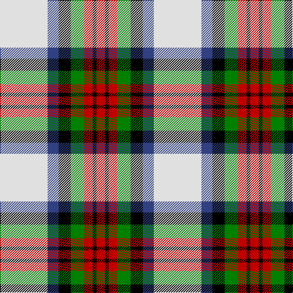

In pattern [RKRGKBW](/patterns/rkrgkbw/).

This was sourced from weddslist.  It is a [7 stripes tartan](/stripes/stripes7/).

Original link http://www.weddslist.com/cgi-bin/tartans/pg.pl?source=sts

## Thread count
LN/78 B18 K20 G22 R14 K6 R/14

## Palette
Each colour and its ΔE from the base-6 reference it is a variant of.

| Colour | Shade | Base | ΔE (OKLab) |
|---|---|---|---|
| B | <code style="background-color:#304080;">#304080</code> `#304080` | B <code style="background-color:#2A418A;">#2A418A</code> | 0.02 |
| G | <code style="background-color:#008000;">#008000</code> `#008000` | G <code style="background-color:#006100;">#006100</code> | 0.10 |
| K | <code style="background-color:#000000;">#000000</code> `#000000` | K <code style="background-color:#000000;">#000000</code> | 0.00 |
| LN | <code style="background-color:#E0E0E0;">#E0E0E0</code> `#E0E0E0` | W <code style="background-color:#F7F7F7;">#F7F7F7</code> | 0.07 |
| R | <code style="background-color:#C00000;">#C00000</code> `#C00000` | R <code style="background-color:#CC0000;">#CC0000</code> | 0.03 |

# Sample pattern

## Nearest tartans

The nearest existing variants by ΔTartan distance.

1. [MacDuff Dress Clan Tartan Tartan Number: 1601. Earliest known date: pre 2003 From Scott Adie pattern. See products available Copyright © Blair Urquhart, Comrie, 2015](/setts/s7/w39b9k10g11r7k3r7~b2c2c80-g006818-k101010-rc80000-we0e0e0~x2/) — ΔT 0.29
1. [MacDuff Dress #5](/setts/s7/w39b9k10g11r7k3r7~b2c4084-g005020-k101010-rdc0000-we0e0e0~x2/) — ΔT 0.34
1. [Shiel, Purple (Dance)](/setts/s7/w8g5b10ba24w30g2wa2~b5c8ca8-ba440044-g006818-wf0e0c8-wac49cd8~x2/) — ΔT 0.86
1. [MacKintosh Dress (Dance)](/setts/s6/g3r9ga18b8w33r3~b780078-g289c18-ga285800-rc80000-we0e0e0~x2/) — ΔT 0.92
1. [Lalage (Personal)](/setts/s8/w4k13w17y2r2y24w2wa2~k101010-rc80000-wdcecf4-waf8f8f8-ya08858~x2/) — ΔT 0.92
1. [Lalage (Personal)](/setts/s8/w4k13w17y2r2y24w2wa2~k101010-rdc0000-wdcecf4-waf8f8f8-ya08858~x2/) — ΔT 0.92
1. [Culloden, dress Ancient](/setts/s8/r6b2ba21w3g19w26g3w5~b304080-ba800080-g003000-rc00000-we0e0e0~x2/) — ΔT 0.94
1. [MacNaughton Dress Clan Tartan Tartan Number: 1434. Earliest known date: 1987 Registered 1987. See products available Copyright © Blair Urquhart, Comrie, 2015](/setts/s9/r2b2w26g25k14b13w26b2r2~b2c2c80-g006818-k101010-rc80000-we0e0e0~x2/) — ΔT 0.97
1. [Ailsa Craig](/setts/s8/r5w2ra20y2k16w18k2w5~k101010-rc80000-ra888888-wf8f8f8-ye8c000~x2/) — ΔT 0.98
1. [Tombow 140th Anniversary, The](/setts/s7/g4y7r9y9b20w2b2~b2c2c80-g006818-rb84c00-wfcfcfc-ye8c000~x2/) — ΔT 0.98

## Neighbour map

Every grey dot is one of 15726 variants placed by the first two principal components of the ΔTartan feature space (44% of its variance). Red is this tartan; blue dots are its nearest — click one to open its page.

<svg viewBox="0 0 640 380" role="img" style="max-width:100%;height:auto;border:1px solid #e0e0e0;border-radius:4px;display:block" xmlns="http://www.w3.org/2000/svg"><image href="/nn/cloud.v1.png" width="640" height="380"/><a href="/setts/s7/w39b9k10g11r7k3r7~b2c2c80-g006818-k101010-rc80000-we0e0e0~x2/"><circle cx="168.7" cy="143.0" r="4" fill="#3465a4"><title>MacDuff Dress Clan Tartan Tartan Number: 1601. Earliest known date: pre 2003 From Scott Adie pattern. See products available Copyright © Blair Urquhart, Comrie, 2015</title></circle></a><a href="/setts/s7/w39b9k10g11r7k3r7~b2c4084-g005020-k101010-rdc0000-we0e0e0~x2/"><circle cx="169.2" cy="142.6" r="4" fill="#3465a4"><title>MacDuff Dress #5</title></circle></a><a href="/setts/s7/w8g5b10ba24w30g2wa2~b5c8ca8-ba440044-g006818-wf0e0c8-wac49cd8~x2/"><circle cx="196.8" cy="141.5" r="4" fill="#3465a4"><title>Shiel, Purple (Dance)</title></circle></a><a href="/setts/s6/g3r9ga18b8w33r3~b780078-g289c18-ga285800-rc80000-we0e0e0~x2/"><circle cx="174.5" cy="161.5" r="4" fill="#3465a4"><title>MacKintosh Dress (Dance)</title></circle></a><a href="/setts/s8/w4k13w17y2r2y24w2wa2~k101010-rc80000-wdcecf4-waf8f8f8-ya08858~x2/"><circle cx="164.4" cy="137.0" r="4" fill="#3465a4"><title>Lalage (Personal)</title></circle></a><a href="/setts/s8/w4k13w17y2r2y24w2wa2~k101010-rdc0000-wdcecf4-waf8f8f8-ya08858~x2/"><circle cx="164.4" cy="136.9" r="4" fill="#3465a4"><title>Lalage (Personal)</title></circle></a><a href="/setts/s8/r6b2ba21w3g19w26g3w5~b304080-ba800080-g003000-rc00000-we0e0e0~x2/"><circle cx="153.2" cy="143.3" r="4" fill="#3465a4"><title>Culloden, dress Ancient</title></circle></a><a href="/setts/s9/r2b2w26g25k14b13w26b2r2~b2c2c80-g006818-k101010-rc80000-we0e0e0~x2/"><circle cx="164.9" cy="143.7" r="4" fill="#3465a4"><title>MacNaughton Dress Clan Tartan Tartan Number: 1434. Earliest known date: 1987 Registered 1987. See products available Copyright © Blair Urquhart, Comrie, 2015</title></circle></a><a href="/setts/s8/r5w2ra20y2k16w18k2w5~k101010-rc80000-ra888888-wf8f8f8-ye8c000~x2/"><circle cx="115.4" cy="150.2" r="4" fill="#3465a4"><title>Ailsa Craig</title></circle></a><a href="/setts/s7/g4y7r9y9b20w2b2~b2c2c80-g006818-rb84c00-wfcfcfc-ye8c000~x2/"><circle cx="153.8" cy="172.9" r="4" fill="#3465a4"><title>Tombow 140th Anniversary, The</title></circle></a><circle cx="162.9" cy="142.2" r="5" fill="#c00000"/></svg>

ID: /setts/s7/w39b9k10g11r7k3r7~b304080-g008000-k000000-rc00000-we0e0e0~x2/
