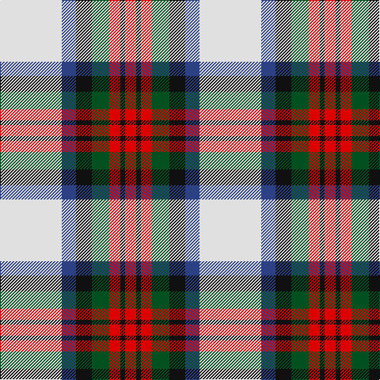

In pattern [RKRGKBW](/stripes/rkrgkbw/).

This was sourced from register-of-tartans.  It is a [7 stripe tartan](/stripes/stripes7/).

Original link https://www.tartanregister.gov.uk/tartanDetails.aspx?ref=2423

## Also known as

This cloth is also recorded under:

- MacDuff Dress #5
- MacDuff dress

## Register references

External register numbers recorded for this tartan.

- Scottish Register of Tartans: [2423](https://www.tartanregister.gov.uk/tartanDetails.aspx?ref=2423)
- Scottish Tartans World Register: 1601

## Thread count
LN/78 B18 K20 G22 R14 K6 R/14

## Palette
Each colour and its ΔE from the base-6 reference it is a variant of.

| Colour | Shade | Base | ΔE (OKLab) |
|---|---|---|---|
| B | <code style="background-color:#2C4084;">#2C4084</code> `#2C4084` | B <code style="background-color:#2A418A;">#2A418A</code> | 0.01 |
| G | <code style="background-color:#005020;">#005020</code> `#005020` | G <code style="background-color:#006100;">#006100</code> | 0.07 |
| K | <code style="background-color:#101010;">#101010</code> `#101010` | K <code style="background-color:#000000;">#000000</code> | 0.17 |
| LN | <code style="background-color:#E0E0E0;">#E0E0E0</code> `#E0E0E0` | W <code style="background-color:#F7F7F7;">#F7F7F7</code> | 0.07 |
| R | <code style="background-color:#DC0000;">#DC0000</code> `#DC0000` | R <code style="background-color:#CC0000;">#CC0000</code> | 0.03 |

# Sample pattern

## Nearest tartans

The nearest existing variants by ΔTartan distance.

1. [MacDuff dress](/setts/s7/w39db9k10g11r7k3r7~x2/) — ΔT 0.34
1. [Shiel, Purple (Dance)](/setts/s7/w8g5t10dp24w30g2lp2~x2/) — ΔT 0.67
1. [MacKintosh Dress (Dance)](/setts/s6/r3w33dp8dg18r9g3~x2/) — ΔT 0.78
1. [Culloden, dress Ancient](/setts/s8/r6db2p21w3dg19w26dg3w5~x2/) — ΔT 0.80
1. [Lalage (Personal)](/setts/s8/w4k13w17lo2r2lo24w2w2~x2/) — ΔT 0.89
1. [Shiel, Magenta (Dance)](/setts/s7/w8b5t10dp24w30b2dg2~x2/) — ΔT 0.92
1. [Ailsa Craig](/setts/s8/r5w2o20ly2k16w18k2w5~x2/) — ΔT 0.95
1. [Tombow 140th Anniversary, The](/setts/s7/g4ly7o9ly9db20w2db2~x2/) — ΔT 0.97
1. [Manitoba Dress (1958) (District)](/setts/s8/db4w1db2w18g3w1r9ly4~x4/) — ΔT 1.01
1. [Ailsa Craig (District)](/setts/s8/r5w2t20ly2k16w18k2w5~x2/) — ΔT 1.02

## Neighbour map

Every grey dot is one of 14299 variants placed by the first two principal components of the ΔTartan feature space (44% of its variance). Red is this tartan; blue dots are its nearest — click one to open its page.

<svg viewBox="0 0 640 380" role="img" style="max-width:100%;height:auto;border:1px solid #e0e0e0;border-radius:4px;display:block" xmlns="http://www.w3.org/2000/svg"><image href="/nn/cloud.v1.png" width="640" height="380"/><a href="/setts/s7/w39db9k10g11r7k3r7~x2/"><circle cx="165.2" cy="138.0" r="4" fill="#3465a4"><title>MacDuff dress</title></circle></a><a href="/setts/s7/w8g5t10dp24w30g2lp2~x2/"><circle cx="198.8" cy="137.3" r="4" fill="#3465a4"><title>Shiel, Purple (Dance)</title></circle></a><a href="/setts/s6/r3w33dp8dg18r9g3~x2/"><circle cx="176.2" cy="158.0" r="4" fill="#3465a4"><title>MacKintosh Dress (Dance)</title></circle></a><a href="/setts/s8/r6db2p21w3dg19w26dg3w5~x2/"><circle cx="155.5" cy="140.0" r="4" fill="#3465a4"><title>Culloden, dress Ancient</title></circle></a><a href="/setts/s8/w4k13w17lo2r2lo24w2w2~x2/"><circle cx="166.7" cy="133.9" r="4" fill="#3465a4"><title>Lalage (Personal)</title></circle></a><a href="/setts/s7/w8b5t10dp24w30b2dg2~x2/"><circle cx="208.5" cy="140.3" r="4" fill="#3465a4"><title>Shiel, Magenta (Dance)</title></circle></a><a href="/setts/s8/r5w2o20ly2k16w18k2w5~x2/"><circle cx="117.9" cy="146.9" r="4" fill="#3465a4"><title>Ailsa Craig</title></circle></a><a href="/setts/s7/g4ly7o9ly9db20w2db2~x2/"><circle cx="156.1" cy="170.7" r="4" fill="#3465a4"><title>Tombow 140th Anniversary, The</title></circle></a><a href="/setts/s8/db4w1db2w18g3w1r9ly4~x4/"><circle cx="212.7" cy="114.6" r="4" fill="#3465a4"><title>Manitoba Dress (1958) (District)</title></circle></a><a href="/setts/s8/r5w2t20ly2k16w18k2w5~x2/"><circle cx="116.4" cy="147.8" r="4" fill="#3465a4"><title>Ailsa Craig (District)</title></circle></a><circle cx="171.3" cy="138.8" r="5" fill="#c00000"/></svg>

ID: /setts/s7/w39db9k10dg11r7k3r7~x2/
