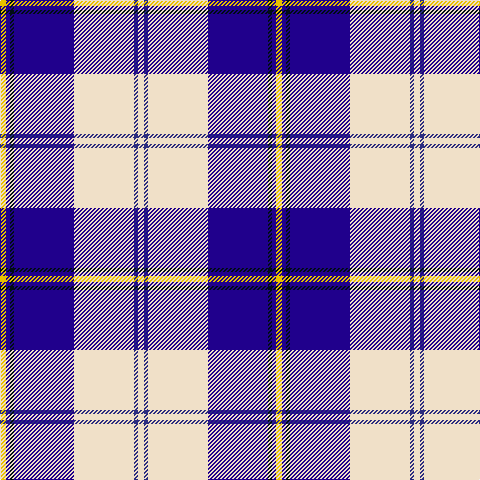

In pattern [WBWBKBY](/stripes/wbwbkby/).

This was sourced from tartans-authority.  It is a [7 stripe tartan](/stripes/stripes7/).

Original link http://www.tartansauthority.com/tartan-ferret/display/7594/

## Attestations

This cloth appears in 2 source records; the oldest owns this page.

- March 2008 — Torridon, Saphire (Dance) (tartans-authority, [record](http://www.tartansauthority.com/tartan-ferret/display/7594/))
- undated — Torridon Saphire (register-of-tartans, [record](https://www.tartanregister.gov.uk/tartanDetails.aspx?ref=5618))

## Register references

External register numbers recorded for this tartan.

- Scottish Register of Tartans: [5618](https://www.tartanregister.gov.uk/tartanDetails.aspx?ref=5618)
- Scottish Tartans Authority (ITI): 7594

## Thread count
Y/6 DBa4 K4 DBa60 W60 DB4 W/6

## Palette
Each colour and the base-6 reference it is a variant of.

| Colour | Shade | Base |
|---|---|---|
| DB | <code style="background-color:#2C2C80;">#2C2C80</code> `oklch(35.0% 0.138 276.6)` <small>#2C2C80</small> | B <code style="background-color:#2A418A;">#2A418A</code> |
| DBa | <code style="background-color:#20008C;">#20008C</code> `oklch(30.4% 0.192 274.5)` <small>#20008C</small> | B <code style="background-color:#2A418A;">#2A418A</code> |
| K | <code style="background-color:#000C14;">#000C14</code> `oklch(14.5% 0.029 231.2)` <small>#000C14</small> | K <code style="background-color:#000000;">#000000</code> |
| W | <code style="background-color:#F0E0C8;">#F0E0C8</code> `oklch(91.3% 0.036 78.1)` <small>#F0E0C8</small> | W <code style="background-color:#F7F7F7;">#F7F7F7</code> |
| Y | <code style="background-color:#E8C000;">#E8C000</code> `oklch(81.9% 0.168 93.7)` <small>#E8C000</small> | Y <code style="background-color:#F2BF00;">#F2BF00</code> |

# Sample pattern

## Nearest tartans

The nearest existing variants by ΔTartan distance.

1. [Cunningham, Dress Blue (Dance)](/setts/s7/b3db2k2db28w30db2w3~x2/) — ΔT 0.96
1. [Cunningham, Dress Blue (Dance) Fashion Tartan Tartan Number: 4642. Earliest known date: 01/01/2002 Like so many of the invented 'Dance' tartans this one is not known by the relevant Clan Cunningham Association (USA). /Threadcount and colours aren't 100% original. Generated manually./ See products available Copyright © Blair Urquhart, Comrie, 2015](/setts/s7/t2db1k1db20w20db1w2~x4/) — ΔT 1.04
1. [Eildon/Longniddry Blue Dress Fashion Tartan Tartan Number: 4799. Earliest known date: 01/01/1980 A Dancers' Fancy from Dalgliesh. This appears under three different names - Longniddry #5486, Eildon #4799 and Harmony Eildon #87 (original Scottish Tartans Authority references). Needs resolving. Sample in Scottish Tartans Authority's Dalgety Collection. /Threadcount and colours aren't 100% original. Generated manually./ See products available Copyright © Blair Urquhart, Comrie, 2015](/setts/s8/db30t2w2t2db4t10w25db4~x2/) — ΔT 1.18
1. [Sinclair Dress (Dance)](/setts/s7/db4r2db31k10g4w21g2~x2/) — ΔT 1.23
1. [Jack Sinclair (Personal)](/setts/s7/b4r2b40k11g2w16r2~x2/) — ΔT 1.26
1. [St Andrews Links Dress](/setts/s7/w30b4w3dp2r2dp24w2~x2/) — ΔT 1.27
1. [Stewart of Appin Htg Dress](/setts/s10/db8r3db36t3k10w34r4w3r3w8~x2/) — ΔT 1.31
1. [Harmony Eildon (Dance)](/setts/s8/db41t2w2t2db5t12w31db4~x2/) — ΔT 1.32
1. [Ailsa, Royal Blue (Dance)](/setts/s6/db8t3db28w32dt3w4~x2/) — ΔT 1.34
1. [Harris, Royal Blue (Dance)](/setts/s10/w3db2k4db2w2db26r4w30r2w3~x2/) — ΔT 1.36

## Neighbour map

Every grey dot is one of 14299 variants placed by the first two principal components of the ΔTartan feature space (44% of its variance). Red is this tartan; blue dots are its nearest — click one to open its page.

<svg viewBox="0 0 640 380" role="img" style="max-width:100%;height:auto;border:1px solid #e0e0e0;border-radius:4px;display:block" xmlns="http://www.w3.org/2000/svg"><image href="/nn/cloud.v1.png" width="640" height="380"/><a href="/setts/s7/b3db2k2db28w30db2w3~x2/"><circle cx="269.1" cy="140.6" r="4" fill="#3465a4"><title>Cunningham, Dress Blue (Dance)</title></circle></a><a href="/setts/s7/t2db1k1db20w20db1w2~x4/"><circle cx="289.3" cy="128.7" r="4" fill="#3465a4"><title>Cunningham, Dress Blue (Dance) Fashion Tartan Tartan Number: 4642. Earliest known date: 01/01/2002 Like so many of the invented 'Dance' tartans this one is not known by the relevant Clan Cunningham Association (USA). /Threadcount and colours aren't 100% original. Generated manually./ See products available Copyright © Blair Urquhart, Comrie, 2015</title></circle></a><a href="/setts/s8/db30t2w2t2db4t10w25db4~x2/"><circle cx="244.1" cy="146.8" r="4" fill="#3465a4"><title>Eildon/Longniddry Blue Dress Fashion Tartan Tartan Number: 4799. Earliest known date: 01/01/1980 A Dancers' Fancy from Dalgliesh. This appears under three different names - Longniddry #5486, Eildon #4799 and Harmony Eildon #87 (original Scottish Tartans Authority references). Needs resolving. Sample in Scottish Tartans Authority's Dalgety Collection. /Threadcount and colours aren't 100% original. Generated manually./ See products available Copyright © Blair Urquhart, Comrie, 2015</title></circle></a><a href="/setts/s7/db4r2db31k10g4w21g2~x2/"><circle cx="213.9" cy="143.1" r="4" fill="#3465a4"><title>Sinclair Dress (Dance)</title></circle></a><a href="/setts/s7/b4r2b40k11g2w16r2~x2/"><circle cx="287.2" cy="119.3" r="4" fill="#3465a4"><title>Jack Sinclair (Personal)</title></circle></a><a href="/setts/s7/w30b4w3dp2r2dp24w2~x2/"><circle cx="248.3" cy="114.5" r="4" fill="#3465a4"><title>St Andrews Links Dress</title></circle></a><a href="/setts/s10/db8r3db36t3k10w34r4w3r3w8~x2/"><circle cx="169.1" cy="119.5" r="4" fill="#3465a4"><title>Stewart of Appin Htg Dress</title></circle></a><a href="/setts/s8/db41t2w2t2db5t12w31db4~x2/"><circle cx="279.3" cy="133.8" r="4" fill="#3465a4"><title>Harmony Eildon (Dance)</title></circle></a><a href="/setts/s6/db8t3db28w32dt3w4~x2/"><circle cx="243.3" cy="175.5" r="4" fill="#3465a4"><title>Ailsa, Royal Blue (Dance)</title></circle></a><a href="/setts/s10/w3db2k4db2w2db26r4w30r2w3~x2/"><circle cx="258.8" cy="113.1" r="4" fill="#3465a4"><title>Harris, Royal Blue (Dance)</title></circle></a><circle cx="239.6" cy="121.8" r="5" fill="#c00000"/></svg>

ID: /setts/s7/w3db2w30db30k2db2ly3~x2/
