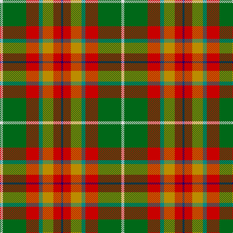

This page is one **sett** — a single exact thread-count. It belongs to the [tartan](/tartans/w3g24r13gi4lo11r8db2/)
(the same proportion at any scale), whose colour order is pattern [BRYGRGW](/stripes/brygrgw/).

Sourced from tartans-authority.  It is a [7 stripe tartan](/stripes/stripes7/).

Original link http://www.tartansauthority.com/tartan-ferret/display/8556/

## Register references

External register numbers recorded for this tartan.

- Scottish Register of Tartans: [8556](https://www.tartanregister.gov.uk/tartanDetails?ref=8556)
- Scottish Tartans Authority (ITI): 8556

## Thread count
LN/6 G48 R26 B8 DY22 R16 DB/4

## Palette

Palette: <strong>Tartan Register</strong>
<table><thead><tr><th>Colour</th><th>Threads</th><th>Shade</th><th>Base</th><th>OKLCh</th></tr></thead><tbody><tr><td>LN/</td><td style="text-align:right;font-variant-numeric:tabular-nums">6</td><td><code style="background-color:#E0E0E0;">#E0E0E0</code> <small style="color:#888">#E0E0E0</small></td><td>W <code style="background-color:#F7F7F7;">#F7F7F7</code></td><td><small style="color:#888">oklch(90.7% 0.000 89.9)</small></td></tr><tr><td>G</td><td style="text-align:right;font-variant-numeric:tabular-nums">48</td><td><code style="background-color:#006818;">#006818</code> <small style="color:#888">#006818</small></td><td>G <code style="background-color:#006100;">#006100</code></td><td><small style="color:#888">oklch(45.0% 0.142 145.0)</small></td></tr><tr><td>R</td><td style="text-align:right;font-variant-numeric:tabular-nums">26</td><td><code style="background-color:#C80000;">#C80000</code> <small style="color:#888">#C80000</small></td><td>R <code style="background-color:#CC0000;">#CC0000</code></td><td><small style="color:#888">oklch(52.3% 0.215 29.2)</small></td></tr><tr><td>B</td><td style="text-align:right;font-variant-numeric:tabular-nums">8</td><td><code style="background-color:#048888;">#048888</code> <small style="color:#888">#048888</small></td><td>G <code style="background-color:#006100;">#006100</code></td><td><small style="color:#888">oklch(56.8% 0.096 194.8)</small></td></tr><tr><td>DY</td><td style="text-align:right;font-variant-numeric:tabular-nums">22</td><td><code style="background-color:#BC8C00;">#BC8C00</code> <small style="color:#888">#BC8C00</small></td><td>Y <code style="background-color:#F2BF00;">#F2BF00</code></td><td><small style="color:#888">oklch(66.8% 0.137 84.1)</small></td></tr><tr><td>R</td><td style="text-align:right;font-variant-numeric:tabular-nums">16</td><td><code style="background-color:#C80000;">#C80000</code> <small style="color:#888">#C80000</small></td><td>R <code style="background-color:#CC0000;">#CC0000</code></td><td><small style="color:#888">oklch(52.3% 0.215 29.2)</small></td></tr><tr><td>DB/</td><td style="text-align:right;font-variant-numeric:tabular-nums">4</td><td><code style="background-color:#1C0070;">#1C0070</code> <small style="color:#888">#1C0070</small></td><td>B <code style="background-color:#2A418A;">#2A418A</code></td><td><small style="color:#888">oklch(26.3% 0.162 277.1)</small></td></tr></tbody></table>

# Sample pattern

## Nearest tartans

The nearest existing variants by ΔTartan distance, with this tartan at the top so the swatches line up against it.

ΔTartan

Tartan

Sett

—

<a href="/ttd/edit/#slug=w3g24r13gi4lo11r8db2~x2">Elystan Glodrydd (Name)</a> <a class="nn-out" href="/setts/s7/w3g24r13gi4lo11r8db2~x2/" title="open its dictionary page">↗</a>

1.03

<a href="/ttd/edit/#slug=t4dy27lo8k4lo8k4lo8r11ly3~x2">Brittany National Walking</a> <a class="nn-out" href="/setts/s9/t4dy27lo8k4lo8k4lo8r11ly3~x2/" title="open its dictionary page">↗</a>

1.07

<a href="/ttd/edit/#slug=r10n3db1lb8db1lo2g5~x4">Porcupine City of</a> <a class="nn-out" href="/setts/s7/r10n3db1lb8db1lo2g5~x4/" title="open its dictionary page">↗</a>

1.07

<a href="/ttd/edit/#slug=r1g4w1g4ly1ri8t1~x6">George Watson's College</a> <a class="nn-out" href="/setts/s7/r1g4w1g4ly1ri8t1~x6/" title="open its dictionary page">↗</a>

1.13

<a href="/ttd/edit/#slug=t4dy27lr8k4lr8k4lr8r11ly3~x2">Brittany Hunting French Fancy Tartan Tartan Number: 5977. Earliest known date: 2003 For Richard and Anne-Marie Duclos of Le Coudray-Montceaux, France. Based on the Breton National at 3902. The term Randonnée (Walking) is used in the sense of the Scottish category, Hunting. See products available Copyright © Blair Urquhart, Comrie, 2015</a> <a class="nn-out" href="/setts/s9/t4dy27lr8k4lr8k4lr8r11ly3~x2/" title="open its dictionary page">↗</a>

1.16

<a href="/ttd/edit/#slug=k20lo4r4lo20y20lb5y2g2~x2">Hackett Hunting (Personal)</a> <a class="nn-out" href="/setts/s8/k20lo4r4lo20y20lb5y2g2~x2/" title="open its dictionary page">↗</a>

1.18

<a href="/ttd/edit/#slug=db4r11db1g8r2g4k1ly2~x4">Craik, of Assington</a> <a class="nn-out" href="/setts/s8/db4r11db1g8r2g4k1ly2~x4/" title="open its dictionary page">↗</a>

1.19

<a href="/ttd/edit/#slug=ly4g18b4ri8b8r21w1~x2">Bathija (Name)</a> <a class="nn-out" href="/setts/s7/ly4g18b4ri8b8r21w1~x2/" title="open its dictionary page">↗</a>

1.20

<a href="/ttd/edit/#slug=ly4r2ly21dt11w2o21lyi4~x2">Barbour - Muted</a> <a class="nn-out" href="/setts/s7/ly4r2ly21dt11w2o21lyi4~x2/" title="open its dictionary page">↗</a>

1.24

<a href="/ttd/edit/#slug=o4do2o21db11w2oi20r3~x2">Barbour Dress</a> <a class="nn-out" href="/setts/s7/o4do2o21db11w2oi20r3~x2/" title="open its dictionary page">↗</a>

1.29

<a href="/ttd/edit/#slug=loi22ly22dr2lb6dr2lo2dr16lg5loi8lb2~x2">Bruce of Kinnaird (Fashion)</a> <a class="nn-out" href="/setts/s10/loi22ly22dr2lb6dr2lo2dr16lg5loi8lb2~x2/" title="open its dictionary page">↗</a>

## Neighbour map

Every grey dot is one of 14359 variants placed by the first two principal components of the ΔTartan feature space (44% of its variance). Red is this tartan; blue dots are its nearest — click one to open its page.

<svg viewBox="0 0 640 380" role="img" style="max-width:100%;height:auto;border:1px solid #e0e0e0;border-radius:4px;display:block" xmlns="http://www.w3.org/2000/svg"><image href="/nn/cloud.v1.png" width="640" height="380"/><a href="/setts/s9/t4dy27lo8k4lo8k4lo8r11ly3~x2/"><circle cx="152.1" cy="170.5" r="4" fill="#3465a4"><title>Brittany National Walking</title></circle></a><a href="/setts/s7/r10n3db1lb8db1lo2g5~x4/"><circle cx="115.9" cy="164.2" r="4" fill="#3465a4"><title>Porcupine City of</title></circle></a><a href="/setts/s7/r1g4w1g4ly1ri8t1~x6/"><circle cx="177.2" cy="172.6" r="4" fill="#3465a4"><title>George Watson's College</title></circle></a><a href="/setts/s9/t4dy27lr8k4lr8k4lr8r11ly3~x2/"><circle cx="118.8" cy="151.3" r="4" fill="#3465a4"><title>Brittany Hunting French Fancy Tartan Tartan Number: 5977. Earliest known date: 2003 For Richard and Anne-Marie Duclos of Le Coudray-Montceaux, France. Based on the Breton National at 3902. The term Randonnée (Walking) is used in the sense of the Scottish category, Hunting. See products available Copyright © Blair Urquhart, Comrie, 2015</title></circle></a><a href="/setts/s8/k20lo4r4lo20y20lb5y2g2~x2/"><circle cx="117.2" cy="160.0" r="4" fill="#3465a4"><title>Hackett Hunting (Personal)</title></circle></a><a href="/setts/s8/db4r11db1g8r2g4k1ly2~x4/"><circle cx="187.9" cy="170.9" r="4" fill="#3465a4"><title>Craik, of Assington</title></circle></a><a href="/setts/s7/ly4g18b4ri8b8r21w1~x2/"><circle cx="154.2" cy="142.9" r="4" fill="#3465a4"><title>Bathija (Name)</title></circle></a><a href="/setts/s7/ly4r2ly21dt11w2o21lyi4~x2/"><circle cx="147.8" cy="145.3" r="4" fill="#3465a4"><title>Barbour - Muted</title></circle></a><a href="/setts/s7/o4do2o21db11w2oi20r3~x2/"><circle cx="189.2" cy="168.1" r="4" fill="#3465a4"><title>Barbour Dress</title></circle></a><a href="/setts/s10/loi22ly22dr2lb6dr2lo2dr16lg5loi8lb2~x2/"><circle cx="131.9" cy="134.8" r="4" fill="#3465a4"><title>Bruce of Kinnaird (Fashion)</title></circle></a><circle cx="162.0" cy="166.9" r="5" fill="#c00000"/></svg>

ID: /setts/s7/w3g24r13gi4lo11r8db2~x2/
