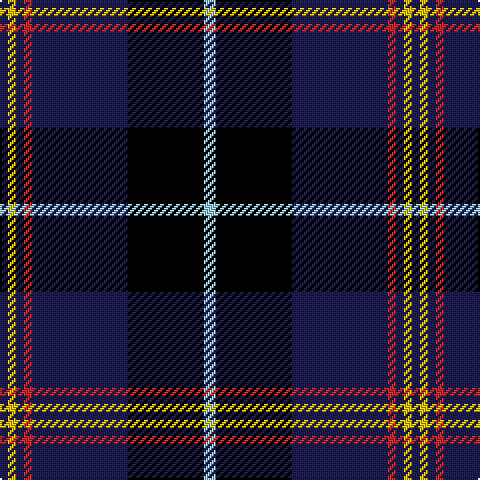

In pattern [BYBRBKW](/patterns/bybrbkw/).

This was sourced from register-of-tartans.  It is a [7 stripes tartan](/stripes/stripes7/).

Original link https://www.tartanregister.gov.uk/tartanDetails.aspx?ref=11316

## Register references

External register numbers recorded for this tartan.

- Scottish Register of Tartans: [11316](https://www.tartanregister.gov.uk/tartanDetails.aspx?ref=11316)

## Thread count
DB/4 Y4 DB4 R4 DB48 K38 LB/6

## Palette
Each colour and its ΔE from the base-6 reference it is a variant of.

| Colour | Shade | Base | ΔE (OKLab) |
|---|---|---|---|
| DB | <code style="background-color:#1C1C50;">#1C1C50</code> `#1C1C50` | B <code style="background-color:#2A418A;">#2A418A</code> | 0.14 |
| K | <code style="background-color:#000000;">#000000</code> `#000000` | K <code style="background-color:#000000;">#000000</code> | 0.00 |
| LB | <code style="background-color:#98C8E8;">#98C8E8</code> `#98C8E8` | W <code style="background-color:#F7F7F7;">#F7F7F7</code> | 0.18 |
| R | <code style="background-color:#C82828;">#C82828</code> `#C82828` | R <code style="background-color:#CC0000;">#CC0000</code> | 0.03 |
| Y | <code style="background-color:#FCC000;">#FCC000</code> `#FCC000` | Y <code style="background-color:#F2BF00;">#F2BF00</code> | 0.02 |

# Sample pattern

## Nearest tartans

The nearest existing variants by ΔTartan distance.

1. [Glasgow, University of](/setts/s8/b2w2k2g2k7ga4b22k2~b304080-g908000-ga008000-k000000-we0e0e0~x2/) — ΔT 1.15
1. [East Tennessee State University](/setts/s7/y2w1b6w1ya2k17ya1~b202060-k00002c-wfcfcfc-yd09800-yafccc00~x2/) — ΔT 1.29
1. [Genet, Edmond Charles 'Citizen' (Personal)](/setts/s7/r4k9g9ka40r2ka2w2~g285800-k101010-ka000028-rdc0000-wf8f8f8~x2/) — ΔT 1.30
1. [Royal Marines Condor](/setts/s7/k5r3k27ka37r5g2y2~g008000-k000000-ka000030-rc00000-yf0c000~x2/) — ΔT 1.31
1. [City of Rome Pipe Band (Corporate)](/setts/s7/r12y6k88b45k6b6ya6~b2c2c80-k101010-r901c38-yd87c00-yae8c000/) — ΔT 1.36
1. [Montgomerie of Eglinton](/setts/s7/k4g5k4b28k4r5k4~b304080-g008000-k000000-rc00000~x2/) — ΔT 1.36
1. [Hume, or Home](/setts/s9/b3g3b20r2k2r2k20g3k3~b304080-g008000-k000000-rc00000~x2/) — ΔT 1.36
1. [Black Raven](/setts/s7/k62b15ba15r20y5b5k15~b070552-ba46306e-k101010-rad6d14-yfbc684~x2/) — ΔT 1.39
1. [Kingsbarns Golf Links](/setts/s10/b8y3k4g4k48b48g4b4r3k8~b0060b0-g008000-k000000-r800000-yf0c000/) — ΔT 1.44
1. [Atlantic Police Academy](/setts/s6/k33y4w3b33r2g2~b000064-g005020-k101010-rdc0000-we0e0e0-yfadc00~x2/) — ΔT 1.45

## Neighbour map

Every grey dot is one of 15726 variants placed by the first two principal components of the ΔTartan feature space (44% of its variance). Red is this tartan; blue dots are its nearest — click one to open its page.

<svg viewBox="0 0 640 380" role="img" style="max-width:100%;height:auto;border:1px solid #e0e0e0;border-radius:4px;display:block" xmlns="http://www.w3.org/2000/svg"><image href="/nn/cloud.v1.png" width="640" height="380"/><a href="/setts/s8/b2w2k2g2k7ga4b22k2~b304080-g908000-ga008000-k000000-we0e0e0~x2/"><circle cx="272.8" cy="155.5" r="4" fill="#3465a4"><title>Glasgow, University of</title></circle></a><a href="/setts/s7/y2w1b6w1ya2k17ya1~b202060-k00002c-wfcfcfc-yd09800-yafccc00~x2/"><circle cx="279.7" cy="135.4" r="4" fill="#3465a4"><title>East Tennessee State University</title></circle></a><a href="/setts/s7/r4k9g9ka40r2ka2w2~g285800-k101010-ka000028-rdc0000-wf8f8f8~x2/"><circle cx="355.5" cy="146.9" r="4" fill="#3465a4"><title>Genet, Edmond Charles 'Citizen' (Personal)</title></circle></a><a href="/setts/s7/k5r3k27ka37r5g2y2~g008000-k000000-ka000030-rc00000-yf0c000~x2/"><circle cx="283.1" cy="161.9" r="4" fill="#3465a4"><title>Royal Marines Condor</title></circle></a><a href="/setts/s7/r12y6k88b45k6b6ya6~b2c2c80-k101010-r901c38-yd87c00-yae8c000/"><circle cx="334.2" cy="165.3" r="4" fill="#3465a4"><title>City of Rome Pipe Band (Corporate)</title></circle></a><a href="/setts/s7/k4g5k4b28k4r5k4~b304080-g008000-k000000-rc00000~x2/"><circle cx="260.5" cy="203.1" r="4" fill="#3465a4"><title>Montgomerie of Eglinton</title></circle></a><a href="/setts/s9/b3g3b20r2k2r2k20g3k3~b304080-g008000-k000000-rc00000~x2/"><circle cx="234.7" cy="176.9" r="4" fill="#3465a4"><title>Hume, or Home</title></circle></a><a href="/setts/s7/k62b15ba15r20y5b5k15~b070552-ba46306e-k101010-rad6d14-yfbc684~x2/"><circle cx="287.5" cy="184.7" r="4" fill="#3465a4"><title>Black Raven</title></circle></a><a href="/setts/s10/b8y3k4g4k48b48g4b4r3k8~b0060b0-g008000-k000000-r800000-yf0c000/"><circle cx="249.6" cy="129.8" r="4" fill="#3465a4"><title>Kingsbarns Golf Links</title></circle></a><a href="/setts/s6/k33y4w3b33r2g2~b000064-g005020-k101010-rdc0000-we0e0e0-yfadc00~x2/"><circle cx="236.1" cy="149.8" r="4" fill="#3465a4"><title>Atlantic Police Academy</title></circle></a><circle cx="274.6" cy="166.3" r="5" fill="#c00000"/></svg>

ID: /setts/s7/w3k19b24r2b2y2b2~b1c1c50-k000000-rc82828-w98c8e8-yfcc000~x2/
