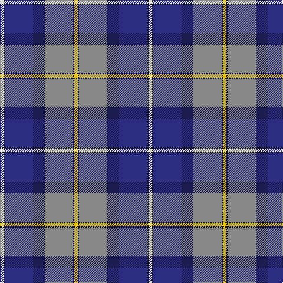

In pattern [WKBBRKY](/patterns/wkbbrky/).

This was sourced from register-of-tartans.  It is a [7 stripes tartan](/stripes/stripes7/).

Original link https://www.tartanregister.gov.uk/tartanDetails.aspx?ref=5741

## Attestations

This cloth appears in 2 source records; the oldest owns this page.

- 01/06/2000 — George Heriot's School (register-of-tartans, [record](https://www.tartanregister.gov.uk/tartanDetails.aspx?ref=5741))
- 2000 — George Heriot's (School) (tartans-authority, [record](http://www.tartansauthority.com/tartan-ferret/display/7764/))

## Thread count
LN/6 K2 DBa48 DB20 N48 K2 Y/6

## Palette
Each colour and its ΔE from the base-6 reference it is a variant of.

| Colour | Shade | Base | ΔE (OKLab) |
|---|---|---|---|
| DB | <code style="background-color:#1C1C50;">#1C1C50</code> `#1C1C50` | B <code style="background-color:#2A418A;">#2A418A</code> | 0.14 |
| DBa | <code style="background-color:#2C2C80;">#2C2C80</code> `#2C2C80` | B <code style="background-color:#2A418A;">#2A418A</code> | 0.06 |
| K | <code style="background-color:#101010;">#101010</code> `#101010` | K <code style="background-color:#000000;">#000000</code> | 0.17 |
| LN | <code style="background-color:#E0E0E0;">#E0E0E0</code> `#E0E0E0` | W <code style="background-color:#F7F7F7;">#F7F7F7</code> | 0.07 |
| N | <code style="background-color:#888888;">#888888</code> `#888888` | R <code style="background-color:#CC0000;">#CC0000</code> | 0.24 |
| Y | <code style="background-color:#E8C000;">#E8C000</code> `#E8C000` | Y <code style="background-color:#F2BF00;">#F2BF00</code> | 0.02 |

# Sample pattern

## Nearest tartans

The nearest existing variants by ΔTartan distance.

1. [Yule (Name)](/setts/s9/b1y3g14w2ba22w2bb14b3y1~b5c8ca8-ba2c2c80-bb780078-g006818-we0e0e0-ye8c000~x2/) — ΔT 0.78
1. [Unidentified (Woven sample)](/setts/s8/k16w6k4b64r19k8g42y6~b3850c8-g006818-k101010-r981c70-wf8f8f8-ye8c000/) — ΔT 0.94
1. [Ancient Gathering](/setts/s8/b1ba12r6w1y3b14bb18w1~b1c1c50-ba5c8ca8-bb003c64-rb458ac-wffffff-ybc8c00~x2/) — ΔT 1.01
1. [US Forces (Thurso) Regimental Tartan Tartan Number: 549. Earliest known date: 1986 Originally listed as MacNeil, this sett was identified by Ken Dalgliesh, weaver in Selkirk, in 1999. See products available Copyright © Blair Urquhart, Comrie, 2015](/setts/s7/b35r2k16y2ba25w2ba6~b202060-ba2888c4-k101010-rc80000-we0e0e0-ye8c000~x2/) — ΔT 1.04
1. [Alexander of Menstry](/setts/s8/g5r2g2r9k9y9b30w5~b2c2c80-g006818-k101010-r9c68a4-wf8f8f8-ya0a0a0~x2/) — ΔT 1.06
1. [Scottish Association for N.S. (Corp)](/setts/s9/b46y4b4y4b6k16r66w11ra6~b2c2c80-k101010-r888888-rac80000-we0e0e0-ye8c000/) — ΔT 1.10
1. [Longhaugh Primary School](/setts/s8/g20b2w2b12ba29r1ba1k3~b202060-ba780078-g289c18-k101010-rc80000-wfcfcfc~x2/) — ΔT 1.15
1. [Accenture](/setts/s10/b3r1ba4g2ra2g21r3b21ba25w3~b780078-ba2c2c80-g006818-r888888-rac80000-we0e0e0~x2/) — ΔT 1.20
1. [Fulbright Foundation](/setts/s8/r3y25b6ba3r2bb5ba18w3~b1c1c50-ba1c0070-bb507c94-rc8002c-we0e0e0-ya0a0a0~x2/) — ΔT 1.22
1. [Queen Margaret University](/setts/s9/b4w3b17wa10k1ba5k1wa6g3~b2c4084-ba5a008c-g005020-k101010-we0e0e0-wac0c0c0~x2/) — ΔT 1.24

## Neighbour map

Every grey dot is one of 15726 variants placed by the first two principal components of the ΔTartan feature space (44% of its variance). Red is this tartan; blue dots are its nearest — click one to open its page.

<svg viewBox="0 0 640 380" role="img" style="max-width:100%;height:auto;border:1px solid #e0e0e0;border-radius:4px;display:block" xmlns="http://www.w3.org/2000/svg"><image href="/nn/cloud.v1.png" width="640" height="380"/><a href="/setts/s9/b1y3g14w2ba22w2bb14b3y1~b5c8ca8-ba2c2c80-bb780078-g006818-we0e0e0-ye8c000~x2/"><circle cx="163.2" cy="108.6" r="4" fill="#3465a4"><title>Yule (Name)</title></circle></a><a href="/setts/s8/k16w6k4b64r19k8g42y6~b3850c8-g006818-k101010-r981c70-wf8f8f8-ye8c000/"><circle cx="158.3" cy="132.7" r="4" fill="#3465a4"><title>Unidentified (Woven sample)</title></circle></a><a href="/setts/s8/b1ba12r6w1y3b14bb18w1~b1c1c50-ba5c8ca8-bb003c64-rb458ac-wffffff-ybc8c00~x2/"><circle cx="144.7" cy="139.1" r="4" fill="#3465a4"><title>Ancient Gathering</title></circle></a><a href="/setts/s7/b35r2k16y2ba25w2ba6~b202060-ba2888c4-k101010-rc80000-we0e0e0-ye8c000~x2/"><circle cx="195.2" cy="143.6" r="4" fill="#3465a4"><title>US Forces (Thurso) Regimental Tartan Tartan Number: 549. Earliest known date: 1986 Originally listed as MacNeil, this sett was identified by Ken Dalgliesh, weaver in Selkirk, in 1999. See products available Copyright © Blair Urquhart, Comrie, 2015</title></circle></a><a href="/setts/s8/g5r2g2r9k9y9b30w5~b2c2c80-g006818-k101010-r9c68a4-wf8f8f8-ya0a0a0~x2/"><circle cx="160.9" cy="133.0" r="4" fill="#3465a4"><title>Alexander of Menstry</title></circle></a><a href="/setts/s9/b46y4b4y4b6k16r66w11ra6~b2c2c80-k101010-r888888-rac80000-we0e0e0-ye8c000/"><circle cx="191.8" cy="109.6" r="4" fill="#3465a4"><title>Scottish Association for N.S. (Corp)</title></circle></a><a href="/setts/s8/g20b2w2b12ba29r1ba1k3~b202060-ba780078-g289c18-k101010-rc80000-wfcfcfc~x2/"><circle cx="227.0" cy="98.1" r="4" fill="#3465a4"><title>Longhaugh Primary School</title></circle></a><a href="/setts/s10/b3r1ba4g2ra2g21r3b21ba25w3~b780078-ba2c2c80-g006818-r888888-rac80000-we0e0e0~x2/"><circle cx="201.7" cy="110.6" r="4" fill="#3465a4"><title>Accenture</title></circle></a><a href="/setts/s8/r3y25b6ba3r2bb5ba18w3~b1c1c50-ba1c0070-bb507c94-rc8002c-we0e0e0-ya0a0a0~x2/"><circle cx="150.1" cy="132.5" r="4" fill="#3465a4"><title>Fulbright Foundation</title></circle></a><a href="/setts/s9/b4w3b17wa10k1ba5k1wa6g3~b2c4084-ba5a008c-g005020-k101010-we0e0e0-wac0c0c0~x2/"><circle cx="166.6" cy="126.5" r="4" fill="#3465a4"><title>Queen Margaret University</title></circle></a><circle cx="193.5" cy="122.5" r="5" fill="#c00000"/></svg>

ID: /setts/s7/w3k1b24ba10r24k1y3~b2c2c80-ba1c1c50-k101010-r888888-we0e0e0-ye8c000~x2/
