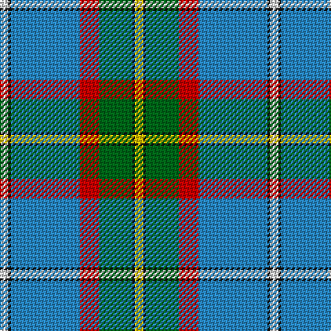

In pattern [WKBRGKY](/patterns/wkbrgky/).

This was sourced from register-of-tartans.  It is a [7 stripes tartan](/stripes/stripes7/).

Original link https://www.tartanregister.gov.uk/tartanDetails.aspx?ref=591

## Attestations

This cloth appears in 2 source records; the oldest owns this page.

- 01/01/1978 — Caskie (register-of-tartans, [record](https://www.tartanregister.gov.uk/tartanDetails.aspx?ref=591))
- pre 1978 — Caskie (Name) (tartans-authority, [record](http://www.tartansauthority.com/tartan-ferret/display/5894/))

## Thread count
LN/6 K2 B50 R14 G24 K2 Y/6

## Palette
Each colour and its ΔE from the base-6 reference it is a variant of.

| Colour | Shade | Base | ΔE (OKLab) |
|---|---|---|---|
| B | <code style="background-color:#2888C4;">#2888C4</code> `#2888C4` | B <code style="background-color:#2A418A;">#2A418A</code> | 0.21 |
| G | <code style="background-color:#006818;">#006818</code> `#006818` | G <code style="background-color:#006100;">#006100</code> | 0.02 |
| K | <code style="background-color:#101010;">#101010</code> `#101010` | K <code style="background-color:#000000;">#000000</code> | 0.17 |
| LN | <code style="background-color:#E0E0E0;">#E0E0E0</code> `#E0E0E0` | W <code style="background-color:#F7F7F7;">#F7F7F7</code> | 0.07 |
| R | <code style="background-color:#C80000;">#C80000</code> `#C80000` | R <code style="background-color:#CC0000;">#CC0000</code> | 0.01 |
| Y | <code style="background-color:#E8C000;">#E8C000</code> `#E8C000` | Y <code style="background-color:#F2BF00;">#F2BF00</code> | 0.02 |

# Sample pattern

## Nearest tartans

The nearest existing variants by ΔTartan distance.

1. [Nova Scotia (District)](/setts/s9/w2b20g2ga2g2ga4g8y2r1~b38409c-g006818-ga289c18-rc80000-wfcfcfc-ye8c000~x2/) — ΔT 0.96
1. [Nova Scotia (Province)](/setts/s9/w2b20g2ga2g2ga4g8y2r1~b38409c-g006818-ga289c18-rc80000-wffffff-ye8c000~x2/) — ΔT 0.96
1. [Wiegratz Alba (Personal)](/setts/s9/w3k2b30k5r5y5b5ba12w1~b608c9c-ba1c1c50-k101010-rc80000-we0e0e0-ye8c000~x2/) — ΔT 1.06
1. [(4) Traill](/setts/s7/r8y2ra7y2b24k2g1~b005f8c-g008000-k000000-rc10000-ra82644b-yefcc09~x2/) — ΔT 1.07
1. [Nickel Lodge Centennial (Corporate)](/setts/s9/r36y2r1y2r4b12w8g2ga12~b003c64-g604000-ga005834-r888888-we0e0e0-ye8c000~x2/) — ΔT 1.08
1. [German MacLeod](/setts/s8/w2k1g13k6b27k2r2y2~b1474b4-g006818-k101010-rc80000-w98c8e8-ye8c000~x2/) — ΔT 1.08
1. [Nickel Lodge Centennial](/setts/s9/r16y1r2y1r2b6w4g1ga6~b003c64-g604000-ga005834-r888888-we0e0e0-ye8c000~x2/) — ΔT 1.09
1. [Nickel Lodge Centennial Corporate Tartan Tartan Number: 920. Earliest known date: 1988 1989 See products available Copyright © Blair Urquhart, Comrie, 2015](/setts/s9/r18y1r2y1r2b6w4g1ga6~b2c2c80-g604000-ga006818-r888888-we0e0e0-ye8c000~x2/) — ΔT 1.11
1. [Scottish Prison Service (Corporate)](/setts/s8/w3k1r4g20k3b30w4r2~b1474b4-g289c18-k101010-rc80000-we0e0e0~x2/) — ΔT 1.11
1. [O'Donohue Personal)](/setts/s10/b24w2b6g9r6b3r6g35k2y2~b3850c8-g009468-k101010-rc80000-we0e0e0-yfccc00~x2/) — ΔT 1.13

## Neighbour map

Every grey dot is one of 15726 variants placed by the first two principal components of the ΔTartan feature space (44% of its variance). Red is this tartan; blue dots are its nearest — click one to open its page.

<svg viewBox="0 0 640 380" role="img" style="max-width:100%;height:auto;border:1px solid #e0e0e0;border-radius:4px;display:block" xmlns="http://www.w3.org/2000/svg"><image href="/nn/cloud.v1.png" width="640" height="380"/><a href="/setts/s9/w2b20g2ga2g2ga4g8y2r1~b38409c-g006818-ga289c18-rc80000-wfcfcfc-ye8c000~x2/"><circle cx="228.1" cy="111.2" r="4" fill="#3465a4"><title>Nova Scotia (District)</title></circle></a><a href="/setts/s9/w2b20g2ga2g2ga4g8y2r1~b38409c-g006818-ga289c18-rc80000-wffffff-ye8c000~x2/"><circle cx="227.5" cy="111.0" r="4" fill="#3465a4"><title>Nova Scotia (Province)</title></circle></a><a href="/setts/s9/w3k2b30k5r5y5b5ba12w1~b608c9c-ba1c1c50-k101010-rc80000-we0e0e0-ye8c000~x2/"><circle cx="247.6" cy="91.4" r="4" fill="#3465a4"><title>Wiegratz Alba (Personal)</title></circle></a><a href="/setts/s7/r8y2ra7y2b24k2g1~b005f8c-g008000-k000000-rc10000-ra82644b-yefcc09~x2/"><circle cx="274.2" cy="117.0" r="4" fill="#3465a4"><title>(4) Traill</title></circle></a><a href="/setts/s9/r36y2r1y2r4b12w8g2ga12~b003c64-g604000-ga005834-r888888-we0e0e0-ye8c000~x2/"><circle cx="288.7" cy="90.9" r="4" fill="#3465a4"><title>Nickel Lodge Centennial (Corporate)</title></circle></a><a href="/setts/s8/w2k1g13k6b27k2r2y2~b1474b4-g006818-k101010-rc80000-w98c8e8-ye8c000~x2/"><circle cx="260.2" cy="108.8" r="4" fill="#3465a4"><title>German MacLeod</title></circle></a><a href="/setts/s9/r16y1r2y1r2b6w4g1ga6~b003c64-g604000-ga005834-r888888-we0e0e0-ye8c000~x2/"><circle cx="245.7" cy="127.7" r="4" fill="#3465a4"><title>Nickel Lodge Centennial</title></circle></a><a href="/setts/s9/r18y1r2y1r2b6w4g1ga6~b2c2c80-g604000-ga006818-r888888-we0e0e0-ye8c000~x2/"><circle cx="269.9" cy="118.6" r="4" fill="#3465a4"><title>Nickel Lodge Centennial Corporate Tartan Tartan Number: 920. Earliest known date: 1988 1989 See products available Copyright © Blair Urquhart, Comrie, 2015</title></circle></a><a href="/setts/s8/w3k1r4g20k3b30w4r2~b1474b4-g289c18-k101010-rc80000-we0e0e0~x2/"><circle cx="249.3" cy="113.9" r="4" fill="#3465a4"><title>Scottish Prison Service (Corporate)</title></circle></a><a href="/setts/s10/b24w2b6g9r6b3r6g35k2y2~b3850c8-g009468-k101010-rc80000-we0e0e0-yfccc00~x2/"><circle cx="238.6" cy="119.2" r="4" fill="#3465a4"><title>O'Donohue Personal)</title></circle></a><circle cx="239.3" cy="116.9" r="5" fill="#c00000"/></svg>

ID: /setts/s7/w3k1b25r7g12k1y3~b2888c4-g006818-k101010-rc80000-we0e0e0-ye8c000~x2/
