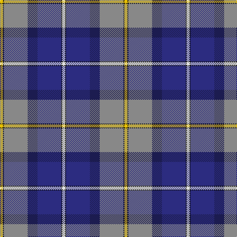

This page is one **sett** — a single exact thread-count. It belongs to the [tartan](/tartans/w3k1db24dbi10o24k1ly3/)
(the same proportion at any scale), whose colour order is pattern [WKBBRKY](/stripes/wkbbrky/).

Sourced from register-of-tartans.  It is a [7 stripe tartan](/stripes/stripes7/).

Original link https://www.tartanregister.gov.uk/tartanDetails.aspx?ref=5741

## Also known as

This cloth is also recorded under:

- George Heriot's School

2 attestations — the source records this cloth was collapsed from (oldest owns this page)

<ul>
<li>01/06/2000 — George Heriot's School (register-of-tartans, <a href="https://www.tartanregister.gov.uk/tartanDetails.aspx?ref=5741">record</a>)</li>
<li>2000 — George Heriot's (School) (tartans-authority, <a href="http://www.tartansauthority.com/tartan-ferret/display/7764/">record</a>)</li>
</ul>

## Register references

External register numbers recorded for this tartan.

- Scottish Register of Tartans: [5741](https://www.tartanregister.gov.uk/tartanDetails.aspx?ref=5741)
- Scottish Tartans Authority (ITI): 7764

## Thread count
Y/6 K2 N48 DB20 DBa48 K2 LN/6

## Palette

Palette: <strong>Tartan Register</strong>
<table><thead><tr><th>Colour</th><th>Threads</th><th>Shade</th><th>Base</th><th>OKLCh</th></tr></thead><tbody><tr><td>Y/</td><td style="text-align:right;font-variant-numeric:tabular-nums">6</td><td><code style="background-color:#E8C000;">#E8C000</code> <small style="color:#888">#E8C000</small></td><td>Y <code style="background-color:#F2BF00;">#F2BF00</code></td><td><small style="color:#888">oklch(81.9% 0.168 93.7)</small></td></tr><tr><td>K</td><td style="text-align:right;font-variant-numeric:tabular-nums">2</td><td><code style="background-color:#101010;">#101010</code> <small style="color:#888">#101010</small></td><td>K <code style="background-color:#000000;">#000000</code></td><td><small style="color:#888">oklch(17.3% 0.000 89.9)</small></td></tr><tr><td>N</td><td style="text-align:right;font-variant-numeric:tabular-nums">48</td><td><code style="background-color:#888888;">#888888</code> <small style="color:#888">#888888</small></td><td>R <code style="background-color:#CC0000;">#CC0000</code></td><td><small style="color:#888">oklch(62.7% 0.000 89.9)</small></td></tr><tr><td>DB</td><td style="text-align:right;font-variant-numeric:tabular-nums">20</td><td><code style="background-color:#1C1C50;">#1C1C50</code> <small style="color:#888">#1C1C50</small></td><td>B <code style="background-color:#2A418A;">#2A418A</code></td><td><small style="color:#888">oklch(26.2% 0.093 277.9)</small></td></tr><tr><td>DBa</td><td style="text-align:right;font-variant-numeric:tabular-nums">48</td><td><code style="background-color:#2C2C80;">#2C2C80</code> <small style="color:#888">#2C2C80</small></td><td>B <code style="background-color:#2A418A;">#2A418A</code></td><td><small style="color:#888">oklch(35.0% 0.138 276.6)</small></td></tr><tr><td>K</td><td style="text-align:right;font-variant-numeric:tabular-nums">2</td><td><code style="background-color:#101010;">#101010</code> <small style="color:#888">#101010</small></td><td>K <code style="background-color:#000000;">#000000</code></td><td><small style="color:#888">oklch(17.3% 0.000 89.9)</small></td></tr><tr><td>LN/</td><td style="text-align:right;font-variant-numeric:tabular-nums">6</td><td><code style="background-color:#E0E0E0;">#E0E0E0</code> <small style="color:#888">#E0E0E0</small></td><td>W <code style="background-color:#F7F7F7;">#F7F7F7</code></td><td><small style="color:#888">oklch(90.7% 0.000 89.9)</small></td></tr></tbody></table>

# Sample pattern

## Nearest tartans

The nearest existing variants by ΔTartan distance, with this tartan at the top so the swatches line up against it.

ΔTartan

Tartan

Sett

—

<a href="/ttd/edit/#slug=w3k1db24dbi10o24k1ly3~x2">George Heriot's School</a> <a class="nn-out" href="/setts/s7/w3k1db24dbi10o24k1ly3~x2/" title="open its dictionary page">↗</a>

0.78

<a href="/ttd/edit/#slug=t1ly3g14w2db22w2dp14t3ly1~x2">Yule (Name)</a> <a class="nn-out" href="/setts/s9/t1ly3g14w2db22w2dp14t3ly1~x2/" title="open its dictionary page">↗</a>

0.94

<a href="/ttd/edit/#slug=k16w6k4b64m19k8g42ly6">Unidentified (Woven sample)</a> <a class="nn-out" href="/setts/s8/k16w6k4b64m19k8g42ly6/" title="open its dictionary page">↗</a>

1.01

<a href="/ttd/edit/#slug=db1t12m6w1lo3db14dt18w1~x2">Ancient Gathering</a> <a class="nn-out" href="/setts/s8/db1t12m6w1lo3db14dt18w1~x2/" title="open its dictionary page">↗</a>

1.04

<a href="/ttd/edit/#slug=db35r2k16ly2t25w2t6~x2">US Forces (Thurso) Regimental Tartan Tartan Number: 549. Earliest known date: 1986 Originally listed as MacNeil, this sett was identified by Ken Dalgliesh, weaver in Selkirk, in 1999. See products available Copyright © Blair Urquhart, Comrie, 2015</a> <a class="nn-out" href="/setts/s7/db35r2k16ly2t25w2t6~x2/" title="open its dictionary page">↗</a>

1.06

<a href="/ttd/edit/#slug=g5m2g2m9k9lr9db30w5~x2">Alexander of Menstry</a> <a class="nn-out" href="/setts/s8/g5m2g2m9k9lr9db30w5~x2/" title="open its dictionary page">↗</a>

1.09

<a href="/ttd/edit/#slug=db46ly4db4ly4db6k16o66w11r6">Scottish Association for N.S. (Corp)</a> <a class="nn-out" href="/setts/s9/db46ly4db4ly4db6k16o66w11r6/" title="open its dictionary page">↗</a>

1.15

<a href="/ttd/edit/#slug=g20db2w2db12dp29r1dp1k3~x2">Longhaugh Primary School</a> <a class="nn-out" href="/setts/s8/g20db2w2db12dp29r1dp1k3~x2/" title="open its dictionary page">↗</a>

1.20

<a href="/ttd/edit/#slug=dp3o1db4g2r2g21o3dp21db25w3~x2">Accenture</a> <a class="nn-out" href="/setts/s10/dp3o1db4g2r2g21o3dp21db25w3~x2/" title="open its dictionary page">↗</a>

1.22

<a href="/ttd/edit/#slug=r3lr25dbi6db3r2t5db18w3~x2">Fulbright Foundation</a> <a class="nn-out" href="/setts/s8/r3lr25dbi6db3r2t5db18w3~x2/" title="open its dictionary page">↗</a>

1.24

<a href="/ttd/edit/#slug=db4w3db17lb10k1dp5k1lb6dg3~x2">Queen Margaret University</a> <a class="nn-out" href="/setts/s9/db4w3db17lb10k1dp5k1lb6dg3~x2/" title="open its dictionary page">↗</a>

## Neighbour map

Every grey dot is one of 14359 variants placed by the first two principal components of the ΔTartan feature space (44% of its variance). Red is this tartan; blue dots are its nearest — click one to open its page.

<svg viewBox="0 0 640 380" role="img" style="max-width:100%;height:auto;border:1px solid #e0e0e0;border-radius:4px;display:block" xmlns="http://www.w3.org/2000/svg"><image href="/nn/cloud.v1.png" width="640" height="380"/><a href="/setts/s9/t1ly3g14w2db22w2dp14t3ly1~x2/"><circle cx="166.0" cy="112.7" r="4" fill="#3465a4"><title>Yule (Name)</title></circle></a><a href="/setts/s8/k16w6k4b64m19k8g42ly6/"><circle cx="161.5" cy="136.4" r="4" fill="#3465a4"><title>Unidentified (Woven sample)</title></circle></a><a href="/setts/s8/db1t12m6w1lo3db14dt18w1~x2/"><circle cx="148.0" cy="145.4" r="4" fill="#3465a4"><title>Ancient Gathering</title></circle></a><a href="/setts/s7/db35r2k16ly2t25w2t6~x2/"><circle cx="198.7" cy="147.5" r="4" fill="#3465a4"><title>US Forces (Thurso) Regimental Tartan Tartan Number: 549. Earliest known date: 1986 Originally listed as MacNeil, this sett was identified by Ken Dalgliesh, weaver in Selkirk, in 1999. See products available Copyright © Blair Urquhart, Comrie, 2015</title></circle></a><a href="/setts/s8/g5m2g2m9k9lr9db30w5~x2/"><circle cx="163.7" cy="135.9" r="4" fill="#3465a4"><title>Alexander of Menstry</title></circle></a><a href="/setts/s9/db46ly4db4ly4db6k16o66w11r6/"><circle cx="194.0" cy="111.7" r="4" fill="#3465a4"><title>Scottish Association for N.S. (Corp)</title></circle></a><a href="/setts/s8/g20db2w2db12dp29r1dp1k3~x2/"><circle cx="228.9" cy="99.4" r="4" fill="#3465a4"><title>Longhaugh Primary School</title></circle></a><a href="/setts/s10/dp3o1db4g2r2g21o3dp21db25w3~x2/"><circle cx="204.2" cy="117.2" r="4" fill="#3465a4"><title>Accenture</title></circle></a><a href="/setts/s8/r3lr25dbi6db3r2t5db18w3~x2/"><circle cx="152.7" cy="134.4" r="4" fill="#3465a4"><title>Fulbright Foundation</title></circle></a><a href="/setts/s9/db4w3db17lb10k1dp5k1lb6dg3~x2/"><circle cx="169.2" cy="128.3" r="4" fill="#3465a4"><title>Queen Margaret University</title></circle></a><circle cx="196.2" cy="126.2" r="5" fill="#c00000"/></svg>

ID: /setts/s7/w3k1db24dbi10o24k1ly3~x2/
