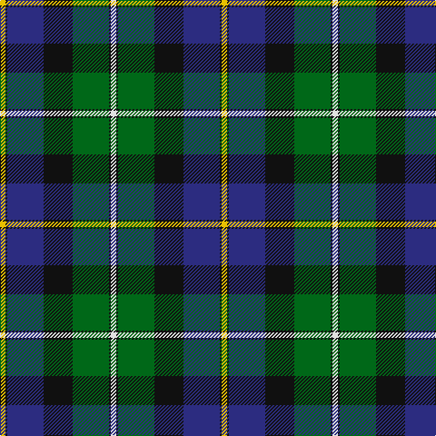

This page is one **sett** — a single exact thread-count. It belongs to the [tartan](/tartans/w3k1g20k16db20k1ly3/)
(the same proportion at any scale), whose colour order is pattern [WKGKBKY](/stripes/wkgkbky/).

Sourced from register-of-tartans.  It is a [7 stripe tartan](/stripes/stripes7/).

Original link https://www.tartanregister.gov.uk/tartanDetails.aspx?ref=2324

3 attestations — the source records this cloth was collapsed from (oldest owns this page)

<ul>
<li>01/08/2007 — MacCormick (register-of-tartans, <a href="https://www.tartanregister.gov.uk/tartanDetails.aspx?ref=2324">record</a>)</li>
<li>August 2007 — MacCormick (Name) (tartans-authority, <a href="http://www.tartansauthority.com/tartan-ferret/display/7161/">record</a>)</li>
<li>undated — MacCormick Tartan Tartan Number: 7161. Earliest known date: August 2007 Designed by Keith McCormick of New Brunswick, Canada for the use of his family which is descended from Hebridean Scots who were a sept of MacLaine of Lochbuie. Can be worn by those of the same name or spelling variations. See products available Copyright © Blair Urquhart, Comrie, 2015 (house-of-tartan, <a href="http://www.house-of-tartan.scotland.net/house/TartanViewjs.asp?colr=Def&tnam=7161">record</a>)</li>
</ul>

## Register references

External register numbers recorded for this tartan.

- Scottish Register of Tartans: [2324](https://www.tartanregister.gov.uk/tartanDetails.aspx?ref=2324)
- Scottish Tartans Authority (ITI): 7161

## Thread count
Y/6 K2 DB40 K32 G40 K2 LN/6

## Palette

Palette: <strong>Tartan Register</strong>
<table><thead><tr><th>Colour</th><th>Threads</th><th>Shade</th><th>Base</th><th>OKLCh</th></tr></thead><tbody><tr><td>Y/</td><td style="text-align:right;font-variant-numeric:tabular-nums">6</td><td><code style="background-color:#E8C000;">#E8C000</code> <small style="color:#888">#E8C000</small></td><td>Y <code style="background-color:#F2BF00;">#F2BF00</code></td><td><small style="color:#888">oklch(81.9% 0.168 93.7)</small></td></tr><tr><td>K</td><td style="text-align:right;font-variant-numeric:tabular-nums">2</td><td><code style="background-color:#101010;">#101010</code> <small style="color:#888">#101010</small></td><td>K <code style="background-color:#000000;">#000000</code></td><td><small style="color:#888">oklch(17.3% 0.000 89.9)</small></td></tr><tr><td>DB</td><td style="text-align:right;font-variant-numeric:tabular-nums">40</td><td><code style="background-color:#2C2C80;">#2C2C80</code> <small style="color:#888">#2C2C80</small></td><td>B <code style="background-color:#2A418A;">#2A418A</code></td><td><small style="color:#888">oklch(35.0% 0.138 276.6)</small></td></tr><tr><td>K</td><td style="text-align:right;font-variant-numeric:tabular-nums">32</td><td><code style="background-color:#101010;">#101010</code> <small style="color:#888">#101010</small></td><td>K <code style="background-color:#000000;">#000000</code></td><td><small style="color:#888">oklch(17.3% 0.000 89.9)</small></td></tr><tr><td>G</td><td style="text-align:right;font-variant-numeric:tabular-nums">40</td><td><code style="background-color:#006818;">#006818</code> <small style="color:#888">#006818</small></td><td>G <code style="background-color:#006100;">#006100</code></td><td><small style="color:#888">oklch(45.0% 0.142 145.0)</small></td></tr><tr><td>K</td><td style="text-align:right;font-variant-numeric:tabular-nums">2</td><td><code style="background-color:#101010;">#101010</code> <small style="color:#888">#101010</small></td><td>K <code style="background-color:#000000;">#000000</code></td><td><small style="color:#888">oklch(17.3% 0.000 89.9)</small></td></tr><tr><td>LN/</td><td style="text-align:right;font-variant-numeric:tabular-nums">6</td><td><code style="background-color:#E0E0E0;">#E0E0E0</code> <small style="color:#888">#E0E0E0</small></td><td>W <code style="background-color:#F7F7F7;">#F7F7F7</code></td><td><small style="color:#888">oklch(90.7% 0.000 89.9)</small></td></tr></tbody></table>

# Sample pattern

## Nearest tartans

The nearest existing variants by ΔTartan distance, with this tartan at the top so the swatches line up against it.

ΔTartan

Tartan

Sett

—

<a href="/ttd/edit/#slug=w3k1g20k16db20k1ly3~x2">MacCormick</a> <a class="nn-out" href="/setts/s7/w3k1g20k16db20k1ly3~x2/" title="open its dictionary page">↗</a>

0.59

<a href="/ttd/edit/#slug=w4k1dg18k17db13r1db3r1~x2">Whitson #2</a> <a class="nn-out" href="/setts/s8/w4k1dg18k17db13r1db3r1~x2/" title="open its dictionary page">↗</a>

0.66

<a href="/ttd/edit/#slug=t3db18k20g20k1ly3~x2">Smith, Sir William (?)</a> <a class="nn-out" href="/setts/s6/t3db18k20g20k1ly3~x2/" title="open its dictionary page">↗</a>

0.87

<a href="/ttd/edit/#slug=r2db16r1k10g12o2~x2">MacWilliam</a> <a class="nn-out" href="/setts/s6/r2db16r1k10g12o2~x2/" title="open its dictionary page">↗</a>

0.91

<a href="/ttd/edit/#slug=db18k10g6r4g6k1w2~x2">Ferguson - 1830 of Atholl (Clan)</a> <a class="nn-out" href="/setts/s7/db18k10g6r4g6k1w2~x2/" title="open its dictionary page">↗</a>

0.95

<a href="/ttd/edit/#slug=r2k9g12db8r1db1w1~x4">Genet, Citizen (Commem)</a> <a class="nn-out" href="/setts/s7/r2k9g12db8r1db1w1~x4/" title="open its dictionary page">↗</a>

0.99

<a href="/ttd/edit/#slug=w1r2b16k14g15k3ly1~x2">Macneil of Barra - Chief (Personal)</a> <a class="nn-out" href="/setts/s7/w1r2b16k14g15k3ly1~x2/" title="open its dictionary page">↗</a>

1.00

<a href="/ttd/edit/#slug=r5k2db19g4k19g28k2ly5~x2">Tait #1</a> <a class="nn-out" href="/setts/s8/r5k2db19g4k19g28k2ly5~x2/" title="open its dictionary page">↗</a>

1.00

<a href="/ttd/edit/#slug=db4k3db18k18g18db1g2w4~x2">Dress Watch</a> <a class="nn-out" href="/setts/s8/db4k3db18k18g18db1g2w4~x2/" title="open its dictionary page">↗</a>

1.02

<a href="/ttd/edit/#slug=w4k1g18k17db13r1db3r1~x2">Whitson</a> <a class="nn-out" href="/setts/s8/w4k1g18k17db13r1db3r1~x2/" title="open its dictionary page">↗</a>

1.03

<a href="/ttd/edit/#slug=r1g14k14r2db14t1~x2">Wilson's, No 221</a> <a class="nn-out" href="/setts/s6/r1g14k14r2db14t1~x2/" title="open its dictionary page">↗</a>

## Neighbour map

Every grey dot is one of 14359 variants placed by the first two principal components of the ΔTartan feature space (44% of its variance). Red is this tartan; blue dots are its nearest — click one to open its page.

<svg viewBox="0 0 640 380" role="img" style="max-width:100%;height:auto;border:1px solid #e0e0e0;border-radius:4px;display:block" xmlns="http://www.w3.org/2000/svg"><image href="/nn/cloud.v1.png" width="640" height="380"/><a href="/setts/s8/w4k1dg18k17db13r1db3r1~x2/"><circle cx="179.0" cy="161.8" r="4" fill="#3465a4"><title>Whitson #2</title></circle></a><a href="/setts/s6/t3db18k20g20k1ly3~x2/"><circle cx="179.8" cy="185.0" r="4" fill="#3465a4"><title>Smith, Sir William (?)</title></circle></a><a href="/setts/s6/r2db16r1k10g12o2~x2/"><circle cx="170.2" cy="180.4" r="4" fill="#3465a4"><title>MacWilliam</title></circle></a><a href="/setts/s7/db18k10g6r4g6k1w2~x2/"><circle cx="189.4" cy="176.6" r="4" fill="#3465a4"><title>Ferguson - 1830 of Atholl (Clan)</title></circle></a><a href="/setts/s7/r2k9g12db8r1db1w1~x4/"><circle cx="170.8" cy="184.2" r="4" fill="#3465a4"><title>Genet, Citizen (Commem)</title></circle></a><a href="/setts/s7/w1r2b16k14g15k3ly1~x2/"><circle cx="152.1" cy="156.6" r="4" fill="#3465a4"><title>Macneil of Barra - Chief (Personal)</title></circle></a><a href="/setts/s8/r5k2db19g4k19g28k2ly5~x2/"><circle cx="184.2" cy="173.0" r="4" fill="#3465a4"><title>Tait #1</title></circle></a><a href="/setts/s8/db4k3db18k18g18db1g2w4~x2/"><circle cx="197.2" cy="181.0" r="4" fill="#3465a4"><title>Dress Watch</title></circle></a><a href="/setts/s8/w4k1g18k17db13r1db3r1~x2/"><circle cx="143.1" cy="145.3" r="4" fill="#3465a4"><title>Whitson</title></circle></a><a href="/setts/s6/r1g14k14r2db14t1~x2/"><circle cx="141.8" cy="182.8" r="4" fill="#3465a4"><title>Wilson's, No 221</title></circle></a><circle cx="172.1" cy="161.5" r="5" fill="#c00000"/></svg>

ID: /setts/s7/w3k1g20k16db20k1ly3~x2/
