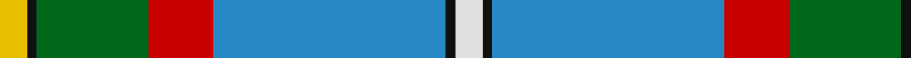
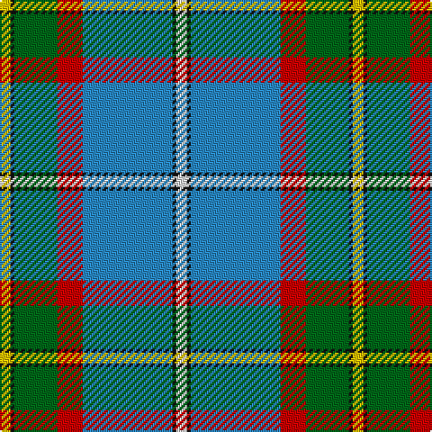

In pattern [WKBRGKY](/stripes/wkbrgky/).

This was sourced from register-of-tartans.  It is a [7 stripe tartan](/stripes/stripes7/).

Original link https://www.tartanregister.gov.uk/tartanDetails.aspx?ref=591

## Attestations

This cloth appears in 2 source records; the oldest owns this page.

- 01/01/1978 — Caskie (register-of-tartans, [record](https://www.tartanregister.gov.uk/tartanDetails.aspx?ref=591))
- pre 1978 — Caskie (Name) (tartans-authority, [record](http://www.tartansauthority.com/tartan-ferret/display/5894/))

## Register references

External register numbers recorded for this tartan.

- Scottish Register of Tartans: [591](https://www.tartanregister.gov.uk/tartanDetails.aspx?ref=591)
- Scottish Tartans Authority (ITI): 5894

## Thread count
Y/6 K2 G24 R14 B50 K2 LN/6

## Palette
Each colour and its ΔE from the base-6 reference it is a variant of.

| Colour | Shade | Base | ΔE (OKLab) |
|---|---|---|---|
| B | <code style="background-color:#2888C4;">#2888C4</code> `#2888C4` | B <code style="background-color:#2A418A;">#2A418A</code> | 0.21 |
| G | <code style="background-color:#006818;">#006818</code> `#006818` | G <code style="background-color:#006100;">#006100</code> | 0.02 |
| K | <code style="background-color:#101010;">#101010</code> `#101010` | K <code style="background-color:#000000;">#000000</code> | 0.17 |
| LN | <code style="background-color:#E0E0E0;">#E0E0E0</code> `#E0E0E0` | W <code style="background-color:#F7F7F7;">#F7F7F7</code> | 0.07 |
| R | <code style="background-color:#C80000;">#C80000</code> `#C80000` | R <code style="background-color:#CC0000;">#CC0000</code> | 0.01 |
| Y | <code style="background-color:#E8C000;">#E8C000</code> `#E8C000` | Y <code style="background-color:#F2BF00;">#F2BF00</code> | 0.02 |

# Sample pattern

## Nearest tartans

The nearest existing variants by ΔTartan distance.

1. [Nova Scotia (Province)](/setts/s9/w2db20g2g2g2g4g8ly2r1~x2/) — ΔT 0.96
1. [(4) Traill](/setts/s7/r8ly2o7ly2n24k2g1~x2/) — ΔT 1.07
1. [Nickel Lodge Centennial (Corporate)](/setts/s9/o36ly2o1ly2o4dt12w8dy2dg12~x2/) — ΔT 1.08
1. [German MacLeod](/setts/s8/ly2r2k2b27k6g13k1lb2~x2/) — ΔT 1.08
1. [Nickel Lodge Centennial](/setts/s9/o16ly1o2ly1o2dt6w4dy1dg6~x2/) — ΔT 1.09
1. [Nickel Lodge Centennial Corporate Tartan Tartan Number: 920. Earliest known date: 1988 1989 See products available Copyright © Blair Urquhart, Comrie, 2015](/setts/s9/o18ly1o2ly1o2db6w4dy1g6~x2/) — ΔT 1.10
1. [Scottish Prison Service (Corporate)](/setts/s8/w3k1r4g20k3b30w4r2~x2/) — ΔT 1.11
1. [O'Donohue Personal)](/setts/s10/b24w2b6g9r6b3r6g35k2ly2~x2/) — ΔT 1.13
1. [Canadian Centennial](/setts/s8/r3w6r2g32db36k2db4ly2~x2/) — ΔT 1.16
1. [Blue Blas Alba](/setts/s9/y4ly2y39dt10o4dt4r4dt25w3~x2/) — ΔT 1.20

## Neighbour map

Every grey dot is one of 14299 variants placed by the first two principal components of the ΔTartan feature space (44% of its variance). Red is this tartan; blue dots are its nearest — click one to open its page.

<svg viewBox="0 0 640 380" role="img" style="max-width:100%;height:auto;border:1px solid #e0e0e0;border-radius:4px;display:block" xmlns="http://www.w3.org/2000/svg"><image href="/nn/cloud.v1.png" width="640" height="380"/><a href="/setts/s9/w2db20g2g2g2g4g8ly2r1~x2/"><circle cx="230.9" cy="114.0" r="4" fill="#3465a4"><title>Nova Scotia (Province)</title></circle></a><a href="/setts/s7/r8ly2o7ly2n24k2g1~x2/"><circle cx="276.4" cy="118.6" r="4" fill="#3465a4"><title>(4) Traill</title></circle></a><a href="/setts/s9/o36ly2o1ly2o4dt12w8dy2dg12~x2/"><circle cx="290.8" cy="94.4" r="4" fill="#3465a4"><title>Nickel Lodge Centennial (Corporate)</title></circle></a><a href="/setts/s8/ly2r2k2b27k6g13k1lb2~x2/"><circle cx="263.6" cy="112.4" r="4" fill="#3465a4"><title>German MacLeod</title></circle></a><a href="/setts/s9/o16ly1o2ly1o2dt6w4dy1dg6~x2/"><circle cx="247.8" cy="131.1" r="4" fill="#3465a4"><title>Nickel Lodge Centennial</title></circle></a><a href="/setts/s9/o18ly1o2ly1o2db6w4dy1g6~x2/"><circle cx="271.9" cy="121.4" r="4" fill="#3465a4"><title>Nickel Lodge Centennial Corporate Tartan Tartan Number: 920. Earliest known date: 1988 1989 See products available Copyright © Blair Urquhart, Comrie, 2015</title></circle></a><a href="/setts/s8/w3k1r4g20k3b30w4r2~x2/"><circle cx="252.5" cy="115.9" r="4" fill="#3465a4"><title>Scottish Prison Service (Corporate)</title></circle></a><a href="/setts/s10/b24w2b6g9r6b3r6g35k2ly2~x2/"><circle cx="241.6" cy="122.9" r="4" fill="#3465a4"><title>O'Donohue Personal)</title></circle></a><a href="/setts/s8/r3w6r2g32db36k2db4ly2~x2/"><circle cx="243.3" cy="120.5" r="4" fill="#3465a4"><title>Canadian Centennial</title></circle></a><a href="/setts/s9/y4ly2y39dt10o4dt4r4dt25w3~x2/"><circle cx="246.5" cy="114.9" r="4" fill="#3465a4"><title>Blue Blas Alba</title></circle></a><circle cx="242.0" cy="119.1" r="5" fill="#c00000"/></svg>

ID: /setts/s7/w3k1t25r7g12k1ly3~x2/
