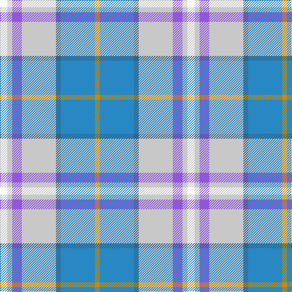

This page is one **sett** — a single exact thread-count. It belongs to the [tartan](/tartans/w3lb2p4lb14n2t14lo2/)
(the same proportion at any scale), whose colour order is pattern [WWBWBBY](/stripes/wwbwbby/).

Sourced from tartans-authority.  It is a [7 stripe tartan](/stripes/stripes7/).

Original link http://www.tartansauthority.com/tartan-ferret/display/5343/

## Thread count
W/12 N8 P16 N56 B8 Ba56 DY/8

## Palette

Palette: <strong>Tartan Register</strong> <small style="color:#888">(5 of 6 colours)</small>
<table><thead><tr><th>Colour</th><th>Threads</th><th>Shade</th><th>Base</th><th>OKLCh</th></tr></thead><tbody><tr><td>W/</td><td style="text-align:right;font-variant-numeric:tabular-nums">12</td><td><code style="background-color:#FCFCFC;">#FCFCFC</code> <small style="color:#888">#FCFCFC</small></td><td>W <code style="background-color:#F7F7F7;">#F7F7F7</code></td><td><small style="color:#888">oklch(99.1% 0.000 89.9)</small></td></tr><tr><td>N</td><td style="text-align:right;font-variant-numeric:tabular-nums">8</td><td><code style="background-color:#C8C8C8;">#C8C8C8</code> <small style="color:#888">#C8C8C8</small></td><td>W <code style="background-color:#F7F7F7;">#F7F7F7</code></td><td><small style="color:#888">oklch(83.3% 0.000 89.9)</small></td></tr><tr><td>P</td><td style="text-align:right;font-variant-numeric:tabular-nums">16</td><td><code style="background-color:#9058D8;">#9058D8</code> <small style="color:#888">#9058D8</small></td><td>B <code style="background-color:#2A418A;">#2A418A</code></td><td><small style="color:#888">oklch(58.4% 0.190 300.8)</small></td></tr><tr><td>N</td><td style="text-align:right;font-variant-numeric:tabular-nums">56</td><td><code style="background-color:#C8C8C8;">#C8C8C8</code> <small style="color:#888">#C8C8C8</small></td><td>W <code style="background-color:#F7F7F7;">#F7F7F7</code></td><td><small style="color:#888">oklch(83.3% 0.000 89.9)</small></td></tr><tr><td>B</td><td style="text-align:right;font-variant-numeric:tabular-nums">8</td><td><code style="background-color:#346488;">#346488</code> <small style="color:#888">#346488</small></td><td>B <code style="background-color:#2A418A;">#2A418A</code></td><td><small style="color:#888">oklch(48.6% 0.078 243.0)</small></td></tr><tr><td>Ba</td><td style="text-align:right;font-variant-numeric:tabular-nums">56</td><td><code style="background-color:#2888C4;">#2888C4</code> <small style="color:#888">#2888C4</small></td><td>B <code style="background-color:#2A418A;">#2A418A</code></td><td><small style="color:#888">oklch(60.1% 0.125 241.5)</small></td></tr><tr><td>DY/</td><td style="text-align:right;font-variant-numeric:tabular-nums">8</td><td><code style="background-color:#C88C00;">#C88C00</code> <small style="color:#888">#C88C00</small></td><td>Y <code style="background-color:#F2BF00;">#F2BF00</code></td><td><small style="color:#888">oklch(68.2% 0.142 78.2)</small></td></tr></tbody></table>

# Sample pattern

## Nearest tartans

The nearest existing variants by ΔTartan distance, with this tartan at the top so the swatches line up against it.

ΔTartan

Tartan

Sett

—

<a href="/ttd/edit/#slug=w3lb2p4lb14n2t14lo2~x4">Seaside (Fashion)</a> <a class="nn-out" href="/setts/s7/w3lb2p4lb14n2t14lo2~x4/" title="open its dictionary page">↗</a>

1.15

<a href="/ttd/edit/#slug=r1g1ly1t9ly3w3lr9t1~x4">Curd (2013)</a> <a class="nn-out" href="/setts/s8/r1g1ly1t9ly3w3lr9t1~x4/" title="open its dictionary page">↗</a>

1.19

<a href="/setts/s12/w3lb2p4lb14n2t14lo2~x4/">Seaside</a>

1.37

<a href="/ttd/edit/#slug=ly4b22g4o24dp6o4w3~x2">Deeside Plaid (Taobh Dhi) (District)</a> <a class="nn-out" href="/setts/s7/ly4b22g4o24dp6o4w3~x2/" title="open its dictionary page">↗</a>

1.42

<a href="/ttd/edit/#slug=lb14t9lb14lr4dg3lb3dg3lr4t14lr2w3~x2">Bouguet, Adrian (Personal)</a> <a class="nn-out" href="/setts/s11/lb14t9lb14lr4dg3lb3dg3lr4t14lr2w3~x2/" title="open its dictionary page">↗</a>

1.43

<a href="/ttd/edit/#slug=ly6b16lb3r3o3g3w2~x4">Atikokan</a> <a class="nn-out" href="/setts/s7/ly6b16lb3r3o3g3w2~x4/" title="open its dictionary page">↗</a>

1.62

<a href="/ttd/edit/#slug=lo6t16lb3y3o3g3w2~x4">Atikokan (District)</a> <a class="nn-out" href="/setts/s7/lo6t16lb3y3o3g3w2~x4/" title="open its dictionary page">↗</a>

1.63

<a href="/ttd/edit/#slug=db4w1n12lr12m4t1w2~x4">Ontex</a> <a class="nn-out" href="/setts/s7/db4w1n12lr12m4t1w2~x4/" title="open its dictionary page">↗</a>

1.66

<a href="/ttd/edit/#slug=dp2w12b11t12k1g2~x4">Isle of Barra (District)</a> <a class="nn-out" href="/setts/s6/dp2w12b11t12k1g2~x4/" title="open its dictionary page">↗</a>

1.75

<a href="/ttd/edit/#slug=lo5o39r16o5g6o5b32lb5~x2">Washington DC (Fashion)</a> <a class="nn-out" href="/setts/s8/lo5o39r16o5g6o5b32lb5~x2/" title="open its dictionary page">↗</a>

1.75

<a href="/ttd/edit/#slug=g4r1db8w1r1w1b8w1b8w1ly1~x4">Texas, Bluebonnet</a> <a class="nn-out" href="/setts/s11/g4r1db8w1r1w1b8w1b8w1ly1~x4/" title="open its dictionary page">↗</a>

## Neighbour map

Every grey dot is one of 14299 variants placed by the first two principal components of the ΔTartan feature space (44% of its variance). Red is this tartan; blue dots are its nearest — click one to open its page.

<svg viewBox="0 0 640 380" role="img" style="max-width:100%;height:auto;border:1px solid #e0e0e0;border-radius:4px;display:block" xmlns="http://www.w3.org/2000/svg"><image href="/nn/cloud.v1.png" width="640" height="380"/><a href="/setts/s8/r1g1ly1t9ly3w3lr9t1~x4/"><circle cx="164.8" cy="162.6" r="4" fill="#3465a4"><title>Curd (2013)</title></circle></a><a href="/setts/s12/w3lb2p4lb14n2t14lo2~x4/"><circle cx="178.4" cy="167.4" r="4" fill="#3465a4"><title>Seaside</title></circle></a><a href="/setts/s7/ly4b22g4o24dp6o4w3~x2/"><circle cx="179.4" cy="175.8" r="4" fill="#3465a4"><title>Deeside Plaid (Taobh Dhi) (District)</title></circle></a><a href="/setts/s11/lb14t9lb14lr4dg3lb3dg3lr4t14lr2w3~x2/"><circle cx="153.0" cy="186.6" r="4" fill="#3465a4"><title>Bouguet, Adrian (Personal)</title></circle></a><a href="/setts/s7/ly6b16lb3r3o3g3w2~x4/"><circle cx="139.9" cy="150.0" r="4" fill="#3465a4"><title>Atikokan</title></circle></a><a href="/setts/s7/lo6t16lb3y3o3g3w2~x4/"><circle cx="168.0" cy="167.5" r="4" fill="#3465a4"><title>Atikokan (District)</title></circle></a><a href="/setts/s7/db4w1n12lr12m4t1w2~x4/"><circle cx="164.2" cy="166.7" r="4" fill="#3465a4"><title>Ontex</title></circle></a><a href="/setts/s6/dp2w12b11t12k1g2~x4/"><circle cx="115.1" cy="174.1" r="4" fill="#3465a4"><title>Isle of Barra (District)</title></circle></a><a href="/setts/s8/lo5o39r16o5g6o5b32lb5~x2/"><circle cx="215.9" cy="187.6" r="4" fill="#3465a4"><title>Washington DC (Fashion)</title></circle></a><a href="/setts/s11/g4r1db8w1r1w1b8w1b8w1ly1~x4/"><circle cx="175.9" cy="145.6" r="4" fill="#3465a4"><title>Texas, Bluebonnet</title></circle></a><circle cx="166.7" cy="181.1" r="5" fill="#c00000"/></svg>

ID: /setts/s7/w3lb2p4lb14n2t14lo2~x4/
