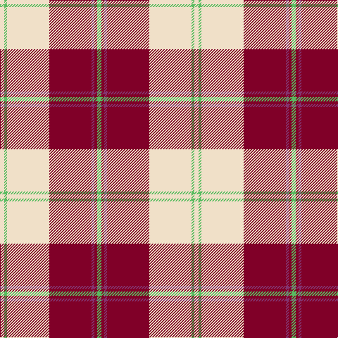

In pattern [WYWRBRY](/stripes/wywrbry/).

This was sourced from tartans-authority.  It is a [7 stripe tartan](/stripes/stripes7/).

Original link http://www.tartansauthority.com/tartan-ferret/display/7607/

## Also known as

This cloth is also recorded under:

- Torridon, Burgundy

## Attestations

This cloth appears in 2 source records; the oldest owns this page.

- March 2008 — Torridon, Burgundy (Dance) (tartans-authority, [record](http://www.tartansauthority.com/tartan-ferret/display/7607/))
- undated — Torridon Burgundy (register-of-tartans, [record](https://www.tartanregister.gov.uk/tartanDetails.aspx?ref=5631))

## Register references

External register numbers recorded for this tartan.

- Scottish Register of Tartans: [5631](https://www.tartanregister.gov.uk/tartanDetails.aspx?ref=5631)
- Scottish Tartans Authority (ITI): 7607

## Thread count
W/6 LG4 W60 DR60 P4 DR4 LG/6

## Palette
Each colour and the base-6 reference it is a variant of.

| Colour | Shade | Base |
|---|---|---|
| DR | <code style="background-color:#800028;">#800028</code> `oklch(38.2% 0.152 14.5)` <small>#800028</small> | R <code style="background-color:#CC0000;">#CC0000</code> |
| LG | <code style="background-color:#58BC60;">#58BC60</code> `oklch(71.3% 0.160 145.2)` <small>#58BC60</small> | Y <code style="background-color:#F2BF00;">#F2BF00</code> |
| P | <code style="background-color:#843470;">#843470</code> `oklch(45.7% 0.132 338.4)` <small>#843470</small> | B <code style="background-color:#2A418A;">#2A418A</code> |
| W | <code style="background-color:#F0E0C8;">#F0E0C8</code> `oklch(91.3% 0.036 78.1)` <small>#F0E0C8</small> | W <code style="background-color:#F7F7F7;">#F7F7F7</code> |

# Sample pattern

## Nearest tartans

The nearest existing variants by ΔTartan distance.

1. [Cunningham Dress Burgundy (Dance)](/setts/s7/w5r2w34r34k2r2ly4~x2/) — ΔT 0.55
1. [Torridon, Cherry (Dance)](/setts/s7/r3r2db2r30w30db2w3~x2/) — ΔT 0.72
1. [Cunningham Dress](/setts/s7/w5r2w34r34k2r2db4~x2/) — ΔT 0.82
1. [MacPherson Dress Burgundy (Dance)](/setts/s7/w4k2w25r21w3r8ly3~x2/) — ΔT 0.84
1. [Arduaine, Red (Dance)](/setts/s7/w5k2w30r24w3r8dt3~x2/) — ΔT 1.07
1. [Papalia, Special Dress](/setts/s6/o4w2r2r34w37k2~x2/) — ΔT 1.09
1. [Masai Shuka 14 (Artefact)](/setts/s8/r40w40k5w2k6w2k5w6~x2/) — ΔT 1.20
1. [Bundy, Dress Red (Personal Dance)](/setts/s8/k1r1w1r15w15r1w1k1~x4/) — ΔT 1.21
1. [Cameron, Hose](/setts/s7/k1r8g1r1w8r1k1~x6/) — ΔT 1.23
1. [Longniddry Burgundy (Dance)](/setts/s8/r42r2w2r2r5r12w32r4~x2/) — ΔT 1.24

## Neighbour map

Every grey dot is one of 14299 variants placed by the first two principal components of the ΔTartan feature space (44% of its variance). Red is this tartan; blue dots are its nearest — click one to open its page.

<svg viewBox="0 0 640 380" role="img" style="max-width:100%;height:auto;border:1px solid #e0e0e0;border-radius:4px;display:block" xmlns="http://www.w3.org/2000/svg"><image href="/nn/cloud.v1.png" width="640" height="380"/><a href="/setts/s7/w5r2w34r34k2r2ly4~x2/"><circle cx="280.9" cy="120.7" r="4" fill="#3465a4"><title>Cunningham Dress Burgundy (Dance)</title></circle></a><a href="/setts/s7/r3r2db2r30w30db2w3~x2/"><circle cx="284.7" cy="126.3" r="4" fill="#3465a4"><title>Torridon, Cherry (Dance)</title></circle></a><a href="/setts/s7/w5r2w34r34k2r2db4~x2/"><circle cx="287.7" cy="117.8" r="4" fill="#3465a4"><title>Cunningham Dress</title></circle></a><a href="/setts/s7/w4k2w25r21w3r8ly3~x2/"><circle cx="264.9" cy="152.7" r="4" fill="#3465a4"><title>MacPherson Dress Burgundy (Dance)</title></circle></a><a href="/setts/s7/w5k2w30r24w3r8dt3~x2/"><circle cx="296.8" cy="140.9" r="4" fill="#3465a4"><title>Arduaine, Red (Dance)</title></circle></a><a href="/setts/s6/o4w2r2r34w37k2~x2/"><circle cx="264.8" cy="108.4" r="4" fill="#3465a4"><title>Papalia, Special Dress</title></circle></a><a href="/setts/s8/r40w40k5w2k6w2k5w6~x2/"><circle cx="296.1" cy="125.8" r="4" fill="#3465a4"><title>Masai Shuka 14 (Artefact)</title></circle></a><a href="/setts/s8/k1r1w1r15w15r1w1k1~x4/"><circle cx="323.6" cy="129.2" r="4" fill="#3465a4"><title>Bundy, Dress Red (Personal Dance)</title></circle></a><a href="/setts/s7/k1r8g1r1w8r1k1~x6/"><circle cx="236.5" cy="156.4" r="4" fill="#3465a4"><title>Cameron, Hose</title></circle></a><a href="/setts/s8/r42r2w2r2r5r12w32r4~x2/"><circle cx="301.7" cy="116.1" r="4" fill="#3465a4"><title>Longniddry Burgundy (Dance)</title></circle></a><circle cx="276.3" cy="128.5" r="5" fill="#c00000"/></svg>

ID: /setts/s7/w3lg2w30r30n2r2lg3~x2/
