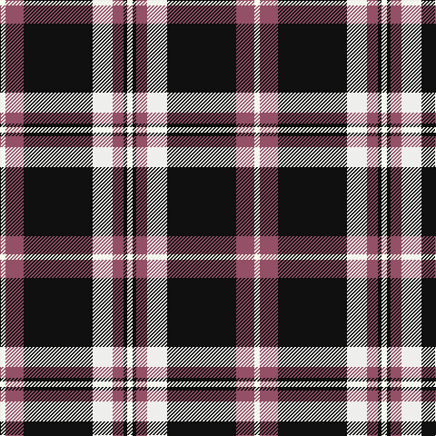

This page is one **sett** — a single exact thread-count. It belongs to the [tartan](/tartans/w3o10k38wi11o6k2w3/)
(the same proportion at any scale), whose colour order is pattern [WKRWKRW](/stripes/wkrwkrw/).

Sourced from register-of-tartans.  It is a [7 stripe tartan](/stripes/stripes7/).

Original link https://www.tartanregister.gov.uk/tartanDetails.aspx?ref=10050

## Register references

External register numbers recorded for this tartan.

- Scottish Register of Tartans: [10050](https://www.tartanregister.gov.uk/tartanDetails.aspx?ref=10050)

## Thread count
W/6 LT20 K76 Wa22 LT12 K4 W/6

## Palette

Palette: <strong>Logan (The Scottish Gael, 1831)</strong> <small style="color:#888">(1 of 4 colours)</small>
<table><thead><tr><th>Colour</th><th>Threads</th><th>Shade</th><th>Base</th><th>OKLCh</th></tr></thead><tbody><tr><td>W/</td><td style="text-align:right;font-variant-numeric:tabular-nums">6</td><td><code style="background-color:#F7FEEE;">#F7FEEE</code> <small style="color:#888">#F7FEEE</small></td><td>W <code style="background-color:#F7F7F7;">#F7F7F7</code></td><td><small style="color:#888">oklch(98.7% 0.022 126.2)</small></td></tr><tr><td>LT</td><td style="text-align:right;font-variant-numeric:tabular-nums">20</td><td><code style="background-color:#945067;">#945067</code> <small style="color:#888">#945067</small></td><td>R <code style="background-color:#CC0000;">#CC0000</code></td><td><small style="color:#888">oklch(51.9% 0.095 359.3)</small></td></tr><tr><td>K</td><td style="text-align:right;font-variant-numeric:tabular-nums">76</td><td><code style="background-color:#101010;">#101010</code> <small style="color:#888">#101010</small></td><td>K <code style="background-color:#000000;">#000000</code></td><td><small style="color:#888">oklch(17.3% 0.000 89.9)</small></td></tr><tr><td>Wa</td><td style="text-align:right;font-variant-numeric:tabular-nums">22</td><td><code style="background-color:#EEEEEC;">#EEEEEC</code> <small style="color:#888">#EEEEEC</small></td><td>W <code style="background-color:#F7F7F7;">#F7F7F7</code></td><td><small style="color:#888">oklch(94.9% 0.003 106.5)</small></td></tr><tr><td>LT</td><td style="text-align:right;font-variant-numeric:tabular-nums">12</td><td><code style="background-color:#945067;">#945067</code> <small style="color:#888">#945067</small></td><td>R <code style="background-color:#CC0000;">#CC0000</code></td><td><small style="color:#888">oklch(51.9% 0.095 359.3)</small></td></tr><tr><td>K</td><td style="text-align:right;font-variant-numeric:tabular-nums">4</td><td><code style="background-color:#101010;">#101010</code> <small style="color:#888">#101010</small></td><td>K <code style="background-color:#000000;">#000000</code></td><td><small style="color:#888">oklch(17.3% 0.000 89.9)</small></td></tr><tr><td>W/</td><td style="text-align:right;font-variant-numeric:tabular-nums">6</td><td><code style="background-color:#F7FEEE;">#F7FEEE</code> <small style="color:#888">#F7FEEE</small></td><td>W <code style="background-color:#F7F7F7;">#F7F7F7</code></td><td><small style="color:#888">oklch(98.7% 0.022 126.2)</small></td></tr></tbody></table>

# Sample pattern

## Nearest tartans

The nearest existing variants by ΔTartan distance, with this tartan at the top so the swatches line up against it.

ΔTartan

Tartan

Sett

—

<a href="/ttd/edit/#slug=w3o10k38wi11o6k2w3~x2">Phantom</a> <a class="nn-out" href="/setts/s7/w3o10k38wi11o6k2w3~x2/" title="open its dictionary page">↗</a>

0.81

<a href="/ttd/edit/#slug=k30w2lr4lo10w9k3lr5~x2">Virginia Commonwealth University</a> <a class="nn-out" href="/setts/s7/k30w2lr4lo10w9k3lr5~x2/" title="open its dictionary page">↗</a>

0.92

<a href="/ttd/edit/#slug=w4k2w16k4w4k37dg12k4ly4~x2">Gordon Dress (MacGregor-Hastie)</a> <a class="nn-out" href="/setts/s9/w4k2w16k4w4k37dg12k4ly4~x2/" title="open its dictionary page">↗</a>

0.93

<a href="/ttd/edit/#slug=k43r10w3k3w15db3~x2">Bro-Wened</a> <a class="nn-out" href="/setts/s6/k43r10w3k3w15db3~x2/" title="open its dictionary page">↗</a>

1.04

<a href="/ttd/edit/#slug=t5r5k58r5t5r5w25r5t4">Meg Merrilees, New (1831)</a> <a class="nn-out" href="/setts/s9/t5r5k58r5t5r5w25r5t4/" title="open its dictionary page">↗</a>

1.06

<a href="/ttd/edit/#slug=w4k30r1k1r3w12ly3~x2">Richecourt, Baron of (Personal)</a> <a class="nn-out" href="/setts/s7/w4k30r1k1r3w12ly3~x2/" title="open its dictionary page">↗</a>

1.12

<a href="/ttd/edit/#slug=r2w8k14o25w2k2w2~x2">Merric, Dark Camel..</a> <a class="nn-out" href="/setts/s7/r2w8k14o25w2k2w2~x2/" title="open its dictionary page">↗</a>

1.13

<a href="/ttd/edit/#slug=r12k2w8k4n16r2k31n2">Distripress Annual Congress 2012</a> <a class="nn-out" href="/setts/s8/r12k2w8k4n16r2k31n2/" title="open its dictionary page">↗</a>

1.13

<a href="/ttd/edit/#slug=w3dr10k38o11dr6k2w3~x2">Phantom (Corporate)</a> <a class="nn-out" href="/setts/s7/w3dr10k38o11dr6k2w3~x2/" title="open its dictionary page">↗</a>

1.21

<a href="/ttd/edit/#slug=k62w10ly10k4w18k4lo3w4">Colbert Check (Fashion)</a> <a class="nn-out" href="/setts/s8/k62w10ly10k4w18k4lo3w4/" title="open its dictionary page">↗</a>

1.22

<a href="/ttd/edit/#slug=r10k3w1k15ly1w3k3ly1~x4">Cunard o' the Clyde</a> <a class="nn-out" href="/setts/s8/r10k3w1k15ly1w3k3ly1~x4/" title="open its dictionary page">↗</a>

## Neighbour map

Every grey dot is one of 14359 variants placed by the first two principal components of the ΔTartan feature space (44% of its variance). Red is this tartan; blue dots are its nearest — click one to open its page.

<svg viewBox="0 0 640 380" role="img" style="max-width:100%;height:auto;border:1px solid #e0e0e0;border-radius:4px;display:block" xmlns="http://www.w3.org/2000/svg"><image href="/nn/cloud.v1.png" width="640" height="380"/><a href="/setts/s7/k30w2lr4lo10w9k3lr5~x2/"><circle cx="247.3" cy="153.3" r="4" fill="#3465a4"><title>Virginia Commonwealth University</title></circle></a><a href="/setts/s9/w4k2w16k4w4k37dg12k4ly4~x2/"><circle cx="275.4" cy="136.7" r="4" fill="#3465a4"><title>Gordon Dress (MacGregor-Hastie)</title></circle></a><a href="/setts/s6/k43r10w3k3w15db3~x2/"><circle cx="316.3" cy="163.0" r="4" fill="#3465a4"><title>Bro-Wened</title></circle></a><a href="/setts/s9/t5r5k58r5t5r5w25r5t4/"><circle cx="247.4" cy="123.5" r="4" fill="#3465a4"><title>Meg Merrilees, New (1831)</title></circle></a><a href="/setts/s7/w4k30r1k1r3w12ly3~x2/"><circle cx="328.7" cy="113.1" r="4" fill="#3465a4"><title>Richecourt, Baron of (Personal)</title></circle></a><a href="/setts/s7/r2w8k14o25w2k2w2~x2/"><circle cx="220.8" cy="157.3" r="4" fill="#3465a4"><title>Merric, Dark Camel..</title></circle></a><a href="/setts/s8/r12k2w8k4n16r2k31n2/"><circle cx="237.0" cy="151.0" r="4" fill="#3465a4"><title>Distripress Annual Congress 2012</title></circle></a><a href="/setts/s7/w3dr10k38o11dr6k2w3~x2/"><circle cx="314.2" cy="157.6" r="4" fill="#3465a4"><title>Phantom (Corporate)</title></circle></a><a href="/setts/s8/k62w10ly10k4w18k4lo3w4/"><circle cx="338.6" cy="124.0" r="4" fill="#3465a4"><title>Colbert Check (Fashion)</title></circle></a><a href="/setts/s8/r10k3w1k15ly1w3k3ly1~x4/"><circle cx="302.4" cy="152.9" r="4" fill="#3465a4"><title>Cunard o' the Clyde</title></circle></a><circle cx="285.9" cy="141.0" r="5" fill="#c00000"/></svg>

ID: /setts/s7/w3o10k38wi11o6k2w3~x2/
