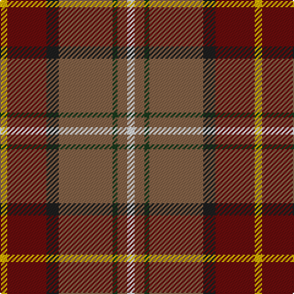

This page is one **sett** — a single exact thread-count. It belongs to the [tartan](/tartans/w3o4dg2o22dt5o16ly3/)
(the same proportion at any scale), whose colour order is pattern [WRGRBRY](/stripes/wrgrbry/).

Sourced from register-of-tartans.  It is a [7 stripe tartan](/stripes/stripes7/).

Original link https://www.tartanregister.gov.uk/tartanDetails.aspx?ref=10668

2 attestations — the source records this cloth was collapsed from (oldest owns this page)

<ul>
<li>06/08/2012 — Pubcrawlers, The (register-of-tartans, <a href="https://www.tartanregister.gov.uk/tartanDetails.aspx?ref=10668">record</a>)</li>
<li>undated — Pubcrawlers, The Corporate Tartan Tartan Number: 10668. Earliest known date: 06/08/2012 With over a decade of performing, the Pubcrawlers have firmly established themselves as a brand as well as a musical group, and the muted earthen tones of the Pubcrawler tartan reflect the colour palette that has come to be associated with both. Working together with members of the band, USA Kilts have crafted a tartan that represents not only the colours that have been the Pubcrawlers' trademark since 2002 (originally chosen as an amalgamation of the colours of several members' family tartans), but their physical location as well, having woven into the pattern the coordinates of Portland, Maine, the city that the band calls home. The Pubcrawlers take great pride in their tartan and will happily permit it to be worn by any members, friends, family and supporters of the band. See products available Copyright © Blair Urquhart, Comrie, 2015 (house-of-tartan, <a href="http://www.house-of-tartan.scotland.net/house/TartanViewjs.asp?colr=Def&tnam=10668">record</a>)</li>
</ul>

## Register references

External register numbers recorded for this tartan.

- Scottish Register of Tartans: [10668](https://www.tartanregister.gov.uk/tartanDetails.aspx?ref=10668)

## Thread count
Y/6 DR32 K10 LT44 DG4 LT8 LN/6

## Palette

Palette: <strong>custom</strong>
<table><thead><tr><th>Colour</th><th>Threads</th><th>Shade</th><th>Base</th><th>OKLCh</th></tr></thead><tbody><tr><td>Y/</td><td style="text-align:right;font-variant-numeric:tabular-nums">6</td><td><code style="background-color:#DFAF00;">#DFAF00</code> <small style="color:#888">#DFAF00</small></td><td>Y <code style="background-color:#F2BF00;">#F2BF00</code></td><td><small style="color:#888">oklch(77.6% 0.159 88.7)</small></td></tr><tr><td>DR</td><td style="text-align:right;font-variant-numeric:tabular-nums">32</td><td><code style="background-color:#680D0D;">#680D0D</code> <small style="color:#888">#680D0D</small></td><td>R <code style="background-color:#CC0000;">#CC0000</code></td><td><small style="color:#888">oklch(33.4% 0.124 27.2)</small></td></tr><tr><td>K</td><td style="text-align:right;font-variant-numeric:tabular-nums">10</td><td><code style="background-color:#1E1E1E;">#1E1E1E</code> <small style="color:#888">#1E1E1E</small></td><td>B <code style="background-color:#2A418A;">#2A418A</code></td><td><small style="color:#888">oklch(23.5% 0.000 89.9)</small></td></tr><tr><td>LT</td><td style="text-align:right;font-variant-numeric:tabular-nums">44</td><td><code style="background-color:#846247;">#846247</code> <small style="color:#888">#846247</small></td><td>R <code style="background-color:#CC0000;">#CC0000</code></td><td><small style="color:#888">oklch(52.4% 0.059 59.5)</small></td></tr><tr><td>DG</td><td style="text-align:right;font-variant-numeric:tabular-nums">4</td><td><code style="background-color:#1B3B1D;">#1B3B1D</code> <small style="color:#888">#1B3B1D</small></td><td>G <code style="background-color:#006100;">#006100</code></td><td><small style="color:#888">oklch(31.9% 0.064 145.2)</small></td></tr><tr><td>LT</td><td style="text-align:right;font-variant-numeric:tabular-nums">8</td><td><code style="background-color:#846247;">#846247</code> <small style="color:#888">#846247</small></td><td>R <code style="background-color:#CC0000;">#CC0000</code></td><td><small style="color:#888">oklch(52.4% 0.059 59.5)</small></td></tr><tr><td>LN/</td><td style="text-align:right;font-variant-numeric:tabular-nums">6</td><td><code style="background-color:#DFDFDF;">#DFDFDF</code> <small style="color:#888">#DFDFDF</small></td><td>W <code style="background-color:#F7F7F7;">#F7F7F7</code></td><td><small style="color:#888">oklch(90.4% 0.000 89.9)</small></td></tr></tbody></table>

# Sample pattern

## Nearest tartans

The nearest existing variants by ΔTartan distance, with this tartan at the top so the swatches line up against it.

ΔTartan

Tartan

Sett

—

<a href="/ttd/edit/#slug=w3o4dg2o22dt5o16ly3~x2">Pubcrawlers, The</a> <a class="nn-out" href="/setts/s7/w3o4dg2o22dt5o16ly3~x2/" title="open its dictionary page">↗</a>

0.67

<a href="/ttd/edit/#slug=r1do1r9g6t2b3r2lo1~x4">Battle of Bannockburn, The</a> <a class="nn-out" href="/setts/s8/r1do1r9g6t2b3r2lo1~x4/" title="open its dictionary page">↗</a>

1.01

<a href="/ttd/edit/#slug=lr6o5k2y18r28w2~x2">Dundhuin</a> <a class="nn-out" href="/setts/s6/lr6o5k2y18r28w2~x2/" title="open its dictionary page">↗</a>

1.01

<a href="/ttd/edit/#slug=b6dp5k2g18m28w2~x2">Dundhuin Ladies (Personal)</a> <a class="nn-out" href="/setts/s6/b6dp5k2g18m28w2~x2/" title="open its dictionary page">↗</a>

1.08

<a href="/ttd/edit/#slug=db3t1k1r12r1g9r1t1db3~x4">Moray of Abercairney</a> <a class="nn-out" href="/setts/s9/db3t1k1r12r1g9r1t1db3~x4/" title="open its dictionary page">↗</a>

1.09

<a href="/ttd/edit/#slug=r63w4k4dp18ly4dg50~x2">Gordon of Abergeldie (Portrait)</a> <a class="nn-out" href="/setts/s6/r63w4k4dp18ly4dg50~x2/" title="open its dictionary page">↗</a>

1.12

<a href="/ttd/edit/#slug=o4do2o21db11w2o20r3~x2">Barbour Dress</a> <a class="nn-out" href="/setts/s7/o4do2o21db11w2o20r3~x2/" title="open its dictionary page">↗</a>

1.13

<a href="/ttd/edit/#slug=r30db12k3g12ly2g3w2~x2">Hewitt (Name)</a> <a class="nn-out" href="/setts/s7/r30db12k3g12ly2g3w2~x2/" title="open its dictionary page">↗</a>

1.16

<a href="/ttd/edit/#slug=k2o30g4w2g14m13ly2~x2">Red Rum</a> <a class="nn-out" href="/setts/s7/k2o30g4w2g14m13ly2~x2/" title="open its dictionary page">↗</a>

1.18

<a href="/ttd/edit/#slug=r2lb1r8k4db1g10lr1g2~x4">Sawyer</a> <a class="nn-out" href="/setts/s8/r2lb1r8k4db1g10lr1g2~x4/" title="open its dictionary page">↗</a>

1.20

<a href="/ttd/edit/#slug=r48b16lo5g17w8dy3~x2">Scottish American Soc. of Michigan</a> <a class="nn-out" href="/setts/s6/r48b16lo5g17w8dy3~x2/" title="open its dictionary page">↗</a>

## Neighbour map

Every grey dot is one of 14299 variants placed by the first two principal components of the ΔTartan feature space (44% of its variance). Red is this tartan; blue dots are its nearest — click one to open its page.

<svg viewBox="0 0 640 380" role="img" style="max-width:100%;height:auto;border:1px solid #e0e0e0;border-radius:4px;display:block" xmlns="http://www.w3.org/2000/svg"><image href="/nn/cloud.v1.png" width="640" height="380"/><a href="/setts/s8/r1do1r9g6t2b3r2lo1~x4/"><circle cx="222.9" cy="165.9" r="4" fill="#3465a4"><title>Battle of Bannockburn, The</title></circle></a><a href="/setts/s6/lr6o5k2y18r28w2~x2/"><circle cx="258.0" cy="163.0" r="4" fill="#3465a4"><title>Dundhuin</title></circle></a><a href="/setts/s6/b6dp5k2g18m28w2~x2/"><circle cx="240.0" cy="157.6" r="4" fill="#3465a4"><title>Dundhuin Ladies (Personal)</title></circle></a><a href="/setts/s9/db3t1k1r12r1g9r1t1db3~x4/"><circle cx="196.7" cy="131.1" r="4" fill="#3465a4"><title>Moray of Abercairney</title></circle></a><a href="/setts/s6/r63w4k4dp18ly4dg50~x2/"><circle cx="242.5" cy="141.0" r="4" fill="#3465a4"><title>Gordon of Abergeldie (Portrait)</title></circle></a><a href="/setts/s7/o4do2o21db11w2o20r3~x2/"><circle cx="189.8" cy="167.4" r="4" fill="#3465a4"><title>Barbour Dress</title></circle></a><a href="/setts/s7/r30db12k3g12ly2g3w2~x2/"><circle cx="231.0" cy="129.6" r="4" fill="#3465a4"><title>Hewitt (Name)</title></circle></a><a href="/setts/s7/k2o30g4w2g14m13ly2~x2/"><circle cx="244.4" cy="155.1" r="4" fill="#3465a4"><title>Red Rum</title></circle></a><a href="/setts/s8/r2lb1r8k4db1g10lr1g2~x4/"><circle cx="191.2" cy="163.0" r="4" fill="#3465a4"><title>Sawyer</title></circle></a><a href="/setts/s6/r48b16lo5g17w8dy3~x2/"><circle cx="243.6" cy="140.3" r="4" fill="#3465a4"><title>Scottish American Soc. of Michigan</title></circle></a><circle cx="238.0" cy="164.5" r="5" fill="#c00000"/></svg>

ID: /setts/s7/w3o4dg2o22dt5o16ly3~x2/
