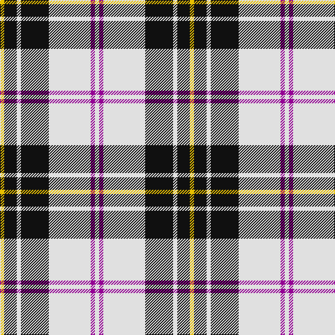

This page is one **sett** — a single exact thread-count. It belongs to the [tartan](/tartans/w3p3w30k20w3k9ly3/)
(the same proportion at any scale), whose colour order is pattern [WBWKWKY](/stripes/wbwkwky/).

Sourced from register-of-tartans.  It is a [7 stripe tartan](/stripes/stripes7/).

Original link https://www.tartanregister.gov.uk/tartanDetails.aspx?ref=2714

2 attestations — the source records this cloth was collapsed from (oldest owns this page)

<ul>
<li>01/01/1842 — MacPherson Dress (1951) (register-of-tartans, <a href="https://www.tartanregister.gov.uk/tartanDetails.aspx?ref=2714">record</a>)</li>
<li>1842 — MacPherson Dress (1951) (tartans-authority, <a href="http://www.tartansauthority.com/tartan-ferret/display/5921/">record</a>)</li>
</ul>

## Register references

External register numbers recorded for this tartan.

- Scottish Register of Tartans: [2714](https://www.tartanregister.gov.uk/tartanDetails.aspx?ref=2714)
- Scottish Tartans Authority (ITI): 5921

## Thread count
Y/6 K18 LN6 K40 LN60 P6 LN/6

## Palette

Palette: <strong>Tartan Register</strong> <small style="color:#888">(3 of 4 colours)</small>
<table><thead><tr><th>Colour</th><th>Threads</th><th>Shade</th><th>Base</th><th>OKLCh</th></tr></thead><tbody><tr><td>Y/</td><td style="text-align:right;font-variant-numeric:tabular-nums">6</td><td><code style="background-color:#E8C000;">#E8C000</code> <small style="color:#888">#E8C000</small></td><td>Y <code style="background-color:#F2BF00;">#F2BF00</code></td><td><small style="color:#888">oklch(81.9% 0.168 93.7)</small></td></tr><tr><td>K</td><td style="text-align:right;font-variant-numeric:tabular-nums">18</td><td><code style="background-color:#101010;">#101010</code> <small style="color:#888">#101010</small></td><td>K <code style="background-color:#000000;">#000000</code></td><td><small style="color:#888">oklch(17.3% 0.000 89.9)</small></td></tr><tr><td>LN</td><td style="text-align:right;font-variant-numeric:tabular-nums">6</td><td><code style="background-color:#E0E0E0;">#E0E0E0</code> <small style="color:#888">#E0E0E0</small></td><td>W <code style="background-color:#F7F7F7;">#F7F7F7</code></td><td><small style="color:#888">oklch(90.7% 0.000 89.9)</small></td></tr><tr><td>K</td><td style="text-align:right;font-variant-numeric:tabular-nums">40</td><td><code style="background-color:#101010;">#101010</code> <small style="color:#888">#101010</small></td><td>K <code style="background-color:#000000;">#000000</code></td><td><small style="color:#888">oklch(17.3% 0.000 89.9)</small></td></tr><tr><td>LN</td><td style="text-align:right;font-variant-numeric:tabular-nums">60</td><td><code style="background-color:#E0E0E0;">#E0E0E0</code> <small style="color:#888">#E0E0E0</small></td><td>W <code style="background-color:#F7F7F7;">#F7F7F7</code></td><td><small style="color:#888">oklch(90.7% 0.000 89.9)</small></td></tr><tr><td>P</td><td style="text-align:right;font-variant-numeric:tabular-nums">6</td><td><code style="background-color:#940094;">#940094</code> <small style="color:#888">#940094</small></td><td>B <code style="background-color:#2A418A;">#2A418A</code></td><td><small style="color:#888">oklch(46.8% 0.215 328.4)</small></td></tr><tr><td>LN/</td><td style="text-align:right;font-variant-numeric:tabular-nums">6</td><td><code style="background-color:#E0E0E0;">#E0E0E0</code> <small style="color:#888">#E0E0E0</small></td><td>W <code style="background-color:#F7F7F7;">#F7F7F7</code></td><td><small style="color:#888">oklch(90.7% 0.000 89.9)</small></td></tr></tbody></table>

# Sample pattern

## Nearest tartans

The nearest existing variants by ΔTartan distance, with this tartan at the top so the swatches line up against it.

ΔTartan

Tartan

Sett

—

<a href="/ttd/edit/#slug=w3p3w30k20w3k9ly3~x2">MacPherson Dress (1951)</a> <a class="nn-out" href="/setts/s7/w3p3w30k20w3k9ly3~x2/" title="open its dictionary page">↗</a>

0.74

<a href="/ttd/edit/#slug=r1lb12k1w2k5r1~x4">Rui (Personal)</a> <a class="nn-out" href="/setts/s6/r1lb12k1w2k5r1~x4/" title="open its dictionary page">↗</a>

0.84

<a href="/ttd/edit/#slug=w5r3w26k21w3k8ly3~x2">MacPherson Dress, Blue (Dance)</a> <a class="nn-out" href="/setts/s7/w5r3w26k21w3k8ly3~x2/" title="open its dictionary page">↗</a>

0.84

<a href="/ttd/edit/#slug=w1m2w17k11w2k4ly1~x4">MacPherson - 1842 (VS) Dress</a> <a class="nn-out" href="/setts/s7/w1m2w17k11w2k4ly1~x4/" title="open its dictionary page">↗</a>

0.97

<a href="/ttd/edit/#slug=r2w30k15lo2k15r2~x2">Brodie (WCWM)</a> <a class="nn-out" href="/setts/s6/r2w30k15lo2k15r2~x2/" title="open its dictionary page">↗</a>

1.00

<a href="/ttd/edit/#slug=w2g4k7w2k1w11db2w2~x4">Forbes - 1880 (Clans Originaux)</a> <a class="nn-out" href="/setts/s8/w2g4k7w2k1w11db2w2~x4/" title="open its dictionary page">↗</a>

1.00

<a href="/ttd/edit/#slug=r1w14k6w1k3ly1~x4">MacPherson #10</a> <a class="nn-out" href="/setts/s6/r1w14k6w1k3ly1~x4/" title="open its dictionary page">↗</a>

1.03

<a href="/ttd/edit/#slug=w6b3w20k2w3k25w3~x2">Forbes Dress (Clans Originaux)</a> <a class="nn-out" href="/setts/s7/w6b3w20k2w3k25w3~x2/" title="open its dictionary page">↗</a>

1.12

<a href="/ttd/edit/#slug=ly35db3r4db3r8db30w3db4~x2">Clemens and August (Personal)</a> <a class="nn-out" href="/setts/s8/ly35db3r4db3r8db30w3db4~x2/" title="open its dictionary page">↗</a>

1.12

<a href="/ttd/edit/#slug=k9lb4k2lb4k2lb30k9lb4b14lo2~x2">Hannay (Clan)</a> <a class="nn-out" href="/setts/s10/k9lb4k2lb4k2lb30k9lb4b14lo2~x2/" title="open its dictionary page">↗</a>

1.14

<a href="/ttd/edit/#slug=k9w4k2w4k2w30k9w4db14ly2~x2">Hannay</a> <a class="nn-out" href="/setts/s10/k9w4k2w4k2w30k9w4db14ly2~x2/" title="open its dictionary page">↗</a>

## Neighbour map

Every grey dot is one of 14359 variants placed by the first two principal components of the ΔTartan feature space (44% of its variance). Red is this tartan; blue dots are its nearest — click one to open its page.

<svg viewBox="0 0 640 380" role="img" style="max-width:100%;height:auto;border:1px solid #e0e0e0;border-radius:4px;display:block" xmlns="http://www.w3.org/2000/svg"><image href="/nn/cloud.v1.png" width="640" height="380"/><a href="/setts/s6/r1lb12k1w2k5r1~x4/"><circle cx="259.7" cy="153.0" r="4" fill="#3465a4"><title>Rui (Personal)</title></circle></a><a href="/setts/s7/w5r3w26k21w3k8ly3~x2/"><circle cx="227.7" cy="178.7" r="4" fill="#3465a4"><title>MacPherson Dress, Blue (Dance)</title></circle></a><a href="/setts/s7/w1m2w17k11w2k4ly1~x4/"><circle cx="280.8" cy="140.7" r="4" fill="#3465a4"><title>MacPherson - 1842 (VS) Dress</title></circle></a><a href="/setts/s6/r2w30k15lo2k15r2~x2/"><circle cx="241.9" cy="160.1" r="4" fill="#3465a4"><title>Brodie (WCWM)</title></circle></a><a href="/setts/s8/w2g4k7w2k1w11db2w2~x4/"><circle cx="224.0" cy="163.8" r="4" fill="#3465a4"><title>Forbes - 1880 (Clans Originaux)</title></circle></a><a href="/setts/s6/r1w14k6w1k3ly1~x4/"><circle cx="300.1" cy="150.3" r="4" fill="#3465a4"><title>MacPherson #10</title></circle></a><a href="/setts/s7/w6b3w20k2w3k25w3~x2/"><circle cx="281.1" cy="170.6" r="4" fill="#3465a4"><title>Forbes Dress (Clans Originaux)</title></circle></a><a href="/setts/s8/ly35db3r4db3r8db30w3db4~x2/"><circle cx="226.5" cy="146.2" r="4" fill="#3465a4"><title>Clemens and August (Personal)</title></circle></a><a href="/setts/s10/k9lb4k2lb4k2lb30k9lb4b14lo2~x2/"><circle cx="251.5" cy="131.9" r="4" fill="#3465a4"><title>Hannay (Clan)</title></circle></a><a href="/setts/s10/k9w4k2w4k2w30k9w4db14ly2~x2/"><circle cx="242.1" cy="131.7" r="4" fill="#3465a4"><title>Hannay</title></circle></a><circle cx="246.6" cy="164.5" r="5" fill="#c00000"/></svg>

ID: /setts/s7/w3p3w30k20w3k9ly3~x2/
